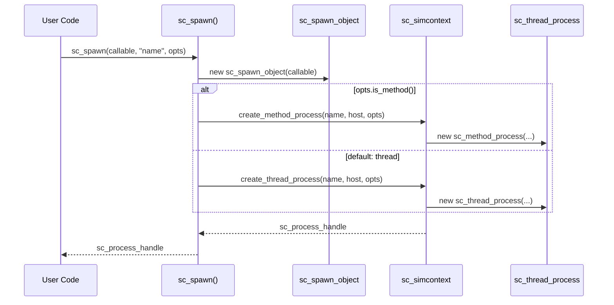

# sc_spawn -- Dynamic Process Spawning

## Overview

`sc_spawn.h` provides the `sc_spawn()` function template, which allows creating new processes **dynamically** during simulation (not just during elaboration). This is the runtime counterpart to `SC_METHOD` / `SC_THREAD` / `SC_CTHREAD` macros.

---

## Analogy: Hiring a Contractor

Think of `sc_spawn()` as **hiring a contractor** during a project:

- At the start of a project (elaboration), you hire permanent employees (`SC_METHOD`, `SC_THREAD`).
- During the project (simulation), you realize you need extra help, so you hire a contractor (`sc_spawn`).
- You tell the contractor what to do (callable object), give them a name, and specify conditions (spawn options).
- The contractor can be either a "quick task" worker (method) or a "long project" worker (thread).
- When the contractor finishes, they leave (process terminates).

---

## Key Functions

### `sc_spawn()` -- No Return Value

```cpp
template<typename T>
sc_process_handle sc_spawn(
    T object,                           // callable object
    const char* name_p = 0,             // optional name
    const sc_spawn_options* opt_p = 0   // optional options
);
```

Creates a new process whose behavior is defined by `object()`. The callable can be:
- A function pointer.
- A lambda.
- An `sc_bind` result.
- Any object with `operator()`.

By default, creates an `SC_THREAD`. Use `sc_spawn_options::spawn_method()` to create an `SC_METHOD` instead.

### `sc_spawn()` -- With Return Value

```cpp
template<typename T, typename R>
sc_process_handle sc_spawn(
    R* r_p,                             // pointer to store result
    T object,                           // callable returning R
    const char* name_p = 0,             // optional name
    const sc_spawn_options* opt_p = 0   // optional options
);
```

Same as above, but the return value of `object()` is stored at `*r_p`.

---

## Helper Classes

### `sc_spawn_object<T>`

Wraps a callable object with no return value:

```cpp
template<typename T>
class sc_spawn_object : public sc_process_host {
    T m_object;
public:
    explicit sc_spawn_object(T object) : m_object(object) {}
    virtual void semantics() { m_object(); }
};
```

The key insight: `sc_spawn_object` inherits from `sc_process_host`, making it compatible with the process infrastructure. The `semantics()` method is what the kernel calls to execute the process.

### `sc_spawn_object_v<T, R>`

Wraps a callable that returns a value:

```cpp
template<typename T, typename R>
class sc_spawn_object_v : public sc_process_host {
    T  m_object;
    R* m_result_p;
public:
    sc_spawn_object_v(R* r_p, T object) : m_object(object), m_result_p(r_p) {}
    virtual void semantics() { *m_result_p = m_object(); }
};
```

---

## How sc_spawn Works



---

## Usage Examples

### Spawning a Thread from a Lambda

```cpp
void my_module::producer() {
    for (int i = 0; i < 10; i++) {
        sc_spawn([this, i]() {
            wait(i * 10, SC_NS);
            data_out.write(i);
        }, sc_gen_unique_name("writer"));
    }
}
```

### Spawning a Method

```cpp
sc_spawn_options opts;
opts.spawn_method();
opts.set_sensitivity(&clk.posedge_event());
opts.dont_initialize();

sc_spawn([this]() {
    out.write(in1.read() + in2.read());
}, "adder", &opts);
```

### Spawning with Return Value

```cpp
int result;
sc_process_handle h = sc_spawn(&result, []() -> int {
    return 42;
}, "calculator");
```

---

## Thread vs Method Spawn

| Feature | Spawn as Thread (default) | Spawn as Method |
|---------|--------------------------|-----------------|
| Created by | `create_thread_process()` | `create_method_process()` |
| Can `wait()` | Yes | No |
| Option | Default | `opts.spawn_method()` |
| Cost | Higher (stack) | Lower |

---

## SFINAE Guards

The template uses `std::is_invocable_v<T>` to ensure the first overload only matches callable objects:

```cpp
template<typename T,
    typename std::enable_if<std::is_invocable_v<T>, bool>::type = true>
sc_process_handle sc_spawn(T object, ...);
```

The return-value version uses `std::is_invocable_r_v<R, T>` to ensure the callable returns the expected type.

---

## Design Rationale

### Why Dynamic Spawning?

Static process declaration (`SC_METHOD`, `SC_THREAD`) requires knowing all processes at elaboration time. Many designs need dynamic creation:
- Fork-join parallelism.
- Testbench stimulus generators.
- Protocol handlers that spawn per-transaction workers.

### Why `sc_process_host` Inheritance?

The process infrastructure needs a host object with a `semantics()` method pointer. By making `sc_spawn_object` inherit from `sc_process_host`, the spawned callable integrates seamlessly with the existing process mechanism.

### Memory Management

The `free_host` parameter is set to `true` for spawned processes, so the `sc_spawn_object` is automatically deleted when the process terminates. The user does not need to manage this memory.

---

## Related Files

- `sc_spawn_options.h/.cpp` -- Configuration options for spawned processes.
- `sc_process.h/.cpp` -- Base process class.
- `sc_process_handle.h` -- Handle returned by `sc_spawn()`.
- `sc_method_process.h/.cpp` -- Created when `spawn_method()` is used.
- `sc_thread_process.h/.cpp` -- Created by default.
- `sc_simcontext.h` -- `create_method_process()` / `create_thread_process()`.
