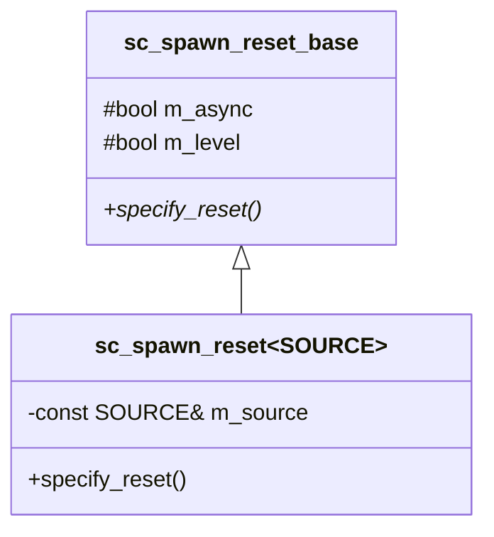
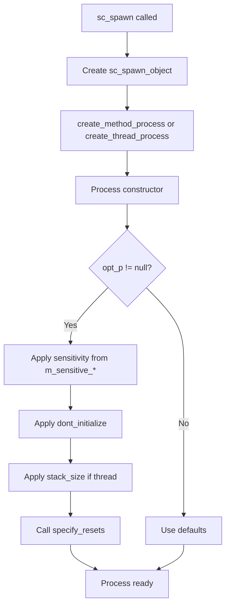

# sc_spawn_options -- Spawn Options Configuration

## Overview

`sc_spawn_options.h` / `sc_spawn_options.cpp` define the `sc_spawn_options` class, which configures how a dynamically spawned process behaves. It specifies sensitivity, reset signals, stack size, and whether the process is a method or thread.

---

## Analogy: The Job Posting

Think of `sc_spawn_options` as a **job posting** for a contractor:

- "This job is a quick task" (`spawn_method()`) or "this is an ongoing project" (default thread).
- "You should monitor these channels for updates" (`set_sensitivity()`).
- "If this alarm goes off, restart your work" (`reset_signal_is()`).
- "Don't start until I tell you" (`dont_initialize()`).
- "You'll need this much desk space" (`set_stack_size()`).

---

## Class API

### Configuration Methods

| Method | Description |
|--------|-------------|
| `spawn_method()` | Create an `SC_METHOD` instead of `SC_THREAD` |
| `dont_initialize()` | Don't run the process at time 0 |
| `set_stack_size(int)` | Set thread stack size (threads only) |
| `is_method()` | Query: is this a method spawn? |

### Sensitivity Configuration

```cpp
void set_sensitivity(const sc_event* event);
void set_sensitivity(sc_port_base* port);
void set_sensitivity(sc_interface* interface_p);
void set_sensitivity(sc_export_base* export_base);
void set_sensitivity(sc_event_finder* event_finder);
```

Each adds to the spawned process's static sensitivity list. You can call these multiple times to add multiple sensitivities.

### Reset Signal Configuration

```cpp
// Synchronous reset
void reset_signal_is(const sc_in<bool>& port, bool level);
void reset_signal_is(const sc_inout<bool>& port, bool level);
void reset_signal_is(const sc_out<bool>& port, bool level);
void reset_signal_is(const sc_signal_in_if<bool>& sig, bool level);

// Asynchronous reset
void async_reset_signal_is(const sc_in<bool>& port, bool level);
void async_reset_signal_is(const sc_inout<bool>& port, bool level);
void async_reset_signal_is(const sc_out<bool>& port, bool level);
void async_reset_signal_is(const sc_signal_in_if<bool>& sig, bool level);
```

The `level` parameter specifies the active reset level: `true` means reset when signal is high, `false` means reset when signal is low.

---

## Internal Data Members

| Member | Type | Description |
|--------|------|-------------|
| `m_dont_initialize` | `bool` | Skip initial execution |
| `m_spawn_method` | `bool` | True = method, false = thread |
| `m_stack_size` | `int` | Thread stack size (0 = default) |
| `m_sensitive_events` | `vector<const sc_event*>` | Events for static sensitivity |
| `m_sensitive_port_bases` | `vector<sc_port_base*>` | Ports for static sensitivity |
| `m_sensitive_interfaces` | `vector<sc_interface*>` | Interfaces for static sensitivity |
| `m_sensitive_event_finders` | `vector<sc_event_finder*>` | Event finders for sensitivity |
| `m_resets` | `vector<sc_spawn_reset_base*>` | Reset specifications |

---

## Reset Implementation

Reset specifications use a type-erased pattern:



- `sc_spawn_reset_base` is the abstract base with `m_async` and `m_level`.
- `sc_spawn_reset<SOURCE>` is a template that stores the reset signal source.
- `specify_reset()` calls `sc_reset::reset_signal_is()` to register the reset.

The `specify_resets()` method on `sc_spawn_options` iterates all stored resets and calls `specify_reset()` on each. This is called during process construction.

---

## Usage Example

```cpp
sc_spawn_options opts;

// Make it a method process
opts.spawn_method();

// Don't run at time 0
opts.dont_initialize();

// Sensitive to clock positive edge
opts.set_sensitivity(&clk.posedge_event());

// Synchronous reset on rst signal, active high
opts.reset_signal_is(rst, true);

// Spawn the process
sc_process_handle h = sc_spawn(my_func, "my_proc", &opts);
```

---

## How Options Are Applied

During process construction, the constructor reads the options:



---

## Design Rationale

### Why a Separate Options Class?

`sc_spawn()` could have had many parameters, but that would be unwieldy. The options object pattern:
- Keeps the `sc_spawn()` signature simple.
- Allows defaults for everything.
- Makes the code self-documenting.
- Is extensible without breaking existing code.

### Why Non-Copyable?

`sc_spawn_options` deletes its copy constructor and assignment operator. This prevents:
- Accidental double-deletion of reset objects.
- Ambiguous ownership of pointers in the sensitivity vectors.

---

## Related Files

- `sc_spawn.h` -- The `sc_spawn()` function that uses these options.
- `sc_process.h/.cpp` -- Base process constructor that reads options.
- `sc_method_process.h/.cpp` -- Method process constructor.
- `sc_thread_process.h/.cpp` -- Thread process constructor.
- `sc_reset.h/.cpp` -- Reset mechanism used by `specify_resets()`.
- `sc_sensitive.h/.cpp` -- Static sensitivity setup.
