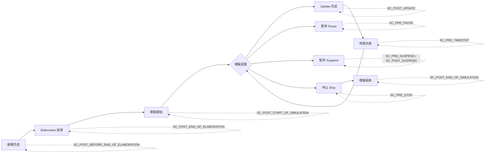

# sc_stage_callback_if.h - 模擬階段回呼介面

## 概觀

`sc_stage_callback_if.h` 定義了 SystemC 模擬階段（stage）回呼的介面和階段列舉。它允許使用者在模擬的各個關鍵時間點插入自訂邏輯，例如在每次更新後做檢查、在模擬暫停前做清理等。

## 為什麼需要這個檔案？

想像你在烤蛋糕。整個過程有很多階段：混合材料、放入烤箱、定時檢查、取出冷卻。如果你想在每個階段自動做某件事（例如每次檢查時拍照記錄），你需要一個「通知系統」告訴你目前在哪個階段。

`sc_stage_callback_if` 就是這個通知系統的介面。你只需要實作 `stage_callback()` 方法，告訴 SystemC 你關心哪些階段，SystemC 就會在那些時刻呼叫你的程式碼。

## 模擬階段列舉 `sc_stage`

```cpp
enum sc_stage {
    SC_POST_BEFORE_END_OF_ELABORATION = 0x001,
    SC_POST_END_OF_ELABORATION        = 0x002,
    SC_POST_START_OF_SIMULATION       = 0x004,
    SC_POST_UPDATE                    = 0x008,
    SC_PRE_TIMESTEP                   = 0x010,
    SC_PRE_PAUSE                      = 0x020,
    SC_PRE_SUSPEND                    = 0x040,
    SC_POST_SUSPEND                   = 0x080,
    SC_PRE_STOP                       = 0x100,
    SC_POST_END_OF_SIMULATION         = 0x200,
};
```

### 階段時間線



### 各階段說明

| 階段 | 位元值 | 觸發時機 | 用途範例 |
|------|--------|----------|----------|
| `SC_POST_BEFORE_END_OF_ELABORATION` | 0x001 | `before_end_of_elaboration()` 結束後 | 最後的結構修改 |
| `SC_POST_END_OF_ELABORATION` | 0x002 | `end_of_elaboration()` 結束後 | 驗證連線完整性 |
| `SC_POST_START_OF_SIMULATION` | 0x004 | `start_of_simulation()` 結束後 | 初始化監控工具 |
| `SC_POST_UPDATE` | 0x008 | 每次 update phase 結束後 | 即時數據收集（高頻） |
| `SC_PRE_TIMESTEP` | 0x010 | 時間推進前 | 時間相關的檢查（高頻） |
| `SC_PRE_PAUSE` | 0x020 | `sc_pause()` 生效前 | 儲存中間狀態 |
| `SC_PRE_SUSPEND` | 0x040 | `sc_suspend_all()` 前 | 暫停前清理 |
| `SC_POST_SUSPEND` | 0x080 | `sc_suspend_all()` 後恢復 | 恢復後初始化 |
| `SC_PRE_STOP` | 0x100 | `sc_stop()` 生效前 | 最終資料輸出 |
| `SC_POST_END_OF_SIMULATION` | 0x200 | 模擬完全結束後 | 資源釋放、報告生成 |

### 位元遮罩設計

每個階段使用一個獨立的位元（power of 2），這允許用位元 OR 來註冊多個階段的回呼：

```cpp
// register for both update and timestep callbacks
mask = SC_POST_UPDATE | SC_PRE_TIMESTEP;  // 0x008 | 0x010 = 0x018
```

## 介面類別 `sc_stage_callback_if`

```cpp
class sc_stage_callback_if {
public:
    typedef unsigned int stage_cb_mask;
    virtual ~sc_stage_callback_if() {}
    virtual void stage_callback(const sc_stage & stage) = 0;
};
```

這是一個純虛擬介面。要接收回呼，你需要：

1. 繼承此介面
2. 實作 `stage_callback()` 方法
3. 向 `sc_stage_callback_registry` 註冊

### 使用範例概念

```cpp
class MyMonitor : public sc_stage_callback_if {
    void stage_callback(const sc_stage& stage) override {
        if (stage == SC_POST_UPDATE) {
            // collect data after each update
        }
        if (stage == SC_PRE_STOP) {
            // flush output before stopping
        }
    }
};
```

## 輔助函式

```cpp
SC_API std::ostream& operator << (std::ostream& os, sc_stage s);
```

提供 `sc_stage` 的格式化輸出，方便偵錯和日誌記錄。

## 相關檔案

- `sc_stage_callback_registry.h` / `.cpp` - 回呼的註冊和派發實作
- `sc_status.h` - 模擬狀態定義（與 stage 不同但相關）
- `sc_simcontext.h` - 持有 callback registry 的模擬上下文
