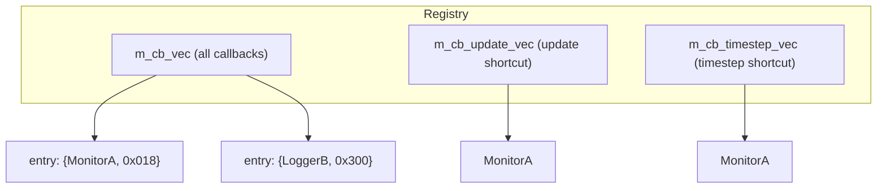
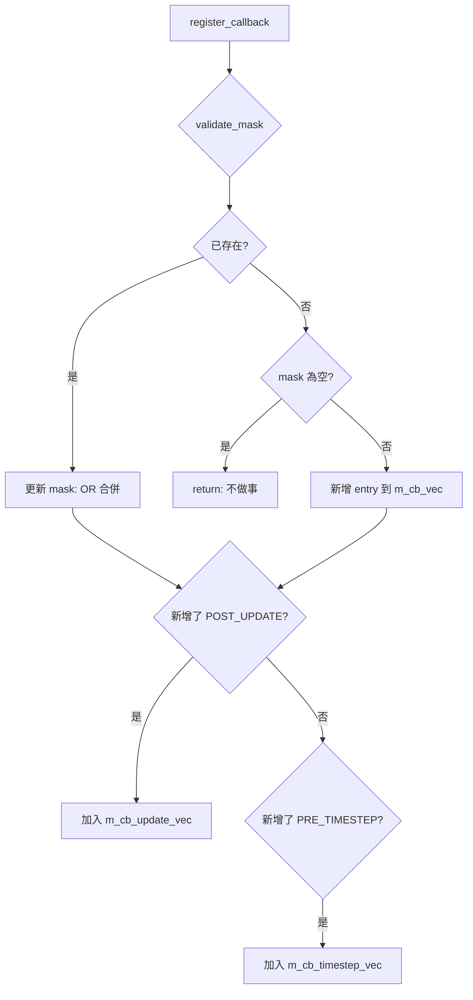
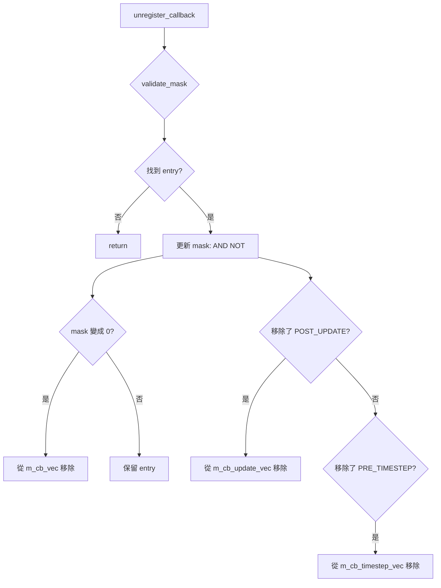

# sc_stage_callback_registry.h / .cpp - 模擬階段回呼註冊器

## 概觀

`sc_stage_callback_registry` 是 SystemC 模擬階段回呼系統的核心管理器。它負責註冊、取消註冊、驗證和派發階段回呼。這個類別是 `sc_simcontext` 的內部元件，使用者不直接存取它，而是透過 `sc_register_stage_callback()` 和 `sc_unregister_stage_callback()` 全域函式來操作。

## 為什麼需要這個檔案？

想像一個活動通知系統：很多人（callback 實作者）想知道某些事件（模擬階段）什麼時候發生。`sc_stage_callback_registry` 就是那個維護「訂閱名單」的管理員：

- 你可以訂閱（register）某些事件
- 你可以取消訂閱（unregister）
- 事件發生時，管理員會通知所有訂閱者

## 類別詳解

### 資料結構

```cpp
struct entry {
    cb_type*  target;  // callback implementation
    mask_type mask;    // which stages to notify
};
```



### 效能最佳化：快捷向量

`SC_POST_UPDATE` 和 `SC_PRE_TIMESTEP` 是高頻事件（每個 delta cycle 或 time step 都會觸發）。為了避免每次都遍歷整個 `m_cb_vec` 做位元比對，registry 維護了兩個快捷向量：

- `m_cb_update_vec`：只包含訂閱了 `SC_POST_UPDATE` 的回呼
- `m_cb_timestep_vec`：只包含訂閱了 `SC_PRE_TIMESTEP` 的回呼

```cpp
// High-frequency path: direct iteration, no mask check
inline void sc_stage_callback_registry::update_done() const {
    if (SC_LIKELY_(!m_cb_update_vec.size())) return;  // fast exit
    for (auto it = vec.begin(); it != vec.end(); ++it)
        (*it)->stage_callback(SC_POST_UPDATE);
}

// Low-frequency path: check mask
void sc_stage_callback_registry::do_callback(sc_stage s) const {
    for (auto it = vec.begin(); it != vec.end(); ++it) {
        if (s & it->mask)
            it->target->stage_callback(s);
    }
}
```

### `scoped_stage` - RAII 階段管理

```cpp
struct scoped_stage {
    scoped_stage(sc_stage& ref, sc_stage s)
      : ref_(ref), prev_(ref) { ref_ = s; }
    ~scoped_stage() { ref_ = prev_; }
};
```

這是一個 RAII 工具，用於在回呼期間臨時設定 `m_simc->m_stage` 的值，並在回呼結束後自動恢復。就像你進入會議室時把門牌翻成「開會中」，離開時翻回「空閒」。

注意它使用了 mutex 來保護 `m_stage` 的存取，確保多執行緒安全。

## 主要操作

### 註冊回呼



### 取消註冊



### 遮罩驗證 `validate_mask()`

確保遮罩值合法，並處理時序問題：

1. **非法位元**：如果 mask 包含 `SC_STAGE_CALLBACK_MASK` 以外的位元，發出警告並清除
2. **Elaboration 已完成**：如果模擬已經過了 elaboration 階段，就不能再註冊 `SC_POST_BEFORE_END_OF_ELABORATION` 或 `SC_POST_END_OF_ELABORATION` 了（這些事件已經過去了）

## 回呼轉發方法

每個階段都有對應的轉發方法，在 `.h` 中以 `inline` 實作：

| 方法 | 觸發的階段 | 效能路徑 |
|------|-----------|----------|
| `construction_done()` | `SC_POST_BEFORE_END_OF_ELABORATION` | 通用 |
| `elaboration_done()` | `SC_POST_END_OF_ELABORATION` | 通用 |
| `start_simulation()` | `SC_POST_START_OF_SIMULATION` | 通用 |
| `update_done()` | `SC_POST_UPDATE` | 快捷（高頻） |
| `before_timestep()` | `SC_PRE_TIMESTEP` | 快捷（高頻） |
| `pre_suspend()` | `SC_PRE_SUSPEND` | 通用 |
| `post_suspend()` | `SC_POST_SUSPEND` | 通用 |
| `simulation_paused()` | `SC_PRE_PAUSE` | 通用 |
| `simulation_stopped()` | `SC_PRE_STOP` | 通用 |
| `simulation_done()` | `SC_POST_END_OF_SIMULATION` | 通用 |

## `sc_stage` 的格式化輸出

`.cpp` 檔案實作了 `operator<<` 來美化 `sc_stage` 的輸出：

- 單一階段：直接印出名稱，如 `SC_POST_UPDATE`
- 組合遮罩：用 `|` 連接，如 `(SC_POST_UPDATE|SC_PRE_TIMESTEP)`
- 無效值：印出十六進位，如 `0x800`

## 存取控制

整個類別的介面是 `private`，只有以下 friend 可以存取：

- `sc_simcontext` - 模擬上下文（擁有者）
- `sc_object` - 系統物件基底類別
- `sc_register_stage_callback()` - 全域註冊函式
- `sc_unregister_stage_callback()` - 全域取消註冊函式

## 相關檔案

- `sc_stage_callback_if.h` - 回呼介面和階段列舉定義
- `sc_simcontext.h` - 持有此 registry 的模擬上下文
- `sc_status.h` - 模擬狀態定義
- `sc_kernel_ids.h` - 錯誤訊息 ID（`SC_ID_STAGE_CALLBACK_REGISTER_`）
