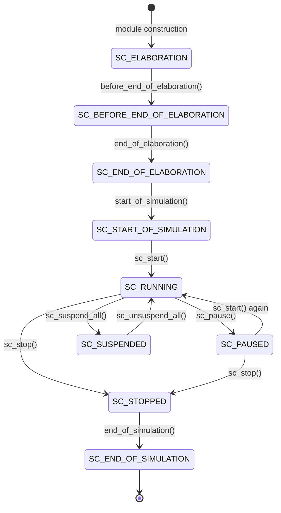

# sc_status.h - 模擬狀態定義

## 概觀

`sc_status.h` 定義了 SystemC 模擬器在不同時間點可能處於的狀態碼。這些狀態可以透過 `sc_get_status()` 查詢，讓使用者程式知道模擬目前在做什麼。

## 為什麼需要這個檔案？

想像一個洗衣機——它有不同的狀態：注水、洗滌、脫水、完成。你可以透過面板燈號知道目前在哪個階段。`sc_status` 就是 SystemC 模擬器的「面板燈號」，告訴你模擬目前處於什麼階段。

## 模擬結果碼

```cpp
const int SC_SIM_OK        = 0;  // simulation finished without error
const int SC_SIM_ERROR     = 1;  // simulation ended with error
const int SC_SIM_USER_STOP = 2;  // simulation stopped by sc_stop()
```

這些是模擬結束後的「成績」：

| 代碼 | 意義 | 生活類比 |
|------|------|----------|
| `SC_SIM_OK` | 正常完成 | 洗衣機正常完成洗衣 |
| `SC_SIM_ERROR` | 發生錯誤 | 洗衣機故障停機 |
| `SC_SIM_USER_STOP` | 使用者主動停止 | 你按了暫停鍵 |

## 模擬狀態列舉 `sc_status`

```cpp
enum sc_status {
    SC_ELABORATION               = 0x001,
    SC_BEFORE_END_OF_ELABORATION = 0x002,
    SC_END_OF_ELABORATION        = 0x004,
    SC_START_OF_SIMULATION       = 0x008,
    SC_RUNNING                   = 0x010,
    SC_PAUSED                    = 0x020,
    SC_SUSPENDED                 = 0x040,
    SC_STOPPED                   = 0x080,
    SC_END_OF_SIMULATION         = 0x100,
};
```

### 狀態時間線



### 各狀態說明

| 狀態 | 位元值 | 觸發時機 | 說明 |
|------|--------|----------|------|
| `SC_ELABORATION` | 0x001 | 模組建構期間 | 正在建立模組階層、連接埠和訊號 |
| `SC_BEFORE_END_OF_ELABORATION` | 0x002 | `before_end_of_elaboration()` 回呼中 | 最後修改結構的機會 |
| `SC_END_OF_ELABORATION` | 0x004 | `end_of_elaboration()` 回呼中 | 結構已固定，可以做最終檢查 |
| `SC_START_OF_SIMULATION` | 0x008 | `start_of_simulation()` 回呼中 | 模擬即將開始 |
| `SC_RUNNING` | 0x010 | 初始化、評估或更新階段 | 模擬正在運行 |
| `SC_PAUSED` | 0x020 | `sc_pause()` 後 | 模擬暫停，可以檢查狀態或繼續 |
| `SC_SUSPENDED` | 0x040 | `sc_suspend_all()` 後 | 所有 process 被暫停 |
| `SC_STOPPED` | 0x080 | `sc_stop()` 後 | 模擬已停止，不能再繼續 |
| `SC_END_OF_SIMULATION` | 0x100 | `end_of_simulation()` 回呼中 | 正在進行最終清理 |

### 位元遮罩設計

與 `sc_stage` 類似，每個狀態用一個位元表示，可以用位元運算組合查詢：

```cpp
// Check if simulation is in any "active" state
if (sc_get_status() & (SC_RUNNING | SC_PAUSED | SC_SUSPENDED)) {
    // simulation has started but not yet ended
}
```

## `sc_status` vs `sc_stage`

這兩個列舉容易混淆，但用途不同：

| 特性 | `sc_status` | `sc_stage` |
|------|-------------|------------|
| 用途 | 查詢當前模擬狀態 | 回呼通知時間點 |
| 方向 | 被動查詢 | 主動通知 |
| 粒度 | 較粗（整體階段） | 較細（PRE/POST 時間點） |
| 定義在 | `sc_status.h` | `sc_stage_callback_if.h` |
| 查詢方式 | `sc_get_status()` | `stage_callback()` 的參數 |

## 格式化輸出

```cpp
SC_API std::ostream& operator << (std::ostream&, sc_status);
```

提供 `sc_status` 的人類可讀輸出，方便偵錯。

## 相關檔案

- `sc_stage_callback_if.h` - 階段回呼介面（相關但不同的概念）
- `sc_simcontext.h` - 持有當前模擬狀態
- `sc_stage_callback_registry.h` - 使用 `sc_status.h` 的定義
