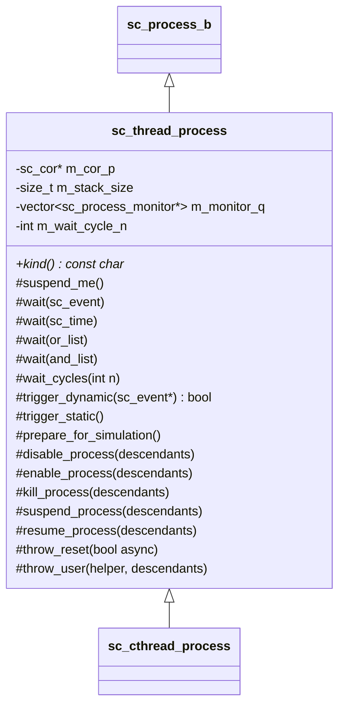
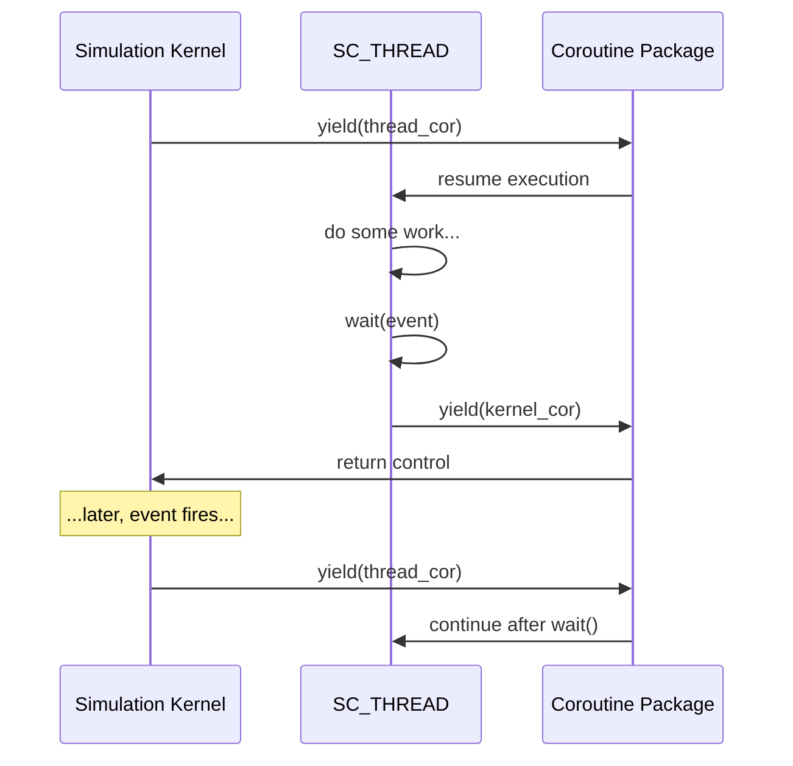

# sc_thread_process -- Thread Process Implementation

## Overview

`sc_thread_process.h` / `sc_thread_process.cpp` implement `sc_thread_process`, the class for `SC_THREAD` processes. Unlike method processes, thread processes have their own execution stack and can suspend mid-execution using `wait()`.

---

## Analogy: The Office Worker

Think of `SC_THREAD` as an **office worker** at a desk:

- The worker starts a task and works on it.
- When they need input from someone else, they pause (`wait()`) and go on break.
- When the needed info arrives (event fires), they return to their desk and continue exactly where they left off.
- The worker has their own desk and chair (stack) -- this costs space but allows true suspension.
- When the worker quits (`kill()`), their desk is eventually cleared.

Compare to `SC_METHOD` which is like a **visitor** who uses a shared desk, completes one task, and leaves.

---

## Key Characteristics

| Feature | SC_THREAD |
|---------|-----------|
| Runs to completion | No, can call `wait()` to suspend |
| Uses `wait()` | Yes, for both static and dynamic sensitivity |
| Has its own stack | Yes (coroutine-based) |
| Cost per instance | Higher (stack allocation) |
| Can be suspended mid-execution | Yes |
| Default stack size | `SC_DEFAULT_STACK_SIZE` |

---

## Class Structure



---

## Core Mechanism: Coroutines

Thread processes use **coroutines** (`sc_cor`) to achieve suspension/resumption. A coroutine is a function that can pause and resume its execution while preserving its local variables.



### `sc_thread_cor_fn(void* arg)`

This is the coroutine entry function. It:
1. Casts `arg` back to `sc_thread_handle`.
2. Calls `semantics()` to execute the user code.
3. Catches `sc_unwind_exception` for reset/kill.
4. On natural completion, calls `disconnect_process()`.

---

## Important Methods

### `suspend_me()` (inline)

This is the central suspension mechanism. When called, it:

1. Gets the next coroutine to run from the kernel.
2. Yields to that coroutine (context switch).
3. Upon waking up, checks if an exception should be thrown.

Exception handling in `suspend_me()`:

| `m_throw_status` | Action |
|-------------------|--------|
| `THROW_NONE` | Return normally |
| `THROW_ASYNC_RESET` / `THROW_SYNC_RESET` | Throw `sc_unwind_exception(reset=true)` |
| `THROW_USER` | Call `m_throw_helper_p->throw_it()` |
| `THROW_KILL` | Throw `sc_unwind_exception(reset=false)` |

### `wait()` variants (inline)

Each variant sets up dynamic sensitivity and then calls `suspend_me()`:

```cpp
void sc_thread_process::wait(const sc_event& e) {
    if (m_unwinding)
        SC_REPORT_ERROR(...);  // can't wait during stack unwind
    m_event_p = &e;
    e.add_dynamic(this);
    m_trigger_type = EVENT;
    suspend_me();
}
```

| Variant | Description |
|---------|-------------|
| `wait(event)` | Suspend until event fires |
| `wait(or_list)` | Suspend until any event in list fires |
| `wait(and_list)` | Suspend until all events in list fire |
| `wait(time)` | Suspend for a duration |
| `wait(time, event)` | Wait for event with timeout |
| `wait(time, or_list)` | Wait for or-list with timeout |
| `wait(time, and_list)` | Wait for and-list with timeout |

### `wait_cycles(int n)`

Suspends the thread for `n` static trigger cycles. Sets `m_wait_cycle_n = n - 1` (the kernel decrements before checking).

### `trigger_static()` (inline)

Similar to `sc_method_process::trigger_static()` but additionally checks the wait cycle count:

```
if (m_wait_cycle_n > 0 && THROW_NONE == m_throw_status) {
    --m_wait_cycle_n;
    return;  // not yet, keep counting
}
```

### `trigger_dynamic(sc_event*)`

Handles dynamic event triggering. For timeout cases, sets `m_timed_out` flag. For AND_LIST, decrements event count and only triggers when all events have fired.

### `prepare_for_simulation()`

Called before simulation starts. Allocates the coroutine stack:

```cpp
void sc_thread_process::prepare_for_simulation() {
    m_cor_p = simcontext()->cor_pkg()->create(
        m_stack_size, sc_thread_cor_fn, this
    );
    m_cor_p->stack_protect(true);
}
```

---

## Process Control

### `kill_process(descendants)`

1. If not running: immediately disconnect.
2. If running: set `THROW_KILL`, remove from runnable queue, let `suspend_me()` throw.
3. Optionally recurse to descendants.

### `throw_reset(bool async)`

1. If the thread is the currently running process:
   - Set throw status.
   - Remove dynamic events.
   - Throw `sc_unwind_exception` immediately.
2. If the thread is not running:
   - Set throw status.
   - Remove dynamic events.
   - Push onto runnable queue so it wakes up and sees the throw.

### `throw_user(helper, descendants)`

Throws a user-defined exception into the thread:
1. Stores the exception helper.
2. Removes dynamic events.
3. If not currently running, schedules the thread to run next.
4. Suspends the caller until the target has processed the exception.

---

## Process Monitors

Thread processes support a monitor pattern:

```cpp
void add_monitor(sc_process_monitor* monitor_p);
void remove_monitor(sc_process_monitor* monitor_p);
void signal_monitors(int type);
```

Monitors are notified when the thread exits. This is used by `sc_join` to implement process synchronization.

---

## Constructor

```cpp
sc_thread_process::sc_thread_process(
    const char* name_p, bool free_host,
    sc_entry_func method_p, sc_process_host* host_p,
    const sc_spawn_options* opt_p
)
```

Sets up:
- `m_process_kind = SC_THREAD_PROC_`
- `m_cor_p = NULL` (allocated later in `prepare_for_simulation()`)
- `m_stack_size = SC_DEFAULT_STACK_SIZE`
- `m_wait_cycle_n = 0`
- Spawn options (sensitivity, `dont_initialize`, resets, stack size)

---

## Design Rationale

### Why Coroutines?

Coroutines allow a thread to truly suspend and resume. Without them, the `wait()` mechanism would require manual state machines (which is what `SC_METHOD` + `next_trigger()` effectively provides). Coroutines make writing sequential behavioral code natural.

### RTL Background

An `SC_THREAD` is analogous to an **initial block** or a **sequential always block** (`always @(posedge clk)`) in Verilog. It models behavior that unfolds over time, step by step.

### Stack Size Considerations

Each thread needs a stack. The default is often 64KB-128KB. In simulations with thousands of threads, stack memory can become significant. Use `sc_spawn_options::set_stack_size()` or `sc_set_stack_size()` to optimize.

---

## Related Files

- `sc_process.h/.cpp` -- Base class `sc_process_b`.
- `sc_method_process.h/.cpp` -- Method process (no stack, no suspend).
- `sc_cthread_process.h/.cpp` -- Clocked thread (inherits from this).
- `sc_cor.h` / `sc_cor_*.h` -- Coroutine implementation.
- `sc_wait.h/.cpp` -- Free `wait()` functions that delegate here.
- `sc_runnable.h` -- Runnable queue management.
- `sc_except.h` -- `sc_unwind_exception`, `sc_halt`.
