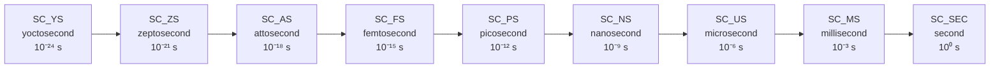

# sc_time -- SystemC 模擬世界的時鐘

## 概述

`sc_time` 是 SystemC 中表示模擬時間的核心類別。在硬體模擬中，時間是最基本的概念之一。`sc_time` 將時間抽象化為一個不可變的值物件，支援各種時間單位（從 yoctosecond 到 second）、算術運算、比較運算，並與模擬引擎緊密整合。

**原始碼位置：**
- 標頭檔：`ref/systemc/src/sysc/kernel/sc_time.h`
- 實作檔：`ref/systemc/src/sysc/kernel/sc_time.cpp`

---

## 日常生活類比

想像你在玩一款**回合制策略遊戲**：

| 遊戲概念 | sc_time |
|---------|---------|
| 遊戲中的「第 N 回合」 | `sc_time` 的 `m_value`（內部整數值） |
| 每回合代表「1 天」還是「1 小時」 | 時間解析度 (time resolution) |
| 「3 天後」、「下周」 | `sc_time(3, SC_NS)`、`sc_time(1, SC_US)` |
| 遊戲的時間軸 | 模擬時間軸 |
| 遊戲不能倒退時間 | `sc_time` 的值只增不減（在正常模擬中） |

**關鍵洞察：** 遊戲內部只追蹤「回合數」（整數），而「每回合多長」是另外設定的。`sc_time` 也一樣，內部儲存的是整數 tick 數，而每個 tick 代表多少實際時間由時間解析度決定。

---

## 時間單位



```cpp
enum sc_time_unit {
    SC_YS = -3,  // yoctosecond (最小)
    SC_ZS = -2,  // zeptosecond
    SC_AS = -1,  // attosecond
    SC_FS = 0,   // femtosecond
    SC_PS = 1,   // picosecond
    SC_NS = 2,   // nanosecond (最常用)
    SC_US = 3,   // microsecond
    SC_MS = 4,   // millisecond
    SC_SEC = 5   // second
};
```

---

## sc_time 類別詳解

### 內部表示

```cpp
class sc_time {
public:
    typedef SC_TIME_DT value_type;  // sc_dt::uint64, at least 64 bits

private:
    value_type m_value{};  // internal tick count
};
```

**核心設計**：`sc_time` 內部只存一個 64 位元無號整數 `m_value`，表示相對於時間解析度的 tick 數。所有的時間計算都在整數空間進行，避免浮點誤差。

### 建構方式

```cpp
// 1. 預設：零時間
constexpr sc_time();

// 2. 指定數值與單位（最常用）
sc_time(double, sc_time_unit);
// example: sc_time(10, SC_NS) = 10 nanoseconds

// 3. 從字串
explicit sc_time(std::string_view strv);
static sc_time from_string(std::string_view strv);

// 4. 從內部值
static sc_time from_value(value_type);

// 5. 從秒數
static sc_time from_seconds(double);

// 6. 最大值
static constexpr sc_time max();
```

### 轉換函式

```cpp
value_type value() const;          // 取得內部 tick 值
double to_double() const;          // 轉為 double（相對於時間解析度）
double to_seconds() const;         // 轉為秒
double to_default_time_units() const; // 轉為預設時間單位
const std::string to_string() const;  // 轉為人類可讀字串
```

### 比較運算子

所有六種比較都有支援：`==`, `!=`, `<`, `<=`, `>`, `>=`。實作非常直接，就是比較 `m_value`：

```cpp
bool operator == (const sc_time& t) const { return m_value == t.m_value; }
bool operator <  (const sc_time& t) const { return m_value <  t.m_value; }
// ... etc
```

### 算術運算子

```cpp
sc_time& operator += (const sc_time&);  // 加
sc_time& operator -= (const sc_time&);  // 減
sc_time& operator *= (double);          // 乘以倍率
sc_time& operator /= (double);          // 除以倍率
sc_time& operator %= (const sc_time&);  // 取餘

// friend operators
const sc_time operator + (const sc_time&, const sc_time&);
const sc_time operator - (const sc_time&, const sc_time&);
const sc_time operator * (const sc_time&, double);
const sc_time operator * (double, const sc_time&);
const sc_time operator / (const sc_time&, double);
double        operator / (const sc_time&, const sc_time&);  // time ratio
const sc_time operator % (const sc_time&, const sc_time&);
```

**注意乘除的四捨五入**：

```cpp
sc_time& operator *= (double d) {
    m_value = static_cast<sc_dt::int64>(
        static_cast<double>(m_value) * d + 0.5  // round to nearest
    );
    return *this;
}
```

乘以 `double` 時先轉為浮點計算，再加 0.5 做四捨五入回整數。

---

## SC_ZERO_TIME

```cpp
inline constexpr sc_time SC_ZERO_TIME;
```

一個全域常數，代表「零時間」。由於 `m_value` 預設為 0，`SC_ZERO_TIME` 的 `m_value` 就是 0。常用於：
- 立即通知：`event.notify(SC_ZERO_TIME)` 表示在下一個 delta cycle 通知
- 時間比較：`if (t == SC_ZERO_TIME)`

---

## sc_time_tuple -- 時間的人類可讀表示

`sc_time_tuple` 是一個輔助類別，用於將內部 tick 值轉換為「數值 + 單位」的形式。

```cpp
class sc_time_tuple {
    value_type   m_value;   // normalized value
    sc_time_unit m_unit;    // best-fit unit
    unsigned     m_offset;  // scaling factor
};
```

**用途**：當你呼叫 `sc_time::to_string()` 時，它會建立一個 `sc_time_tuple` 來找到最適合的單位表示。例如 1000 ps 會顯示為 "1 ns" 而非 "1000 ps"。

---

## sc_time_params -- 時間系統設定

```cpp
struct sc_time_params {
    double              time_resolution;              // in yoctoseconds
    unsigned            time_resolution_log10;        // log10 of resolution
    bool                time_resolution_specified;    // user set it?
    std::atomic<bool>   time_resolution_fixed;        // locked after first use?

    sc_time::value_type default_time_unit;            // in resolution ticks
    bool                default_time_unit_specified;   // user set it?
};
```

### 時間解析度

時間解析度決定了 `m_value = 1` 代表多少真實時間。預設通常是 1 ps (picosecond)。

```cpp
sc_set_time_resolution(1, SC_PS);  // 1 tick = 1 ps
sc_set_time_resolution(1, SC_NS);  // 1 tick = 1 ns (lower precision, faster)
```

**重要限制**：
- 時間解析度必須在建立任何 `sc_time` 物件（除了 `SC_ZERO_TIME`）之前設定
- 一旦設定就不能更改（`time_resolution_fixed` 會被鎖定）
- 使用 `std::atomic<bool>` 確保執行緒安全

### 預設時間單位

```cpp
sc_set_default_time_unit(1, SC_NS);
```

設定後，`sc_time(10, true)` 中的 `10` 就代表 10 ns。

---

## 設計原理

### 為什麼用整數而不是浮點數？

**精度問題**：浮點數在累加時會產生誤差。例如 `0.1 + 0.1 + ... + 0.1`（10 次）在浮點數中可能不等於 `1.0`。但在硬體模擬中，時間必須精確到 tick。使用整數完全避免了累積誤差。

**效能考量**：整數比較和運算比浮點數快，而時間比較是模擬器中最頻繁的操作之一。

### 為什麼需要如此多的時間單位？

不同的硬體運作在不同的時間尺度：
- **數位邏輯**：nanosecond (ns) 等級
- **類比電路**：picosecond (ps) 等級
- **光學通訊**：femtosecond (fs) 等級
- **系統級模擬**：microsecond (us) 到 millisecond (ms)

SystemC 作為「系統級到閘極級」的通用框架，需要涵蓋所有尺度。

### RTL 背景

在 Verilog/VHDL 中，時間也是用整數 tick 加上 timescale 來表示：

```verilog
`timescale 1ns / 1ps   // unit = 1ns, precision = 1ps
#10;                    // wait 10ns
```

SystemC 的 `sc_time` + `sc_set_time_resolution()` 對應的就是這個概念。

---

## 使用範例

```cpp
// basic construction
sc_time t1(10, SC_NS);        // 10 ns
sc_time t2(1.5, SC_US);       // 1.5 us = 1500 ns
sc_time t3 = SC_ZERO_TIME;    // 0

// arithmetic
sc_time t4 = t1 + t2;         // 1510 ns
sc_time t5 = t1 * 3;          // 30 ns
double ratio = t2 / t1;       // 150.0

// comparison
bool b = (t1 < t2);           // true

// output
std::cout << t1 << std::endl;  // "10 ns"
std::cout << t2 << std::endl;  // "1500 ns" or "1.5 us"
```

---

## 相關檔案

| 檔案 | 說明 |
|------|------|
| `sc_simcontext.h/cpp` | 管理 `sc_time_params`，維護目前模擬時間 |
| `sc_event.h/cpp` | 事件通知需要 `sc_time` 指定延遲 |
| `sc_clock.h/cpp` | 時鐘使用 `sc_time` 定義週期和工作週期 |
| `sc_wait.h` | `wait(sc_time)` 函式 |
| `sc_nbdefs.h` | 定義 `sc_dt::uint64` |
