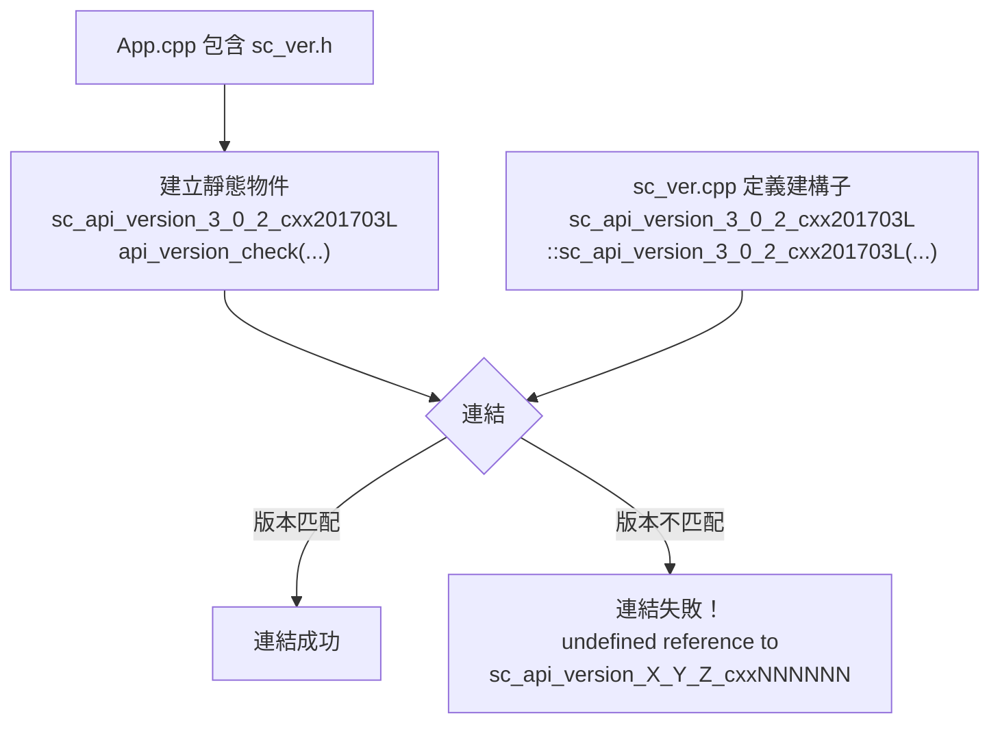

# sc_ver.h / .cpp - 版本與版權資訊

## 概觀

`sc_ver.h` 和 `sc_ver.cpp` 管理 SystemC 函式庫的版本號碼、版權資訊和 API 版本相容性檢查。它們確保應用程式連結的 SystemC 函式庫版本與編譯時使用的標頭檔版本一致。

## 為什麼需要這個檔案？

想像你買了一台電器（你的程式），附帶一本說明書（header 檔）。如果你用新版說明書的方式操作舊版電器，可能會出問題。`sc_ver` 的 API 版本檢查就是確保「說明書版本」和「電器版本」匹配的機制。

## 版本資訊

### 當前版本定義

```cpp
#define SYSTEMC_3_0_2
#define SYSTEMC_VERSION       20251031
#define SC_VERSION_ORIGINATOR "Accellera"
#define SC_VERSION_MAJOR      3
#define SC_VERSION_MINOR      0
#define SC_VERSION_PATCH      2
#define SC_IS_PRERELEASE      0
#define IEEE_1666_SYSTEMC     202301L  // IEEE 1666-2023
```

### 版本字串格式

- 正式版：`3.0.2-Accellera`
- 預覽版：`3.0.2_pub_rev_20251031-Accellera`
- 完整版本：`SystemC 3.0.2-Accellera --- <date> <time>`

### 版本查詢函式

| 函式 | 回傳值 |
|------|--------|
| `sc_version()` | `"SystemC 3.0.2-Accellera --- Mar 15 2026 10:30:00"` |
| `sc_release()` | `"3.0.2-Accellera"` |
| `sc_copyright()` | 版權聲明文字 |

### 版本變數

| 變數 | 型別 | 說明 |
|------|------|------|
| `sc_version_major` | `unsigned int` | 主版本號 (3) |
| `sc_version_minor` | `unsigned int` | 次版本號 (0) |
| `sc_version_patch` | `unsigned int` | 修訂號 (2) |
| `sc_is_prerelease` | `bool` | 是否為預覽版 |
| `sc_version_originator` | `string` | 發行者 ("Accellera") |
| `sc_version_release_date` | `string` | 發行日期 |

## API 版本檢查機制

### 連結期檢查

這是整個檔案最精巧的設計。目標是在**連結時**（而不是執行時）就捕捉版本不匹配的問題。



#### 運作原理

1. `SC_API_VERSION_STRING` 巨集生成一個包含版本號和 C++ 標準版本的類別名稱，如 `sc_api_version_3_0_2_cxx201703L`
2. 每個包含 `sc_ver.h` 的 `.cpp` 檔案都會建立這個類別的靜態實例
3. 這個實例的建構子定義在 `sc_ver.cpp` 中
4. 如果 header 版本（來自應用程式編譯時）和函式庫版本不同，類別名稱就不同，連結器會報錯

### 執行期檢查

建構子還會檢查一些編譯期開關的一致性：

```cpp
SC_API_PERFORM_CHECK_(sc_writer_policy,
                      default_writer_policy,
                      "SC_DEFAULT_WRITER_POLICY");
SC_API_PERFORM_CHECK_(bool,
                      has_covariant_virtual_base,
                      "SC_ENABLE_COVARIANT_VIRTUAL_BASE");
```

`SC_API_PERFORM_CHECK_` 的邏輯：
- 第一次呼叫：記住這個值
- 後續呼叫：比較值是否一致
- 不一致：`SC_REPORT_FATAL`

這確保所有翻譯單元（`.cpp` 檔案）使用相同的編譯選項。

## 版權訊息顯示

### `pln()` 函式

`pln()` 在模擬開始時印出版本和版權資訊到 `stderr`：

```
        SystemC 3.0.2-Accellera --- Mar 15 2026 10:30:00
        Copyright (c) 1996-2025 by all Contributors,
        ALL RIGHTS RESERVED
```

可以透過以下方式禁用：
1. 編譯時定義 `SC_DISABLE_COPYRIGHT_MESSAGE`
2. 設定環境變數 `SYSTEMC_DISABLE_COPYRIGHT_MESSAGE`
3. 設定環境變數 `SC_COPYRIGHT_MESSAGE=DISABLE`

### 回歸測試支援

```cpp
if (getenv("SYSTEMC_REGRESSION") != 0) {
    cerr << "SystemC Simulation" << endl;
}
```

在回歸測試環境中印出固定字串，方便自動化比對。

## 相關檔案

- `sc_cmnhdr.h` - 定義 `SC_CPLUSPLUS` 巨集
- `sc_macros.h` - 定義 `SC_CONCAT_UNDERSCORE_`、`SC_STRINGIFY_HELPER_` 等巨集
- `sc_kernel_ids.h` - `SC_ID_INCONSISTENT_API_CONFIG_` 錯誤 ID
- `sc_communication/sc_writer_policy.h` - `SC_DEFAULT_WRITER_POLICY` 定義
