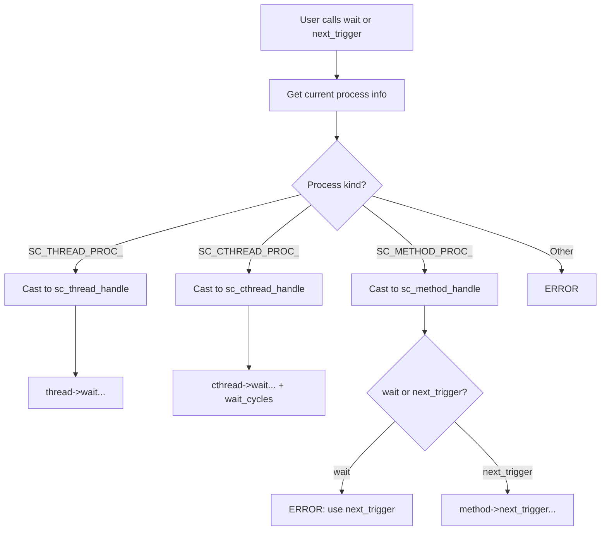
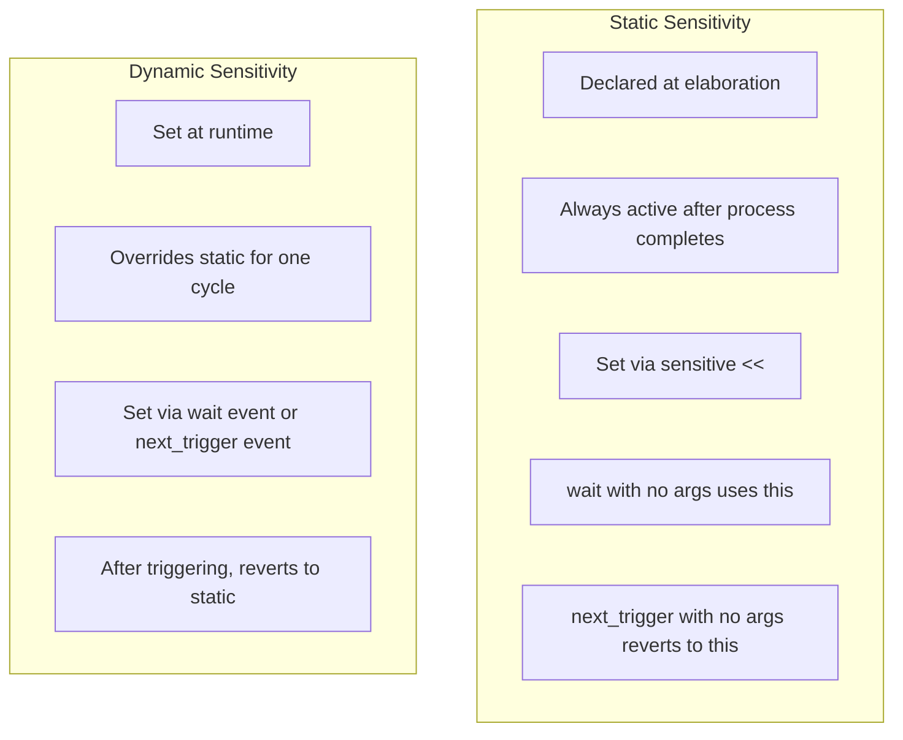

# sc_wait -- Wait and Next Trigger Functions

## Overview

`sc_wait.h` / `sc_wait.cpp` provide the global `wait()` and `next_trigger()` functions that are the primary user-facing API for **dynamic sensitivity**. These free functions delegate to the appropriate method on the currently executing process.

---

## Analogy: The Break Room Rules

Think of the simulation as an office:

- **`wait()` for threads**: "I'll go to the break room and come back when X happens." The worker (thread) literally leaves their desk and returns later.
- **`next_trigger()` for methods**: "I'm done for now. Next time, call me when Y happens." The visitor (method) finishes and leaves a note about when to call them back.
- You can't use `wait()` if you're a visitor (method) -- you don't have a desk to leave and come back to.
- You can't use `next_trigger()` if you're a worker (thread) -- you're expected to stay at your desk and use `wait()`.

---

## Two Families of Functions

### `wait()` -- For SC_THREAD and SC_CTHREAD

Suspends the calling thread until the specified condition is met.

| Function | Description |
|----------|-------------|
| `wait()` | Wait for static sensitivity (next trigger from sensitivity list) |
| `wait(event)` | Wait for a specific event |
| `wait(event_or_list)` | Wait for any event in the list |
| `wait(event_and_list)` | Wait for all events in the list |
| `wait(time)` | Wait for a duration |
| `wait(time, event)` | Wait for event with timeout |
| `wait(time, or_list)` | Wait for or-list with timeout |
| `wait(time, and_list)` | Wait for and-list with timeout |
| `wait(double, time_unit)` | Convenience: `wait(sc_time(v, tu))` |
| `wait(double, time_unit, event)` | Convenience with timeout |

### `next_trigger()` -- For SC_METHOD

Configures what triggers the next invocation of the method.

| Function | Description |
|----------|-------------|
| `next_trigger()` | Revert to static sensitivity |
| `next_trigger(event)` | Next trigger on specific event |
| `next_trigger(event_or_list)` | Next trigger on any event in list |
| `next_trigger(event_and_list)` | Next trigger on all events in list |
| `next_trigger(time)` | Next trigger after timeout |
| `next_trigger(time, event)` | Next trigger on event with timeout |
| `next_trigger(time, or_list)` | Next trigger on or-list with timeout |
| `next_trigger(time, and_list)` | Next trigger on and-list with timeout |

---

## How They Work



### Process Kind Dispatch

Each free function checks `cpi->kind` to determine the process type and delegates accordingly:

```cpp
void wait(const sc_event& e, sc_simcontext* simc) {
    sc_curr_proc_handle cpi = simc->get_curr_proc_info();
    switch (cpi->kind) {
    case SC_THREAD_PROC_:
        reinterpret_cast<sc_thread_handle>(cpi->process_handle)->wait(e);
        break;
    case SC_CTHREAD_PROC_:
        warn_cthread_wait();  // deprecated for cthread
        cthread_h->wait(e);
        cthread_h->wait_cycles();  // extra wait for clock sync
        break;
    default:
        SC_REPORT_ERROR(...);  // not allowed in SC_METHOD
        break;
    }
}
```

### SC_CTHREAD Special Handling

For `SC_CTHREAD`, dynamic `wait()` calls (with events/times) are **deprecated**. When used:
1. A deprecation warning is issued.
2. The dynamic wait is performed.
3. `wait_cycles()` is called afterwards to re-synchronize with the clock.

---

## Error Handling

| Error | Situation |
|-------|-----------|
| `SC_ID_WAIT_NOT_ALLOWED_` | `wait()` called in an `SC_METHOD` |
| `SC_ID_NEXT_TRIGGER_NOT_ALLOWED_` | `next_trigger()` called in an `SC_THREAD` |
| `SC_ID_EVENT_LIST_FAILED_` | Empty event list passed to `wait()` / `next_trigger()` |

---

## Additional Functions

### `timed_out()` (Deprecated)

Returns `true` if the last `wait()` with a timeout actually timed out (rather than being triggered by the event).

```cpp
wait(10, SC_NS, some_event);
if (timed_out()) {
    // some_event did not fire within 10 ns
}
```

### `sc_set_location(file, lineno)`

Records the source file and line number in the current process. Used for debugging and error reporting.

---

## Usage Examples

### Thread with Dynamic Sensitivity

```cpp
void my_thread() {
    while (true) {
        wait(data_ready_event);    // dynamic: wait for specific event
        process_data();
        wait();                     // static: wait for default sensitivity
    }
}
```

### Method with Dynamic Sensitivity

```cpp
void my_method() {
    if (need_more_data) {
        next_trigger(data_event);  // next time, trigger on data_event
    }
    // If next_trigger() is not called, uses static sensitivity
}
```

### Wait with Timeout

```cpp
void my_thread() {
    wait(100, SC_NS, ack_event);
    if (timed_out()) {
        handle_timeout();
    } else {
        handle_ack();
    }
}
```

---

## Static vs Dynamic Sensitivity



---

## Design Rationale

### Why Free Functions?

`wait()` and `next_trigger()` are global free functions rather than member functions because:
1. They need to work inside any function called by a process, not just the top-level callback.
2. Making them global avoids requiring users to pass `this` or a process reference around.
3. They internally use `sc_get_curr_simcontext()` to find the current process.

### Why Separate wait and next_trigger?

- `wait()` **suspends** the calling thread. Only threads have stacks that allow suspension.
- `next_trigger()` **sets up the next trigger** and returns. Methods cannot suspend, so they must return to the kernel.

This distinction reflects the fundamental difference between thread and method processes.

---

## Related Files

- `sc_thread_process.h` -- Thread's `wait()` and `suspend_me()` implementation.
- `sc_method_process.h` -- Method's `next_trigger()` and `clear_trigger()`.
- `sc_wait_cthread.h/.cpp` -- Additional wait functions for clocked threads.
- `sc_simcontext.h` -- `get_curr_proc_info()` to find current process.
- `sc_event.h` -- Events, event lists used as wait conditions.
