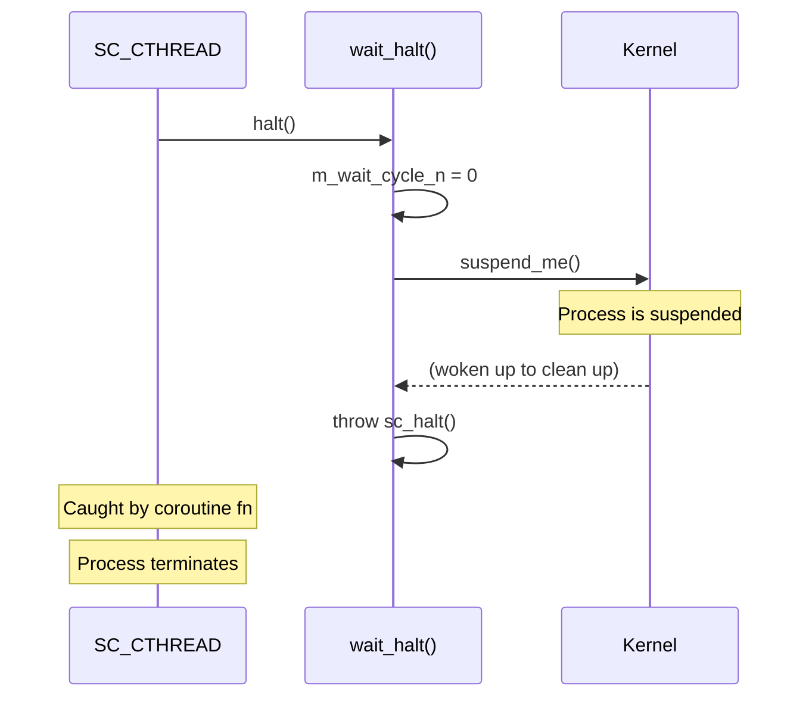
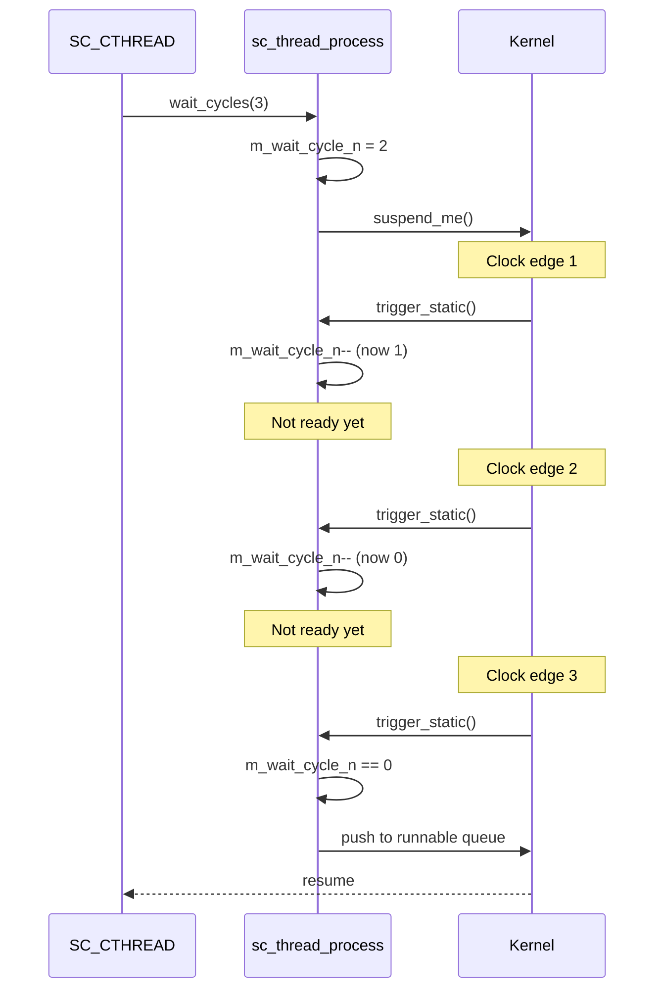

# sc_wait_cthread -- Wait Functions for Clocked Threads

## Overview

`sc_wait_cthread.h` / `sc_wait_cthread.cpp` provide specialized wait functions for `SC_CTHREAD` processes: `halt()`, `wait(int n)`, `at_posedge()`, and `at_negedge()`.

---

## Analogy: The Assembly Line Controls

Imagine a factory assembly line controlled by a conveyor belt (clock):

- **`wait(n)`**: "Skip the next `n` belt-steps. I need time to prepare." The worker stands idle for `n` clock cycles.
- **`halt()`**: "I'm done forever. Take me off the line." The worker permanently leaves.
- **`at_posedge(signal)`**: "Wait until the signal light turns ON." The worker watches the light and waits for the 0-to-1 transition.
- **`at_negedge(signal)`**: "Wait until the signal light turns OFF." The worker waits for the 1-to-0 transition.

---

## Functions

### `halt(sc_simcontext*)`

Permanently stops the calling `SC_CTHREAD` process.

```cpp
void halt(sc_simcontext* simc) {
    sc_curr_proc_handle cpi = simc->get_curr_proc_info();
    switch (cpi->kind) {
    case SC_CTHREAD_PROC_:
        reinterpret_cast<sc_cthread_handle>(cpi->process_handle)->wait_halt();
        break;
    default:
        SC_REPORT_ERROR(SC_ID_HALT_NOT_ALLOWED_, 0);
        break;
    }
}
```

- Only valid in `SC_CTHREAD`.
- Calls `wait_halt()` which suspends the coroutine and throws `sc_halt()` on wake-up.
- The process never runs again after calling `halt()`.

### `wait(int n, sc_simcontext*)`

Waits for `n` clock cycles.

```cpp
void wait(int n, sc_simcontext* simc) {
    // ... error check: n > 0
    switch (cpi->kind) {
    case SC_THREAD_PROC_:
    case SC_CTHREAD_PROC_:
        reinterpret_cast<sc_thread_handle>(cpi->process_handle)->wait_cycles(n);
        break;
    default:
        SC_REPORT_ERROR(...);
        break;
    }
}
```

- Valid in both `SC_THREAD` and `SC_CTHREAD`.
- `n` must be positive; `n <= 0` generates an error.
- Internally calls `wait_cycles(n)`, which sets `m_wait_cycle_n = n - 1` and suspends.

### `at_posedge(signal)`

Waits until the signal transitions from 0 to 1:

```cpp
void at_posedge(const sc_signal_in_if<bool>& s, sc_simcontext* simc) {
    if (s.read() == true)
        do { wait(simc); } while (s.read() == true);   // wait until LOW
    do { wait(simc); } while (s.read() == false);       // wait until HIGH
}
```

Works for both `bool` and `sc_logic` signals.

### `at_negedge(signal)`

Waits until the signal transitions from 1 to 0:

```cpp
void at_negedge(const sc_signal_in_if<bool>& s, sc_simcontext* simc) {
    if (s.read() == false)
        do { wait(simc); } while (s.read() == false);   // wait until HIGH
    do { wait(simc); } while (s.read() == true);         // wait until LOW
}
```

---

## Execution Flow

### halt() Flow



### wait(n) Flow



---

## Error Conditions

| Error | Condition |
|-------|-----------|
| `SC_ID_HALT_NOT_ALLOWED_` | `halt()` called outside `SC_CTHREAD` |
| `SC_ID_WAIT_N_INVALID_` | `wait(n)` called with `n <= 0` |
| `SC_ID_WAIT_NOT_ALLOWED_` | `wait(n)` called in `SC_METHOD` |

---

## Usage Examples

### Basic Clocked Thread with wait(n)

```cpp
void my_cthread() {
    // Reset phase
    output.write(0);
    wait();              // wait 1 clock cycle

    // Main loop
    while (true) {
        output.write(input.read());
        wait(2);         // wait 2 clock cycles
    }
}
```

### Using halt()

```cpp
void one_shot_cthread() {
    wait();              // wait for first clock edge
    output.write(42);    // do something once
    halt();              // done forever
}
```

### Edge Detection

```cpp
void edge_detector() {
    while (true) {
        at_posedge(start_signal);
        // start_signal just went from 0 to 1
        do_work();
        at_negedge(done_signal);
        // done_signal just went from 1 to 0
        cleanup();
    }
}
```

---

## Design Rationale

### Why Separate from sc_wait.h?

These functions are specific to clocked thread semantics:
- `halt()` only makes sense for clock-synchronized processes.
- `wait(n)` counts clock cycles, not arbitrary events.
- `at_posedge()`/`at_negedge()` are edge-detection utilities built on top of `wait()`.

Keeping them separate clarifies which functions are for general use (`sc_wait.h`) vs. clock-domain-specific use (`sc_wait_cthread.h`).

### RTL Background

In RTL Verilog:
```verilog
repeat(3) @(posedge clk);   // equivalent to wait(3)
$finish;                      // somewhat like halt()
@(posedge start);            // equivalent to at_posedge(start)
```

The `wait(n)` pattern directly maps to the RTL concept of "wait for N clock edges."

---

## Related Files

- `sc_wait.h/.cpp` -- General `wait()` and `next_trigger()` functions.
- `sc_cthread_process.h/.cpp` -- Clocked thread process class with `wait_halt()`.
- `sc_thread_process.h` -- Thread process with `wait_cycles()`.
- `sc_except.h` -- `sc_halt` exception class.
- `sc_simcontext.h` -- `get_curr_proc_info()` for process identification.
