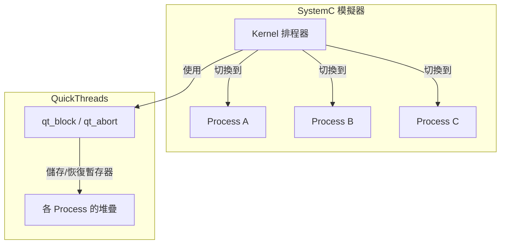

# SystemC Packages - 外部套件

## 概述

`sysc/packages/` 目錄包含 SystemC 使用的外部程式庫。目前唯一的套件是 **QuickThreads (Qt)**——一套使用者層級的執行緒（coroutine，協程）函式庫。

> **重要提醒**：這裡的「Qt」是 **QuickThreads** 的縮寫，與知名的 **Qt GUI 框架**完全無關。QuickThreads 是 David Keppel 於 1993 年開發的輕量級上下文切換函式庫。

## QuickThreads 在 SystemC 中的角色

SystemC 模擬器需要在多個「程序」（`SC_THREAD`、`SC_METHOD`）之間快速切換執行。這就像一位廚師同時煮多道菜——雖然只有一個人（一個 CPU 執行緒），但要在各道菜之間快速切換，讓每道菜都能「進行中」。

QuickThreads 提供了比作業系統執行緒更輕量的上下文切換機制：

### 三種上下文切換後端

SystemC 支援三種上下文切換實作：

| 後端 | 啟用方式 | 特點 |
|------|---------|------|
| QuickThreads | 預設 | 最快，使用組合語言 |
| POSIX Threads | `SC_USE_PTHREADS` | 使用 `ucontext` 或 pthreads |
| C++ Threads | `SC_USE_STD_THREADS` | 使用 C++11 `std::thread` |

當定義了 `SC_USE_PTHREADS` 或 `SC_USE_STD_THREADS` 時，QuickThreads 會被完全停用。

## 檔案結構

| 檔案 | 說明 |
|------|------|
| [qt.md](qt.md) | QuickThreads 主要 API — 執行緒建立、切換、中止 |
| [qtmd.md](qtmd.md) | 機器相關定義 — 依 CPU 架構選擇組合語言實作 |

### md/ 子目錄 — 各架構的組合語言實作

`md/` 子目錄包含各種 CPU 架構的組合語言檔案，負責實際的暫存器儲存/恢復：

| 架構 | 標頭檔 | 組合語言 | 狀態 |
|------|--------|---------|------|
| x86-64 | `iX86_64.h` | `iX86_64.s` | 主要使用 |
| AArch64 (ARM64) | `aarch64.h` | `aarch64.s` | 主要使用 |
| RISC-V 64 | `riscv64.h` | `riscv64.s` | 較新支援 |
| x86 (32-bit) | `i386.h` | `i386.s` | 傳統支援 |
| SPARC | `sparc.h` | `sparc.s` | 傳統支援 |
| PA-RISC | `hppa.h` | `hppa.s` | 傳統支援 |
| PowerPC (macOS) | `powerpc_mach.h` | `powerpc_mach.s` | 傳統支援 |
| PowerPC (SysV) | `powerpc_sys5.h` | `powerpc_sys5.s` | 傳統支援 |
| Alpha | `axp.h` | `axp.s` | 歷史遺留 |
| MIPS | `mips.h` | `mips.s` | 歷史遺留 |
| VAX | `vax.h` | `vax.s` | 歷史遺留 |
| KSR1 | `ksr1.h` | `ksr1.s` | 歷史遺留 |
| M88K | `m88k.h` | `m88k.s` | 歷史遺留 |

每個架構都包含：
- `.h` 檔：定義堆疊佈局常數（暫存器在堆疊上的偏移量）
- `.s` 檔：組合語言實作的 `qt_block`、`qt_blocki`、`qt_abort` 等函式
- `_b.s` 檔：某些架構的額外輔助組合語言

## 設計原理

為什麼不直接用作業系統的執行緒？

1. **效能**：QuickThreads 的上下文切換只需要儲存/恢復少量暫存器（callee-saved），比作業系統執行緒快 10-100 倍
2. **確定性**：使用者層級的切換完全由模擬器控制，不受 OS 排程器影響
3. **單執行緒語意**：SystemC 的語意是「一次只有一個程序在執行」，不需要真正的並行
