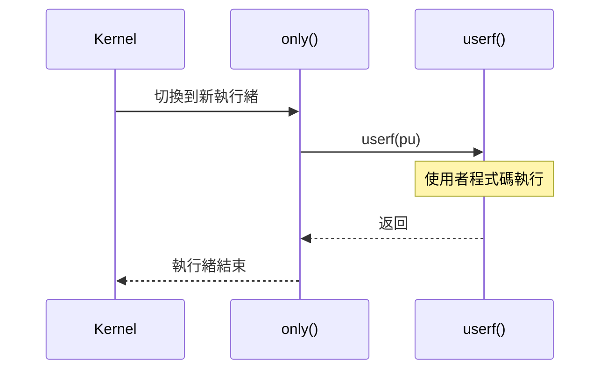
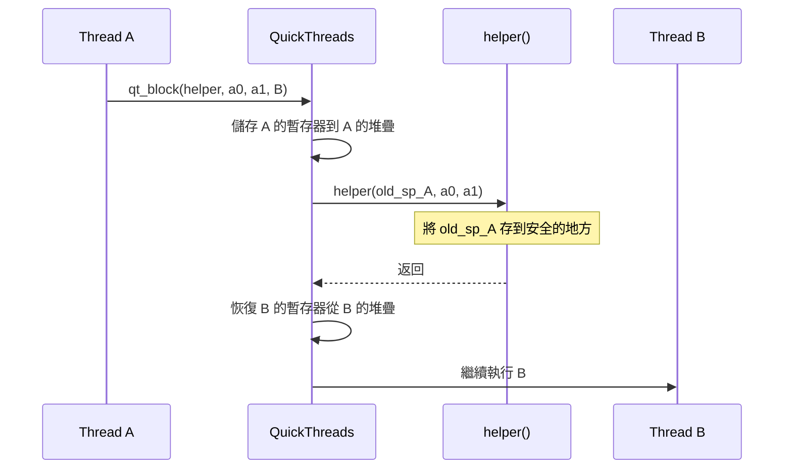

# qt.h / qt.c - QuickThreads 主要 API

## 概述

`qt.h` 定義了 QuickThreads 函式庫的核心 API，包括執行緒建立、上下文切換、以及中止等操作。`qt.c` 提供了 varargs 版本的實作和輔助函式。

**來源檔案**：`sysc/packages/qt/qt.h` + `qt.c`

## 生活比喻

想像你是一位小說家，同時在寫三本小說：

1. 你寫小說 A 寫到一半，在書桌上做個記號（**儲存狀態**），把稿紙放好
2. 你拿出小說 B 的稿紙，找到上次的記號（**恢復狀態**），繼續寫
3. 寫到某個段落，又切換到小說 C...

QuickThreads 就是幫你管理這些「記號」和「切換」的系統。每個「記號」就是一個堆疊指標（`qt_t*`），記錄了某個執行緒暫停時的所有狀態。

## 核心型別

### qt_t — 執行緒狀態

```cpp
typedef struct qt_t {
    char dummy;
} qt_t;
```

`qt_t*` 代表一個執行緒的當前狀態，實際上是一個堆疊指標。整個結構只是為了型別安全而存在——你不需要（也不應該）直接存取它的內容。

### 函式指標型別

```cpp
typedef void  (qt_userf_t)(void *pu);                  // 使用者函式
typedef void *(qt_vuserf_t)(int arg0, ...);             // varargs 使用者函式
typedef void  (qt_only_t)(void *pu, void *pt, qt_userf_t *userf); // 包裝函式
typedef void *(qt_helper_t)(qt_t *old, void *a0, void *a1);       // 切換輔助函式
```

## 堆疊管理

### 對齊

```cpp
#define QUICKTHREADS_STKROUNDUP(bytes) \
    (((bytes) + QUICKTHREADS_STKALIGN) & ~(QUICKTHREADS_STKALIGN - 1))
```

將位元組數向上取整到堆疊對齊邊界。

### 計算堆疊頂部

```cpp
// 堆疊向下成長
#define QUICKTHREADS_SP(sto, size) ((qt_t *)(&((char *)(sto))[(size)]))

// 堆疊向上成長
#define QUICKTHREADS_SP(sto, size) ((qt_t *)(sto))
```

給定一塊記憶體（`sto`）和大小（`size`），計算堆疊指標的初始值。

## 執行緒建立

### 非 varargs 版本

```cpp
#define QUICKTHREADS_ARGS(sp, pu, pt, userf, only)
```

在堆疊上佈置初始參數，讓執行緒第一次被切換到時能夠正確地呼叫使用者函式。

參數：
- `sp`：堆疊指標
- `pu`：使用者參數（傳給 `userf`）
- `pt`：額外參數（傳給 `only`）
- `userf`：使用者函式
- `only`：包裝函式，負責呼叫 `userf` 並處理啟動/清理



### Varargs 版本

```cpp
qt_t *qt_vargs(qt_t *sp, int nbytes, void *vargs,
               void *pt, qt_startup_t *startup,
               qt_vuserf_t *vuserf, qt_cleanup_t *cleanup);
```

用於需要傳遞可變數量參數的場景。先呼叫 `startup`，再呼叫 `vuserf`，最後呼叫 `cleanup`。

## 上下文切換

### qt_block — 協作式切換

```cpp
void *qt_block(qt_helper_t *h, void *a0, void *a1, qt_t *newthread);
#define QUICKTHREADS_BLOCK(h, a0, a1, newthread) \
    (qt_block(h, a0, a1, newthread))
```

**儲存**當前執行緒的狀態，**恢復** `newthread` 的狀態。切換前會呼叫 helper 函式 `h(old_sp, a0, a1)`，讓呼叫者有機會將舊的堆疊指標存起來。



### qt_blocki — 中斷安全版本

```cpp
void *qt_blocki(qt_helper_t *h, void *a0, void *a1, qt_t *newthread);
```

與 `qt_block` 類似，但在某些平台上處理中斷相關的暫存器。

### qt_abort — 不歸切換

```cpp
void *qt_abort(qt_helper_t *h, void *a0, void *a1, qt_t *newthread);
#define QUICKTHREADS_ABORT(h, a0, a1, newthread) \
    do { qt_abort(h, a0, a1, newthread); } while (0)
```

與 `qt_block` 不同，`qt_abort` **不儲存**當前執行緒的狀態。用於當前執行緒已經結束、不需要恢復的場景。

## qt.c 中的輔助函式

### qt_vargs — varargs 堆疊佈置

```cpp
qt_t *qt_vargs(qt_t *sp, int nbytes, void *vargs,
               void *pt, qt_startup_t *startup,
               qt_vuserf_t *vuserf, qt_cleanup_t *cleanup);
```

將可變參數複製到新執行緒的堆疊上，並設置好 startup、userf、cleanup 函式的位置。堆疊成長方向不同時，參數的複製順序也不同。

### qt_null 和 qt_error

```cpp
void qt_null(void);   // 空函式，用作預設回呼
void qt_error(void);  // 呼叫 abort()，用於不應到達的地方
```

## 條件編譯

```cpp
#if !defined(SC_USE_PTHREADS) && !defined(SC_USE_STD_THREADS)
// ... QuickThreads 程式碼 ...
#endif
```

當使用 pthreads 或 C++ threads 後端時，整個 QuickThreads 標頭不會被引入。

## 在 SystemC 中的應用

SystemC 核心透過 `sc_cor_qt` 類別封裝 QuickThreads API：

1. `SC_THREAD` 的每個實例都有自己的堆疊
2. 使用 `QUICKTHREADS_ARGS` 初始化堆疊
3. 使用 `QUICKTHREADS_BLOCK` 在程序之間切換
4. 使用 `QUICKTHREADS_ABORT` 結束執行緒

## 相關檔案

- [qtmd.md](qtmd.md) — 機器相關定義
- [_index.md](_index.md) — 套件概述
