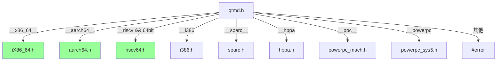

# qtmd.h - 機器相關定義

## 概述

`qtmd.h` 是 QuickThreads 的架構分派器（dispatcher），根據編譯器偵測到的 CPU 架構，引入對應的機器相關標頭檔。每個架構的標頭檔定義了堆疊佈局、暫存器偏移量、對齊要求等常數。

**來源檔案**：`sysc/packages/qt/qtmd.h`（僅標頭檔）

## 生活比喻

想像你是一位國際快遞公司的倉庫管理員。每個國家的包裹大小規格和擺放方式不同：

- 日本的包裹要直放
- 美國的包裹要橫放
- 歐洲的包裹要先墊一層泡棉

`qtmd.h` 就是那本「各國包裹擺放指南」，它告訴你：根據你現在在哪個國家（CPU 架構），應該用哪種擺放方式（堆疊佈局）。

## 架構選擇邏輯

```cpp
#if defined(__sparc) || defined(__sparc__)
    #include "sysc/packages/qt/md/sparc.h"
#elif defined(__hppa)
    #include "sysc/packages/qt/md/hppa.h"
#elif defined(__x86_64__)
    #include "sysc/packages/qt/md/iX86_64.h"
#elif defined(__i386)
    #include "sysc/packages/qt/md/i386.h"
#elif defined(__ppc__)
    #include "sysc/packages/qt/md/powerpc_mach.h"
#elif defined(__powerpc)
    #include "sysc/packages/qt/md/powerpc_sys5.h"
#elif defined(__aarch64__)
    #include "sysc/packages/qt/md/aarch64.h"
#elif defined(__riscv) && (__riscv_xlen == 64)
    #include "sysc/packages/qt/md/riscv64.h"
#else
    #error "Unknown architecture!"
#endif
```



綠色標記的是現代常用的架構。

## 各架構標頭檔定義的常數

每個架構標頭檔通常會定義以下巨集：

| 巨集 | 說明 |
|------|------|
| `QUICKTHREADS_GROW_DOWN` 或 `QUICKTHREADS_GROW_UP` | 堆疊成長方向 |
| `QUICKTHREADS_STKALIGN` | 堆疊對齊要求（bytes） |
| `QUICKTHREADS_STKBASE` | 堆疊基底偏移量 |
| `QUICKTHREADS_ONLY_INDEX` | `only` 函式在堆疊上的索引 |
| `QUICKTHREADS_USER_INDEX` | `userf` 函式在堆疊上的索引 |
| `QUICKTHREADS_ARGT_INDEX` | `pt` 參數在堆疊上的索引 |
| `QUICKTHREADS_ARGU_INDEX` | `pu` 參數在堆疊上的索引 |
| `qt_word_t` | 機器字組型別 |

### 堆疊佈局示例（概念性）

以 x86-64 為例（堆疊向下成長）：

```
高位址
┌─────────────────┐
│  QUICKTHREADS_SP │ ← 堆疊頂部（初始指標）
├─────────────────┤
│  return address  │
│  saved rbx       │
│  saved rbp       │
│  saved r12       │ ← callee-saved 暫存器
│  saved r13       │
│  saved r14       │
│  saved r15       │
├─────────────────┤
│  pu (使用者參數)  │
│  pt (額外參數)    │
│  userf           │
│  only            │
└─────────────────┘
低位址 ← 堆疊成長方向
```

## 為什麼需要組合語言？

上下文切換需要直接操作 CPU 暫存器，這是 C/C++ 無法做到的事情。組合語言檔案（`.s`）負責：

1. **儲存 callee-saved 暫存器**：把當前執行緒需要保留的暫存器推入堆疊
2. **切換堆疊指標**：把 CPU 的堆疊指標（如 x86-64 的 `rsp`）換成新執行緒的
3. **恢復 callee-saved 暫存器**：從新堆疊上彈出之前儲存的暫存器
4. **跳轉執行**：繼續執行新執行緒的程式碼

這整個過程只涉及 callee-saved 暫存器（而非所有暫存器），因為根據 ABI 約定，caller-saved 暫存器在函式呼叫時本來就不保證保留。

## PowerPC 的特殊處理

注意有兩個 PowerPC 標頭：
- `powerpc_mach.h`：macOS (Mach-O) 平台
- `powerpc_sys5.h`：Linux (System V ABI) 平台

同一個 CPU 架構在不同作業系統上的 ABI 可能不同，因此需要分開處理。

## 相關檔案

- [qt.md](qt.md) — 使用這些常數的 QuickThreads API
- [_index.md](_index.md) — 套件概述與所有架構清單
