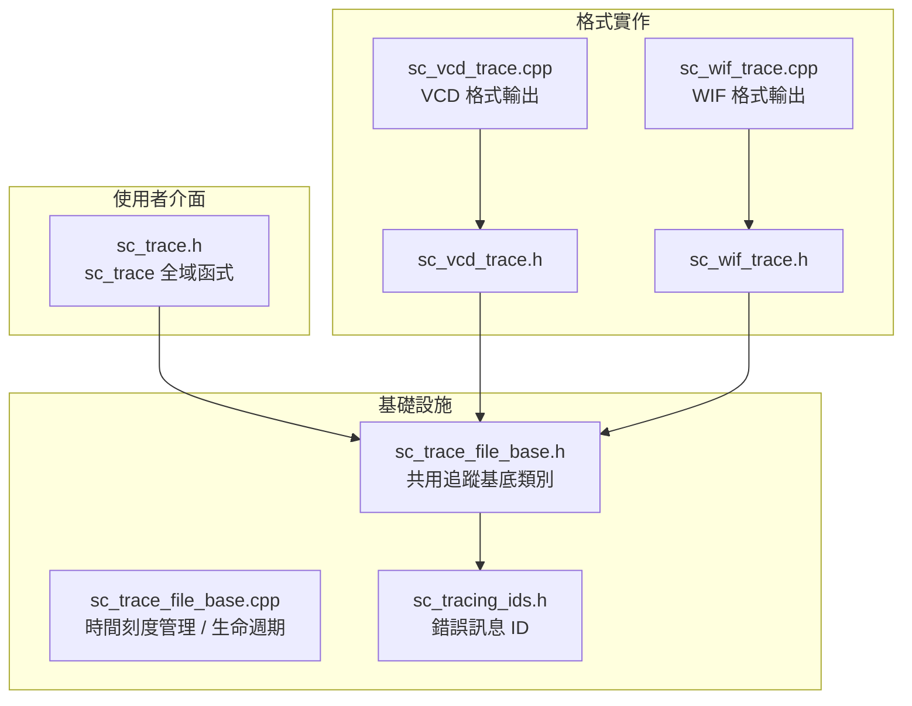
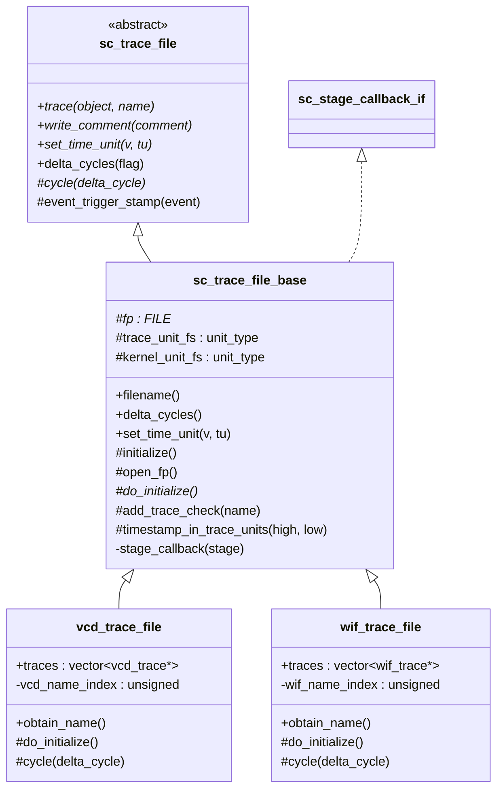
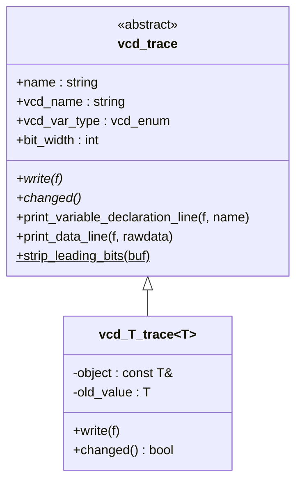
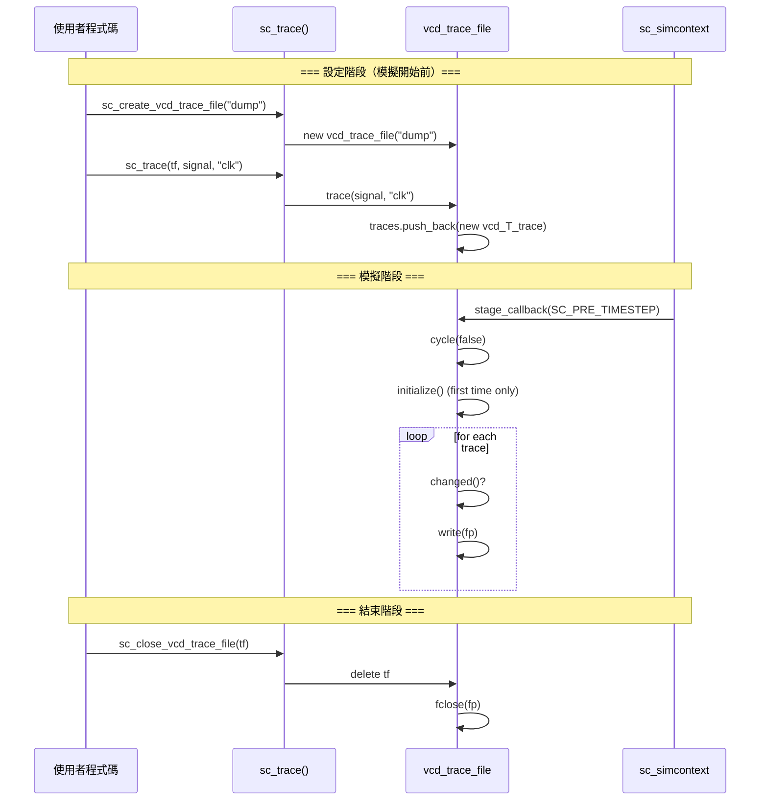

# sysc/tracing/ - 波形追蹤子系統

> SystemC 模擬過程中的訊號記錄機制，將訊號值隨時間的變化匯出為 VCD 或 WIF 格式檔案，供後續波形檢視工具分析。

## 日常生活比喻

想像你在觀察一場足球比賽。**追蹤（tracing）** 就像賽事的「文字轉播」——每個時刻都記錄下球員（訊號）的位置和狀態。賽後，你可以用這份紀錄還原任何時刻發生了什麼。

- **sc_trace_file** = 轉播記者（抽象角色，負責「記錄」這件事）
- **sc_trace_file_base** = 記者的標準作業流程（開檔、時間校準、何時該記錄）
- **vcd_trace_file** = 用「VCD 格式」寫紀錄的記者
- **wif_trace_file** = 用「WIF 格式」寫紀錄的記者
- **sc_trace()** = 告訴記者「請幫我盯這個球員」

## 子系統概覽

## 類別繼承階層

## VCD 內部追蹤物件階層

## 追蹤流程

## 檔案清單

| 檔案 | 說明 |
|------|------|
| [sc_trace.md](sc_trace.md) | 追蹤公用 API：`sc_trace_file` 抽象類別與全域 `sc_trace()` 函式 |
| [sc_trace_file_base.md](sc_trace_file_base.md) | 追蹤檔案共用基底類別：時間刻度、檔案生命週期、callback 機制 |
| [sc_tracing_ids.md](sc_tracing_ids.md) | 追蹤子系統錯誤/警告訊息 ID 定義 |
| [sc_vcd_trace.md](sc_vcd_trace.md) | VCD（Value Change Dump）格式追蹤實作 |
| [sc_wif_trace.md](sc_wif_trace.md) | WIF（Waveform Interchange Format）格式追蹤實作 |

## 相關子系統

- `sysc/kernel/` — 模擬核心，提供 `sc_simcontext`、`sc_event`、`sc_time`
- `sysc/communication/` — 訊號介面 `sc_signal_in_if`，追蹤函式可直接追蹤訊號
- `sysc/datatypes/` — 各種資料型別（`sc_logic`, `sc_bv_base` 等），追蹤需支援所有型別
- `sysc/utils/` — 錯誤回報機制 `sc_report`
