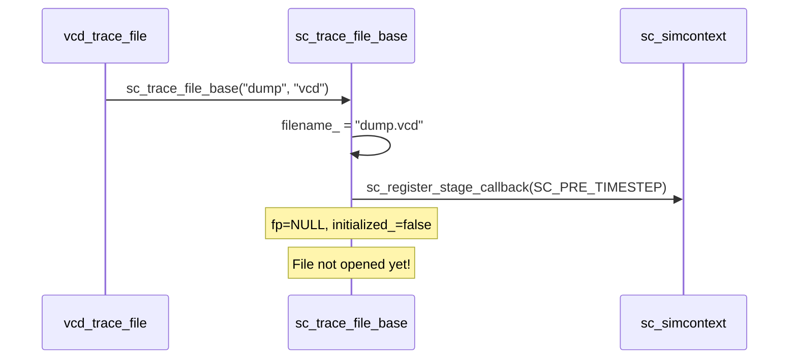
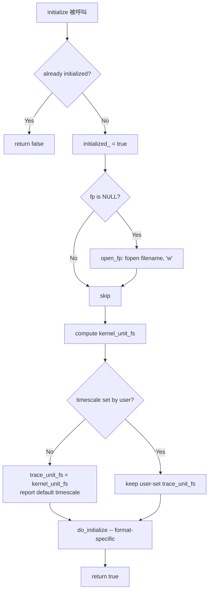
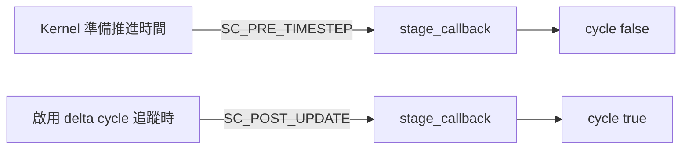

# sc_trace_file_base.h / sc_trace_file_base.cpp - 追蹤檔案共用基底類別

> 提供 VCD 和 WIF 追蹤檔案的共用實作：檔案開關、時間刻度管理、模擬核心 callback 整合。是連接抽象介面 `sc_trace_file` 與具體格式實作之間的橋樑。

## 日常生活比喻

如果 `sc_trace_file` 是「記者」的職位描述（要會寫報導、會拍照），那 `sc_trace_file_base` 就是「記者的標準裝備和作業手冊」——規定了怎麼準備紙筆（開檔案）、怎麼校正手錶（設定時間刻度）、什麼時候該動筆（callback 時機）。

至於報導要寫成中文（VCD）還是英文（WIF），那是子類別的事。

## 概覽

`sc_trace_file_base` 繼承自 `sc_trace_file`（公開）和 `sc_stage_callback_if`（私有），承擔以下責任：

1. **檔案管理**：開啟、關閉追蹤檔案
2. **時間刻度**：在 kernel 時間單位和追蹤檔案時間單位之間轉換
3. **生命週期**：管理初始化時機，確保追蹤開始後不能再新增追蹤物件
4. **觸發機制**：透過 stage callback 在正確時機呼叫 `cycle()`

## 類別定義

```cpp
class sc_trace_file_base
  : public sc_trace_file
  , private sc_stage_callback_if
{
public:
    typedef sc_time::value_type unit_type;

    const char* filename() const;
    bool delta_cycles() const;
    virtual void delta_cycles(bool flag);
    virtual void set_time_unit(double v, sc_time_unit tu);

protected:
    sc_trace_file_base(const char* name, const char* extension);
    bool is_initialized() const;
    bool initialize();
    void open_fp();
    virtual void do_initialize() = 0;
    bool add_trace_check(const std::string& name) const;
    bool has_low_units() const;
    int  low_units_len() const;
    void timestamp_in_trace_units(unit_type &high, unit_type &low) const;
    virtual ~sc_trace_file_base();

    static unit_type unit_to_fs(sc_time_unit tu);
    static std::string fs_unit_to_str(unit_type tu);

private:
    virtual void stage_callback(const sc_stage& stage);

protected:
    FILE*       fp;                    // trace file pointer
    unit_type   trace_unit_fs;         // trace timescale in femtoseconds
    unit_type   kernel_unit_fs;        // kernel timescale in femtoseconds
    bool        timescale_set_by_user;

private:
    std::string filename_;
    bool        initialized_;
    bool        trace_delta_cycles_;
    static bool tracing_initialized_;
};
```

## 核心機制詳解

### 1. 建構與檔案開啟



建構時**不會立即開檔**，而是等到第一次 `initialize()` 時才開。這讓使用者有機會在模擬開始前設定時間刻度。

### 2. 初始化流程

`initialize()` 在第一次 `cycle()` 呼叫時被觸發：



### 3. 時間刻度管理

這是最精密的部分。追蹤檔案的時間單位（`trace_unit_fs`）和模擬核心的時間單位（`kernel_unit_fs`）可能不同。

**所有時間單位都以飛秒（femtosecond, fs）為基底儲存**，避免浮點數精度問題。

| 時間單位 | 飛秒值 |
|---------|--------|
| `SC_FS` | 1 |
| `SC_PS` | 1,000 |
| `SC_NS` | 1,000,000 |
| `SC_US` | 1,000,000,000 |
| `SC_MS` | 1,000,000,000,000 |
| `SC_SEC` | 1,000,000,000,000,000 |

#### 高位/低位時間戳

`timestamp_in_trace_units()` 將當前模擬時間分為 `high` 和 `low` 兩部分：

- **當 kernel 解析度比追蹤單位更精細**（`kernel_unit_fs > trace_unit_fs`，即 `has_low_units() == true`）：
  - 例如 trace 用 1ns，kernel 用 1ps
  - `high` = 時間值（以 trace 單位計）
  - `low` = delta cycle 偏移（如果啟用 delta cycle 追蹤）

- **當追蹤單位等於或比 kernel 更精細**：
  - `high` = 時間值除以單位比率
  - `low` = 餘數（亞單位部分）

### 4. Stage Callback 觸發



- 預設註冊 `SC_PRE_TIMESTEP`：每次時間推進前記錄一次
- 若開啟 `delta_cycles(true)`，額外註冊 `SC_POST_UPDATE`：每個 delta cycle 更新後也記錄

### 5. set_time_unit

```cpp
void set_time_unit(double v, sc_time_unit tu);
```

使用者可以呼叫此方法設定追蹤檔案的時間單位，例如：

```cpp
tf->set_time_unit(1, SC_NS);   // 1 nanosecond
tf->set_time_unit(10, SC_PS);  // 10 picoseconds
```

**限制**：必須在模擬開始前呼叫。一旦追蹤已開始（`initialized_ == true`），再呼叫會報錯 `SC_ID_TRACING_ALREADY_INITIALIZED_`。

### 6. add_trace_check

```cpp
bool add_trace_check(const std::string& name) const;
```

子類別在每次 `trace()` 時呼叫此方法，確認是否還能新增追蹤物件。如果已經初始化，就會報錯並返回 `false`——因為追蹤檔案的 header 已經寫入，無法再新增變數宣告。

### 7. 解構

解構時：
1. 若從未初始化，發出 `SC_ID_TRACING_CLOSE_EMPTY_FILE_` 警告
2. 關閉 `fp`
3. 從 simcontext 取消註冊 callback

## 靜態輔助函式

| 函式 | 說明 |
|------|------|
| `unit_to_fs(tu)` | 將 `sc_time_unit` 列舉轉為飛秒數值 |
| `fs_unit_to_str(tu)` | 將飛秒數值轉為可讀字串，如 `"1 ns"` |
| `localtime_string()` | 取得當前本地時間的格式化字串，用於追蹤檔案 header |

## 成員變數一覽

| 變數 | 存取層級 | 說明 |
|------|---------|------|
| `fp` | protected | 追蹤檔案的 FILE 指標 |
| `trace_unit_fs` | protected | 追蹤檔案的時間單位（飛秒） |
| `kernel_unit_fs` | protected | 模擬核心的時間解析度（飛秒） |
| `timescale_set_by_user` | protected | 使用者是否手動設定過時間刻度 |
| `filename_` | private | 檔案名稱（含副檔名） |
| `initialized_` | private | 是否已完成初始化 |
| `trace_delta_cycles_` | private | 是否追蹤 delta cycle |
| `tracing_initialized_` | private static | 全域追蹤是否已設定完成（用於抑制迴歸測試中的訊息） |

## 設計決策

### 為什麼私有繼承 sc_stage_callback_if？

因為 `stage_callback()` 是內部實作細節。使用者不應該知道追蹤檔案是透過 stage callback 來觸發記錄的——這是追蹤子系統和模擬核心之間的私有協定。

### 為什麼不在建構時就開檔？

因為 `write_comment()` 可能在 `initialize()` 之前就被呼叫（使用者想在檔案開頭加註解）。`open_fp()` 是獨立方法，可以按需提前開檔。但時間刻度相關的設定必須等到模擬核心就緒才能確定。

### 為什麼用飛秒而不是 double？

浮點數會有精度問題。用 64 位元整數表示飛秒可以精確表示從 1fs 到 100s 的所有常用時間單位，不會有捨入誤差。

## 相關檔案

- [sc_trace.md](sc_trace.md) — 父類別 `sc_trace_file` 定義
- [sc_vcd_trace.md](sc_vcd_trace.md) — VCD 格式子類別
- [sc_wif_trace.md](sc_wif_trace.md) — WIF 格式子類別
- [sc_tracing_ids.md](sc_tracing_ids.md) — 錯誤訊息 ID
- `sysc/kernel/sc_stage_callback_if.h` — stage callback 介面
- `sysc/kernel/sc_simcontext.h` — 模擬上下文，提供時間資訊
