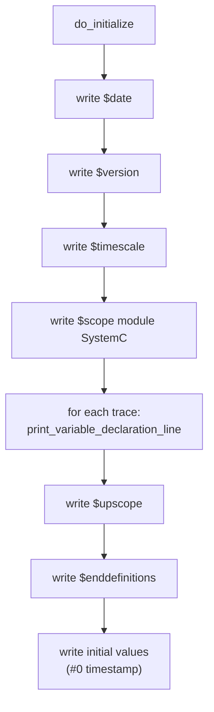
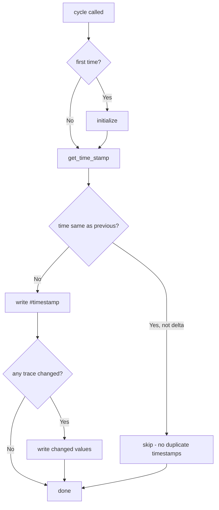

# sc_vcd_trace.h / sc_vcd_trace.cpp - VCD 格式波形追蹤

> 實作 VCD（Value Change Dump）格式的波形檔案輸出。VCD 是最廣泛使用的波形格式，幾乎所有波形檢視工具（GTKWave、Verdi、SimVision）都支援。

## 日常生活比喻

如果追蹤系統是「記者」，VCD 追蹤就是用「逐筆速記法」寫紀錄的記者。他不會每秒鐘都寫下所有球員的位置，而是只在「有人動了」的時候才記一筆。這就是 VCD 格式的精髓——**只記錄值的變化**（Value Change），而不是每個時刻的完整快照。

就像速記用自己的簡寫符號（`!` 代表某位球員，`@` 代表另一位），VCD 也為每個被追蹤的訊號分配一個短短的代號（如 `!`、`"`、`#`），讓檔案盡可能緊湊。

## VCD 檔案格式簡介

一個典型的 VCD 檔案長這樣：

```
$date
   Mar 15, 2026       10:30:00
$end
$version
   SystemC 3.0.0 ...
$end
$timescale
     1 ns
$end
$scope module SystemC $end
$var wire  1  !  clk       $end
$var wire  8  "  data [7:0]  $end
$upscope $end
$enddefinitions  $end

#0
1!
b00000000 "
#10
0!
#20
1!
b11001010 "
```

### 格式要點

| 區段 | 說明 |
|------|------|
| `$date ... $end` | 檔案建立時間 |
| `$version ... $end` | SystemC 版本資訊 |
| `$timescale ... $end` | 時間單位 |
| `$scope` / `$upscope` | 階層範圍（對應模組結構） |
| `$var` | 變數宣告：型別、位寬、代號、名稱 |
| `#<time>` | 時間戳 |
| `<value><code>` | 值變化（1 bit 時如 `1!`，多 bit 時如 `b11001010 "` ） |

## 類別結構

### vcd_trace_file

```cpp
class vcd_trace_file : public sc_trace_file_base
{
public:
    enum vcd_enum { VCD_WIRE=0, VCD_REAL, VCD_EVENT, VCD_TIME, VCD_LAST };

    vcd_trace_file(const char* name);
    ~vcd_trace_file();

    std::vector<vcd_trace*> traces;   // all traced variables
    std::string obtain_name();         // generate next VCD short code

protected:
    void do_initialize();
    void cycle(bool delta_cycle);
    // trace() overloads for all types...

private:
    unsigned vcd_name_index;
    unit_type previous_time_units_low;
    unit_type previous_time_units_high;
};
```

### vcd_trace（內部基底類別）

定義在 `sc_vcd_trace.cpp` 中，對外不可見：

```cpp
class vcd_trace
{
public:
    vcd_trace(const std::string& name_, const std::string& vcd_name_);

    virtual void write(FILE* f) = 0;    // write current value
    virtual bool changed() = 0;         // has value changed?
    virtual void set_width();

    void print_variable_declaration_line(FILE* f, const char* scoped_name);
    void print_data_line(FILE* f, const char* rawdata);
    static const char* strip_leading_bits(const char* originalbuf);

    const std::string name;             // original signal name
    const std::string vcd_name;         // short VCD identifier
    vcd_trace_file::vcd_enum vcd_var_type;
    int bit_width;
};
```

### vcd_T_trace\<T\>（模板子類別）

```cpp
template<class T>
class vcd_T_trace : public vcd_trace
{
    const T& object;    // reference to the traced variable
    T old_value;        // previous value (for change detection)
    // ...
    bool changed() { return object != old_value; }
    void write(FILE* f) { /* format and write current value */ }
};
```

## 核心機制

### 1. VCD 名稱產生

`obtain_name()` 為每個追蹤變數產生唯一的短代號。規則：

```
index 0 -> "!"
index 1 -> "\""
index 2 -> "#"
...
index 93 -> "~"
index 94 -> "!!"
index 95 -> "!\""
...
```

使用 ASCII 可印刷字元（33 `!` 到 126 `~`，共 94 個字元），類似 94 進制編碼。這讓 VCD 檔案極其緊湊——即使追蹤上千個訊號，代號也只需 2-3 個字元。

### 2. 初始化（do_initialize）



### 3. cycle（每時刻記錄）



**重要邏輯**：`cycle()` 會遍歷所有 `traces`，呼叫每個 trace 的 `changed()` 方法。只有值確實改變的訊號才會被寫入——這正是 VCD「Value Change Dump」的核心理念。

### 4. 值格式化

不同型別的值有不同的輸出格式：

| VCD 型別 | 格式範例 | 說明 |
|----------|---------|------|
| `VCD_WIRE`（1-bit） | `1!` 或 `0!` | 值直接跟代號 |
| `VCD_WIRE`（多-bit） | `b11001010 "` | `b` 前綴 + 二進制值 + 空格 + 代號 |
| `VCD_REAL` | `r3.14 #` | `r` 前綴 + 浮點值 + 空格 + 代號 |
| `VCD_EVENT` | `1!` 接下一次 `0!` | 事件觸發時輸出 1，下次時刻自動歸 0 |
| `VCD_TIME` | `r<value> #` | 以 real 型別記錄時間值 |

### 5. 名稱清理

VCD 格式不允許訊號名稱中有 `[` 和 `]` 字元（這些在 VCD 中有特殊含義，用於表示位元範圍）。`remove_vcd_name_problems()` 會將名稱中的 `[` 替換為 `(`，`]` 替換為 `)`。

### 6. strip_leading_bits

多位元值輸出時，會去除多餘的前導位元：

```
b000z100  -> b0z100
b00000xxx -> b0xxx
b000      -> b0
bzzzzz1   -> bz1
b00001    -> b1
```

這樣做是為了壓縮 VCD 檔案大小。

## 公用 API 函式

```cpp
// Create VCD trace file (adds .vcd extension)
sc_trace_file* sc_create_vcd_trace_file(const char* name);

// Close and flush VCD trace file
void sc_close_vcd_trace_file(sc_trace_file* tf);
```

這兩個函式定義在 `sc_vcd_trace.cpp` 底部，是使用者建立和關閉 VCD 追蹤檔案的唯一入口。

## Delta Cycle 追蹤

VCD 格式本身沒有 delta cycle 的概念（它只有「時間」）。SystemC 用一個巧妙的方法模擬：每個 delta cycle 被視為「1 個額外的時間單位」。

例如，在時間 10ns 發生了 3 個 delta cycle：
```
#10
1!
#11
0!
#12
1!
```

這不是真正的時間推進，而是「偽時間步」。開啟時會發出 `SC_ID_TRACING_VCD_DELTA_CYCLE_` 資訊。

## VCD 型別列舉

```cpp
enum vcd_enum { VCD_WIRE=0, VCD_REAL, VCD_EVENT, VCD_TIME, VCD_LAST };
```

| 列舉值 | VCD 關鍵字 | 用途 |
|--------|-----------|------|
| `VCD_WIRE` | `wire` | 數位訊號（bool, logic, integer） |
| `VCD_REAL` | `real` | 浮點數（float, double, sc_fxval） |
| `VCD_EVENT` | `event` | SystemC 事件 |
| `VCD_TIME` | `time` | 時間值 |

## RTL 背景知識

VCD 格式最初是 Verilog 模擬器的標準輸出格式，定義在 IEEE 1364（Verilog 標準）中。它被設計用於記錄數位電路的訊號變化。SystemC 借用了這個格式，讓硬體工程師可以用熟悉的工具（如 GTKWave）來檢視 SystemC 模擬結果。

VCD 中的 `wire` 型別對應 Verilog 的 `wire`/`reg`，`real` 對應 Verilog 的 `real`。`event` 和 `time` 是較少使用的 Verilog 資料型別。

## 相關檔案

- [sc_trace.md](sc_trace.md) — 祖父類別 `sc_trace_file` 和全域 `sc_trace()` 函式
- [sc_trace_file_base.md](sc_trace_file_base.md) — 父類別，提供時間刻度和 callback 機制
- [sc_wif_trace.md](sc_wif_trace.md) — 另一種追蹤格式實作
- [sc_tracing_ids.md](sc_tracing_ids.md) — VCD 特有的錯誤訊息（704, 713）
- `sysc/kernel/sc_ver.h` — 提供 SystemC 版本字串，寫入 VCD header
