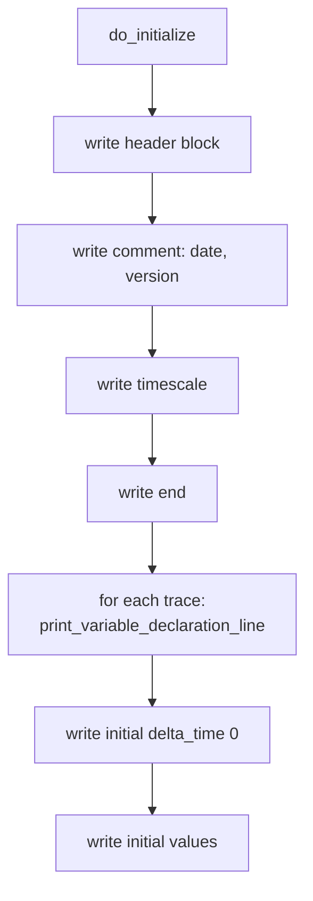
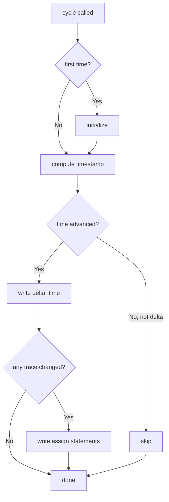

# sc_wif_trace.h / sc_wif_trace.cpp - WIF 格式波形追蹤

> 實作 WIF（Waveform Interchange Format）格式的波形檔案輸出。WIF 是 Synopsys 公司開發的波形格式，主要搭配 Synopsys VSS（VHDL System Simulator）使用。

## 日常生活比喻

如果 VCD 記者用的是「速記簡碼」，WIF 記者用的則是「正式報表格式」——每個變數都有完整的宣告（`declare`），每次記錄都標明「哪個變數在什麼時間變成什麼值」。格式更結構化，但檔案也更大。

就像同一場球賽，一位記者寫簡短的 Twitter 貼文（VCD），另一位記者寫正式的比賽報告（WIF）——內容相同，格式不同。

## WIF 格式簡介

SystemC 產生的是 ASCII WIF 格式（`.awif` 副檔名），可以用 Synopsys 的 `a2wif` 工具轉換為二進制 WIF 格式。

一個典型的 ASCII WIF 檔案長這樣：

```
header
  comment "Generated by SystemC"
  timescale 1 ns
end

declare  sig0   "top.clk"  BIT  variable ;
start_trace sig0 ;
declare  sig1   "top.data"  MVL  0 7 variable ;
start_trace sig1 ;

delta_time 0 ;
assign sig0 '1' ;
assign sig1 "00000000" ;

delta_time 10 ;
assign sig0 '0' ;

delta_time 20 ;
assign sig0 '1' ;
assign sig1 "11001010" ;
```

### 格式要點

| 區段 | 說明 |
|------|------|
| `header ... end` | 檔案元資訊（時間刻度、註解、版本） |
| `declare` | 變數宣告：WIF 名稱、原始名稱、型別、位元範圍 |
| `start_trace` | 開始追蹤該變數 |
| `delta_time <t>` | 時間戳（相對於上一次或絕對時間） |
| `assign <name> <value>` | 變數值更新 |

## 類別結構

### wif_trace_file

```cpp
class wif_trace_file : public sc_trace_file_base
{
public:
    enum wif_enum { WIF_BIT=0, WIF_MVL=1, WIF_REAL=2, WIF_LAST };

    explicit wif_trace_file(const char* name);
    ~wif_trace_file();

    std::vector<wif_trace*> traces;   // all traced variables
    std::string obtain_name();         // generate next WIF variable name

protected:
    void do_initialize();
    void cycle(bool delta_cycle);
    // trace() overloads for all types...

private:
    unsigned wif_name_index;
    unit_type previous_units_low;
    unit_type previous_units_high;
};
```

### wif_trace（內部基底類別）

定義在 `sc_wif_trace.cpp` 中：

```cpp
class wif_trace
{
public:
    wif_trace(const std::string& name_, const std::string& wif_name_);

    virtual void write(FILE* f) = 0;
    virtual bool changed() = 0;
    virtual void set_width();
    virtual void print_variable_declaration_line(FILE* f);

    const std::string name;       // original signal name
    const std::string wif_name;   // WIF variable name (e.g., "sig0")
    const char* wif_type;         // "BIT", "MVL", or "real"
    int bit_width;
};
```

### wif_T_trace\<T\>（模板子類別）

與 VCD 的模板結構相同——持有被追蹤物件的 const reference 和舊值，透過比較偵測變化。

## WIF 與 VCD 的差異

```mermaid
flowchart LR
    subgraph VCD
        direction TB
        V1["代號系統：! \" # ..."]
        V2["值格式：1! 或 b1010 \""]
        V3["時間戳：#100"]
        V4["副檔名：.vcd"]
        V5["開放標準"]
    end
    subgraph WIF
        direction TB
        W1["命名系統：sig0, sig1 ..."]
        W2["值格式：assign sig0 '1'"]
        W3["時間戳：delta_time 100"]
        W4["副檔名：.awif"]
        W5["Synopsys 專有"]
    end
```

| 特性 | VCD | WIF |
|------|-----|-----|
| 變數代號 | 短 ASCII 碼（`!`, `"`, `#`） | 語義化名稱（`sig0`, `sig1`） |
| 值格式 | 緊湊（`1!`） | 明確（`assign sig0 '1'`） |
| 可讀性 | 較低 | 較高 |
| 檔案大小 | 較小 | 較大 |
| 工具支援 | 幾乎所有波形工具 | 主要是 Synopsys 工具 |
| 事件追蹤 | 支援 | 不支援（會報警告） |
| 時間值追蹤 | 支援 | 不支援（會報警告） |

## 核心機制

### 1. WIF 名稱產生

`obtain_name()` 產生的名稱格式為 `"sig0"`, `"sig1"`, `"sig2"`, ...——比 VCD 的 ASCII 碼更直觀，但也更占空間。

### 2. 初始化（do_initialize）



WIF 的變數宣告比 VCD 更詳細：

```
declare  sig0   "top.clk"  BIT  variable ;
start_trace sig0 ;
```

包含：WIF 名稱、原始階層名稱（用引號括起）、資料型別、位元範圍（如果適用）。

### 3. cycle（每時刻記錄）

邏輯與 VCD 相同，但輸出格式不同：



### 4. 值格式化

| WIF 型別 | 格式範例 | 說明 |
|----------|---------|------|
| `WIF_BIT` | `assign sig0 '1' ;` | 單引號括住的 0/1 |
| `WIF_MVL`（1-bit） | `assign sig0 '1' ;` | 同 BIT，但支援 0/1/Z/X |
| `WIF_MVL`（多-bit） | `assign sig1 "11001010" ;` | 雙引號括住的二進制字串 |
| `WIF_REAL` | `assign sig2  3.14 ;` | 直接輸出浮點數 |

### 5. 不支援的追蹤型別

WIF 格式不支援 `sc_event` 和 `sc_time` 的追蹤。嘗試追蹤這些型別時，會發出 `SC_ID_TRACING_OBJECT_IGNORED_` 警告並靜默跳過：

```cpp
void wif_trace_file::trace(const sc_event&, const std::string& name) {
    SC_REPORT_WARNING(SC_ID_TRACING_OBJECT_IGNORED_,
                      "sc_event tracing not supported by WIF format");
}
```

## WIF 型別列舉

```cpp
enum wif_enum { WIF_BIT=0, WIF_MVL=1, WIF_REAL=2, WIF_LAST };
```

| 列舉值 | WIF 關鍵字 | 用途 |
|--------|-----------|------|
| `WIF_BIT` | `BIT` | 純二進制訊號（bool） |
| `WIF_MVL` | `MVL` | 多值邏輯訊號（0, 1, Z, X）— 對應 `sc_logic` |
| `WIF_REAL` | `real` | 浮點數 |

### BIT vs MVL

- `BIT`：只有 0 和 1 兩個值，用於 `bool` 型別
- `MVL`（Multi-Valued Logic）：有 0、1、Z（高阻抗）、X（未知）四個值，用於 `sc_logic` 和整數型別

這反映了數位電路中的四態邏輯——真實的硬體訊號不只有 0 和 1，還有「沒有驅動」（Z）和「衝突/未確定」（X）。

## 公用 API 函式

```cpp
// Create WIF trace file (adds .awif extension)
sc_trace_file* sc_create_wif_trace_file(const char* name);

// Close and flush WIF trace file
void sc_close_wif_trace_file(sc_trace_file* tf);
```

注意副檔名是 `.awif`（ASCII WIF），不是 `.wif`。

## RTL 背景知識

WIF 格式源自 Synopsys 的 VHDL 模擬器 VSS。在早期 EDA 工具鏈中，不同公司有不同的波形格式：

- **VCD**：Verilog 陣營（Cadence 的 Verilog-XL）
- **WIF**：VHDL 陣營（Synopsys 的 VSS）
- **FSDB**：Synopsys 的 Verdi（專有高效格式）

現今 VCD 因為是開放標準而成為主流，WIF 的使用已大幅減少。SystemC 保留 WIF 支援主要是為了向後相容。

## 設計決策

### 為什麼產生 ASCII WIF 而不是 Binary WIF？

原始碼中有明確說明：ASCII 格式可以由任何人產生，不需要 Synopsys 的授權。需要二進制格式的使用者可以用 `a2wif` 工具轉換。這降低了 SystemC 對商業工具的依賴。

### 為什麼 wif_trace_file 的建構函式是 explicit？

防止從 `const char*` 的隱式轉換。雖然 VCD 版本沒有標記 `explicit`（可能是疏忽），WIF 版本遵循了更好的 C++ 實踐。

## 相關檔案

- [sc_trace.md](sc_trace.md) — 祖父類別 `sc_trace_file` 和全域 API
- [sc_trace_file_base.md](sc_trace_file_base.md) — 父類別，提供共用基礎設施
- [sc_vcd_trace.md](sc_vcd_trace.md) — 另一種追蹤格式實作（更常用）
- [sc_tracing_ids.md](sc_tracing_ids.md) — 錯誤訊息 ID
