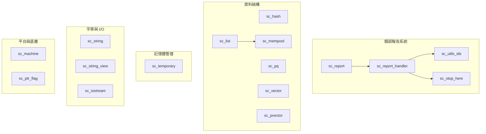

# SystemC Utils - 工具程式庫

## 概述

`sysc/utils/` 目錄包含 SystemC 模擬器所需的各種基礎工具類別與函式。這些工具就像一棟大樓的水電管線——使用者平時不太會直接接觸，但整棟大樓的運作完全依賴它們。

## 子模組分類

### 錯誤報告系統（Error Reporting）
模擬器執行時的「警報系統」，負責收集、分類、處理各種訊息與錯誤。

| 檔案 | 說明 |
|------|------|
| [sc_report.md](sc_report.md) | 錯誤報告物件 — 代表一則報告訊息 |
| [sc_report_handler.md](sc_report_handler.md) | 錯誤報告處理器 — 決定如何處理報告 |
| [sc_utils_ids.md](sc_utils_ids.md) | 報告 ID 定義 — 所有錯誤訊息的編號與文字 |
| [sc_stop_here.md](sc_stop_here.md) | 除錯輔助函式 — 提供斷點設定位置 |

### 資料結構（Data Structures）
模擬器內部使用的各種容器與資料結構。

| 檔案 | 說明 |
|------|------|
| [sc_hash.md](sc_hash.md) | 鏈式雜湊表 — 附帶 MTF 策略的高效查找 |
| [sc_list.md](sc_list.md) | 雙向鏈結串列 — 簡單的雙向鏈結串列實作 |
| [sc_pq.md](sc_pq.md) | 優先佇列 — 用於事件排程的二元堆積 |
| [sc_vector.md](sc_vector.md) | 具名物件向量 — IEEE 1666 標準的 `sc_vector` |
| [sc_pvector.md](sc_pvector.md) | 指標向量 — 舊式內部用指標向量 |

### 記憶體管理（Memory Management）
小物件的高效記憶體管理。

| 檔案 | 說明 |
|------|------|
| [sc_mempool.md](sc_mempool.md) | 記憶體池 — 小物件的快速配置與釋放 |
| [sc_temporary.md](sc_temporary.md) | 暫存值池 — 固定大小的環形暫存物件池 |

### 字串與 I/O（String & I/O）
字串處理與輸入輸出相關的輔助工具。

| 檔案 | 說明 |
|------|------|
| [sc_string.md](sc_string.md) | 字串工具 — 數字表示法列舉與 I/O 輔助 |
| [sc_string_view.md](sc_string_view.md) | 字串視圖 — 不擁有記憶體的常數字串參照 |
| [sc_iostream.md](sc_iostream.md) | I/O 串流標頭 — 可攜式 iostream 包裝 |

### 平台與底層（Platform & Low-level）
平台偵測、位元操作等底層工具。

| 檔案 | 說明 |
|------|------|
| [sc_machine.md](sc_machine.md) | 機器環境偵測 — 位元序與資料大小偵測 |
| [sc_ptr_flag.md](sc_ptr_flag.md) | 指標旗標 — 在指標的最低位元儲存布林旗標 |

## 模組關係圖

## 設計理念

這些工具類別的設計有幾個共通特點：

1. **自給自足**：SystemC 最早開發時 C++ 標準庫還不成熟，因此許多容器（如 `sc_list`、`sc_pvector`、`sc_hash`）都是自行實作的。
2. **效能優先**：`sc_mempool` 提供小物件的快速配置，避免頻繁呼叫系統 `malloc`。
3. **可攜性**：`sc_machine.h` 和 `sc_iostream.h` 封裝了平台差異。
4. **向後相容**：許多舊式 API（如整數 ID 報告）仍然保留，但標記為已棄用。
