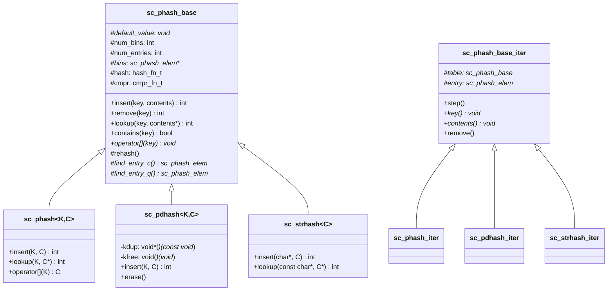

# sc_hash - 鏈式雜湊表

## 概述

`sc_hash` 實作了一套鏈式雜湊表（chained hash table），附帶 MTF（Move-To-Front，移至前端）優化策略。這是 SystemC 內部使用的高效查找資料結構，用於模擬器核心中需要快速鍵值查詢的場景。

**來源檔案**：`sysc/utils/sc_hash.h` + `sc_hash.cpp`

## 生活比喻

想像一個大型圖書館的索引卡片系統：

- **雜湊函式**就像「依書名第一個字分類」的規則，把書分配到不同的抽屜
- **鏈式儲存**就是每個抽屜裡的卡片用鏈條串在一起
- **MTF 策略**就像「最近被查閱的卡片放到最前面」——如果你昨天查了某本書，今天再查同一本會更快找到

## 核心設定常數

```cpp
const int    PHASH_DEFAULT_MAX_DENSITY     = 5;    // 每個桶最多 5 個元素
const int    PHASH_DEFAULT_INIT_TABLE_SIZE = 11;   // 初始桶數（質數）
const double PHASH_DEFAULT_GROW_FACTOR;            // 擴展倍率
const bool   PHASH_DEFAULT_REORDER_FLAG    = true; // 預設啟用 MTF
```

## 類別層次



## sc_phash_base — 基礎類別

### 建構子

```cpp
sc_phash_base(
    void* def       = 0,                            // 預設值
    int   size      = PHASH_DEFAULT_INIT_TABLE_SIZE, // 初始桶數
    int   density   = PHASH_DEFAULT_MAX_DENSITY,     // 最大密度
    double grow     = PHASH_DEFAULT_GROW_FACTOR,     // 擴展倍率
    bool   reorder  = PHASH_DEFAULT_REORDER_FLAG,    // 是否啟用 MTF
    hash_fn_t hash_fn = default_ptr_hash_fn,         // 雜湊函式
    cmpr_fn_t cmpr_fn = 0                            // 比較函式
);
```

### 查找策略

有兩種查找方式：
- `find_entry_q()`：快速比對（quick），使用指標相等比較（`cmpr == 0` 時）
- `find_entry_c()`：自訂比對（compare），使用使用者提供的比較函式

### 自動擴展（Rehash）

當 `num_entries / num_bins > max_density` 時，會觸發 `rehash()`，將桶數乘以 `grow_factor` 並重新分配所有元素。

### 主要操作

| 方法 | 說明 |
|------|------|
| `insert(key, contents)` | 插入鍵值對，若已存在則覆蓋 |
| `insert_if_not_exists(key, contents)` | 只在不存在時插入 |
| `remove(key)` | 移除指定鍵 |
| `remove_by_contents(contents)` | 依內容值移除 |
| `lookup(key, contents*)` | 查找鍵對應的值 |
| `contains(key)` | 檢查鍵是否存在 |
| `operator[](key)` | 取得鍵對應的值 |

## sc_phash — 型別安全的雜湊表

模板類別 `sc_phash<K, C>` 包裝 `sc_phash_base`，提供型別安全的介面。所有指標轉型都在模板方法中完成。

## sc_pdhash — 帶記憶體管理的雜湊表

`sc_pdhash<K, C>` 額外提供鍵的複製（`kdup`）和釋放（`kfree`）函式，適用於需要擁有鍵的場景。解構時會自動釋放所有鍵。

## sc_strhash — 字串鍵雜湊表

`sc_strhash<C>` 專門用於以字串為鍵的場景，預設使用：
- `default_str_hash_fn` 作為雜湊函式
- `sc_strhash_cmp` 作為比較函式（`strcmp` 語意）
- `sc_strhash_kdup` 和 `sc_strhash_kfree` 管理字串記憶體

## 預定義雜湊函式

```cpp
unsigned default_int_hash_fn(const void*);  // 整數雜湊
unsigned default_ptr_hash_fn(const void*);  // 指標雜湊
unsigned default_str_hash_fn(const void*);  // 字串雜湊
```

## 設計備註

這套雜湊表是在 C++ 標準函式庫的 `unordered_map` 普及之前設計的。現代 C++ 專案通常直接使用 `std::unordered_map`，但 SystemC 核心為了向後相容和內部效能考量，仍然保留了這套實作。

## 相關檔案

- [sc_list.md](sc_list.md) — 另一種內部資料結構
- [sc_mempool.md](sc_mempool.md) — 雜湊表節點可能使用的記憶體池
