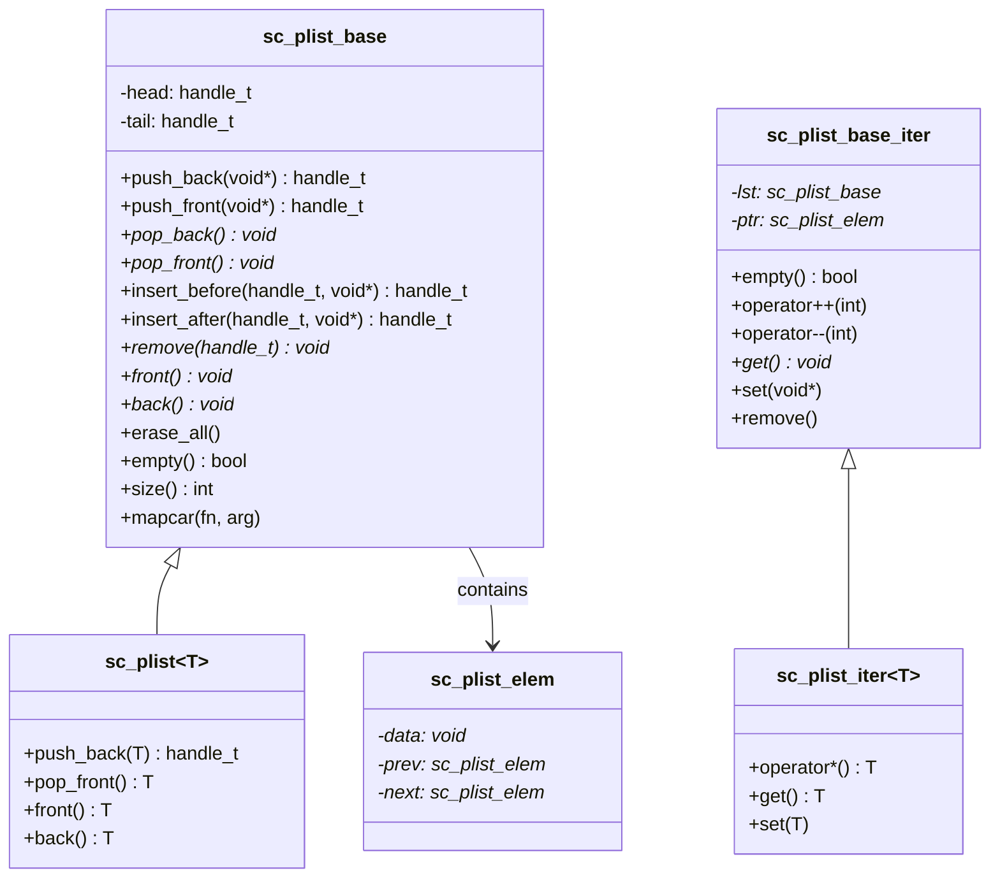

# sc_list - 雙向鏈結串列

## 概述

`sc_list` 提供了一個簡單的雙向鏈結串列（doubly linked list）實作。它是 SystemC 內部使用的容器，節點的記憶體配置透過 `sc_mempool` 進行，以提升小物件配置的效能。

**來源檔案**：`sysc/utils/sc_list.h` + `sc_list.cpp`

## 生活比喻

想像一列火車車廂：
- 每個車廂（`sc_plist_elem`）裝著一份貨物（`data`）
- 每個車廂都有向前和向後的連接器（`prev` 和 `next`）
- 你可以在車頭或車尾掛新車廂（`push_front` / `push_back`）
- 也可以在任意車廂前後插入新車廂（`insert_before` / `insert_after`）
- 移除車廂時，兩側的車廂會自動重新連接

## 類別結構



## sc_plist_elem — 節點

```cpp
class sc_plist_elem {
    void* data;
    sc_plist_elem* prev;
    sc_plist_elem* next;
};
```

節點使用 `sc_mempool` 進行記憶體配置（覆寫了 `operator new` 和 `operator delete`），這對於頻繁建立和刪除的小物件特別有效率。

## sc_plist_base — 基礎串列

### 主要操作

| 方法 | 時間複雜度 | 說明 |
|------|-----------|------|
| `push_back(d)` | O(1) | 在尾部加入元素 |
| `push_front(d)` | O(1) | 在頭部加入元素 |
| `pop_back()` | O(1) | 移除並回傳尾部元素 |
| `pop_front()` | O(1) | 移除並回傳頭部元素 |
| `insert_before(h, d)` | O(1) | 在指定位置前插入 |
| `insert_after(h, d)` | O(1) | 在指定位置後插入 |
| `remove(h)` | O(1) | 移除指定位置的元素 |
| `size()` | O(n) | 計算元素數量（需遍歷） |
| `mapcar(fn, arg)` | O(n) | 對每個元素執行函式 |

注意 `size()` 是 O(n)，因為串列沒有維護計數器。

### 錯誤處理

`front()` 和 `back()` 在串列為空時會觸發 `SC_REPORT_ERROR`：
- `SC_ID_FRONT_ON_EMPTY_LIST_` — 對空串列呼叫 `front()`
- `SC_ID_BACK_ON_EMPTY_LIST_` — 對空串列呼叫 `back()`

## sc_plist\<T\> — 型別安全包裝

模板類別 `sc_plist<T>` 繼承 `sc_plist_base`，將 `void*` 轉型為模板參數 `T`，提供型別安全的介面。

## sc_plist_iter — 迭代器

迭代器支援雙向遍歷：
- `operator++(int)` — 前進到下一個元素
- `operator--(int)` — 後退到前一個元素
- `remove()` — 移除當前元素並自動前進
- `remove(direction)` — 移除當前元素，`direction=1` 前進，否則後退

## 相關檔案

- [sc_mempool.md](sc_mempool.md) — 節點記憶體由此配置
- [sc_hash.md](sc_hash.md) — 另一種內部資料結構
- [sc_utils_ids.md](sc_utils_ids.md) — 定義了空串列錯誤的訊息 ID
