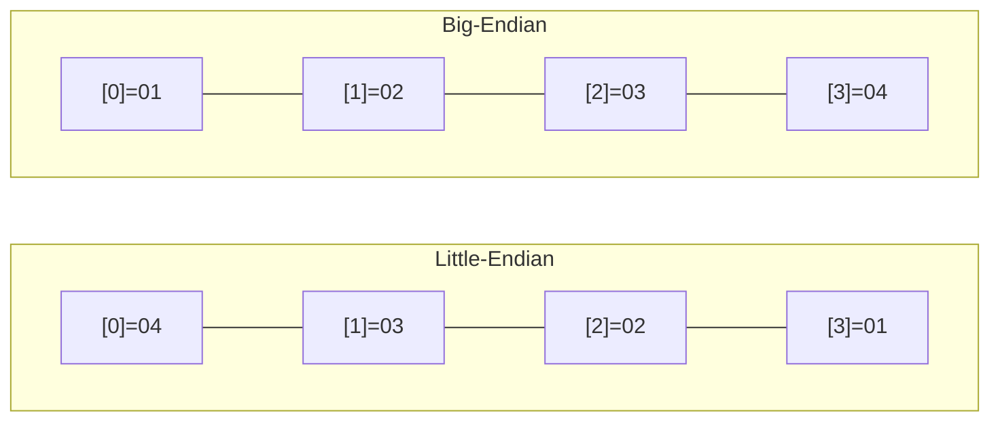

# sc_machine - 機器環境偵測

## 概述

`sc_machine.h` 負責偵測編譯目標平台的硬體特性，主要包含位元序（endianness）和 `long` 資料型別的大小。這些資訊被 SystemC 的資料型別模組用來正確地進行位元操作。

**來源檔案**：`sysc/utils/sc_machine.h`（僅標頭檔）

## 生活比喻

想像你收到一箱國際郵件：
- **Little-endian**：地址的寫法是「巷→路→區→市→國」（小的在前面）
- **Big-endian**：地址的寫法是「國→市→區→路→巷」（大的在前面）

不同的 CPU 用不同的順序排列位元組。如果不知道對方的「書寫方向」，資料就會被讀反。`sc_machine.h` 就是用來確認「這台電腦的書寫方向」。

## 位元序偵測

```cpp
#if defined(_MSC_VER) && !defined(__BYTE_ORDER__)
    // MSVC 目標平台都是 little-endian
    #define SC_LITTLE_ENDIAN
#elif __BYTE_ORDER__ == __ORDER_LITTLE_ENDIAN__
    #define SC_LITTLE_ENDIAN
#elif __BYTE_ORDER__ == __ORDER_BIG_ENDIAN__
    #define SC_BIG_ENDIAN
#else
    #error "Could not detect the endianness of the CPU."
#endif
```

偵測邏輯：
1. MSVC（Microsoft Visual C++）：所有支援的平台（x86、x64、ARM、ARM64）都是 little-endian
2. GCC/Clang：使用編譯器預定義的 `__BYTE_ORDER__` 巨集
3. 其他：編譯錯誤

### Little-endian vs Big-endian

以 32 位元整數 `0x01020304` 為例：

| 位元序 | 位址 0 | 位址 1 | 位址 2 | 位址 3 |
|--------|--------|--------|--------|--------|
| Little-endian | 04 | 03 | 02 | 01 |
| Big-endian | 01 | 02 | 03 | 04 |



## long 資料型別大小偵測

```cpp
#if ULONG_MAX > 0xffffffffUL
    #define SC_LONG_64
#endif
```

如果 `unsigned long` 的最大值超過 32 位元的範圍，就定義 `SC_LONG_64`。這在不同平台上有不同的結果：

| 平台 | sizeof(long) | SC_LONG_64 |
|------|-------------|------------|
| Linux x86_64 | 8 bytes | 有定義 |
| Windows x64 (MSVC) | 4 bytes | 未定義 |
| macOS ARM64 | 8 bytes | 有定義 |

這個差異對 SystemC 的定點數和位元向量型別很重要。

## 相關檔案

- [sc_ptr_flag.md](sc_ptr_flag.md) — 利用指標對齊特性儲存旗標
