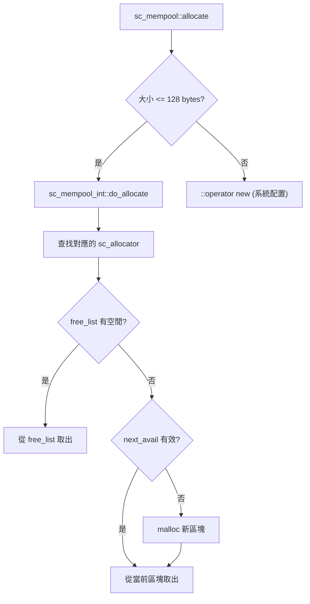

# sc_mempool - 小物件記憶體池

## 概述

`sc_mempool` 提供了一套專為小物件設計的記憶體池管理機制。它比直接呼叫 `malloc/new` 更快，特別適合模擬器中大量小物件頻繁建立與銷毀的場景。

**來源檔案**：`sysc/utils/sc_mempool.h` + `sc_mempool.cpp`

## 生活比喻

想像一家文具店的零件收納盒：

- 不同大小的零件（螺絲、螺帽、墊片）放在不同格子裡
- 需要某個大小的零件時，直接從對應的格子裡拿（比跑去五金行買快多了）
- 用完放回對應的格子（而不是丟掉重新買）
- 如果格子裡沒有了，才去批發一整盒新的（分配新的記憶體區塊）

`sc_mempool` 就是這樣的「零件收納系統」：它把不同大小的記憶體請求導向不同的配置器（allocator），每個配置器管理固定大小的記憶體格子。

## 公開介面

```cpp
class sc_mempool {
public:
    static void* allocate(std::size_t sz);      // 配置記憶體
    static void  release(void* p, std::size_t sz); // 釋放記憶體
    static void  display_statistics();           // 顯示統計資訊
};
```

### sc_mpobject — 自動使用記憶體池的基礎類別

```cpp
class sc_mpobject {
public:
    static void* operator new(std::size_t sz);
    static void  operator delete(void* p, std::size_t sz);
    static void* operator new[](std::size_t sz);
    static void  operator delete[](void* p, std::size_t sz);
};
```

任何繼承 `sc_mpobject` 的類別，其 `new` 和 `delete` 都會自動使用記憶體池。

## 內部架構



## sc_allocator — 單一大小的配置器

每個 `sc_allocator` 管理一種固定大小的記憶體格子：

```cpp
class sc_allocator {
    int block_size;       // 每個區塊的大小（包含鏈結）
    int cell_size;        // 每個格子的大小
    char* block_list;     // 已配置的區塊鏈表
    link* free_list;      // 空閒格子的鏈表
    char* next_avail;     // 當前區塊中下一個可用的格子
};
```

配置策略（按優先順序）：
1. **free_list**：如果有之前釋放的格子，直接重用
2. **next_avail**：如果當前區塊還有空間，使用下一個可用格子
3. **新區塊**：以上都沒有，用 `malloc` 配置一整個新區塊

## 大小對應表

```
大小 (bytes)     配置器
───────────────────────
  1 -  8          #1 ( 8 bytes)
  9 - 16          #2 (16 bytes)
 17 - 24          #3 (24 bytes)
 25 - 32          #4 (32 bytes)
 33 - 48          #5 (48 bytes)
 49 - 64          #6 (64 bytes)
 65 - 80          #7 (80 bytes)
 81 - 96          #8 (96 bytes)
 97 - 128         #9 (128 bytes)
```

大於 128 bytes 的請求會直接使用系統的 `::operator new`。

## 環境變數控制

```
SYSTEMC_MEMPOOL_DONT_USE=1
```

設定此環境變數可以完全停用記憶體池，所有配置都改用系統 `::operator new`。這在使用 Valgrind 或 AddressSanitizer 等記憶體檢查工具時很有用。

## 設計注意事項

1. **記憶體永不釋放**：配置的區塊不會被歸還給系統，直到程式結束。這是有意的設計，因為全域物件可能在解構順序上有依賴。
2. **對齊保證**：依賴 `malloc` 回傳正確對齊的記憶體。
3. **執行緒安全**：不是執行緒安全的（與 SystemC 單執行緒模型一致）。
4. **單例模式**：`the_mempool` 是一個全域靜態指標，延遲初始化。

## 相關檔案

- [sc_list.md](sc_list.md) — 鏈結串列的節點使用 `sc_mempool` 配置
- [sc_temporary.md](sc_temporary.md) — 另一種記憶體管理策略（環形池）
