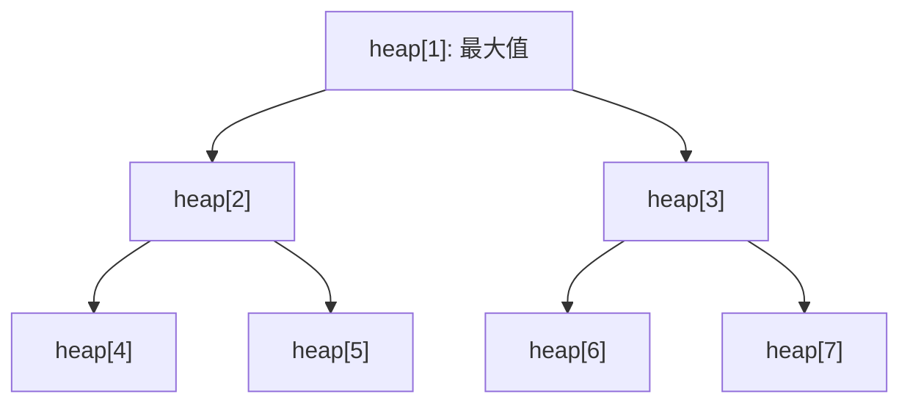

# sc_pq - 優先佇列

## 概述

`sc_pq` 實作了一個基於二元堆積（binary heap）的優先佇列（priority queue）。它可以用來為多個時鐘建模——總是能快速取出「下一個最早發生的事件」。

**來源檔案**：`sysc/utils/sc_pq.h` + `sc_pq.cpp`

## 生活比喻

想像一家醫院急診室的「分級制度」：

- 病患到達時，護理師依照嚴重程度打分數
- 最嚴重的病患永遠排在最前面
- 即使後來才到，只要分數更高就會被優先處理
- 每次醫生看完一個病患，下一個最嚴重的就會自動排到最前面

這就是優先佇列：不管元素插入的順序，`top()` 永遠回傳優先權最高的元素。

## 二元堆積原理

二元堆積是一棵完全二元樹，用陣列實作：



陣列索引關係（從 1 開始）：
- 父節點：`i >> 1`（等同 `i / 2`）
- 左子節點：`i << 1`（等同 `i * 2`）
- 右子節點：`(i << 1) + 1`（等同 `i * 2 + 1`）

## sc_ppq_base — 基礎類別

```cpp
class sc_ppq_base {
public:
    typedef int (*compare_fn_t)(const void*, const void*);

    sc_ppq_base(int sz, compare_fn_t cmp);
    ~sc_ppq_base();

    void* top() const;         // 取得最高優先權元素（不移除）
    void* extract_top();       // 取出最高優先權元素
    void  insert(void* elem);  // 插入新元素
    int   size() const;        // 元素數量
    bool  empty() const;       // 是否為空
};
```

### 比較函式

```cpp
typedef int (*compare_fn_t)(const void*, const void*);
```

比較函式回傳值：
- 正值：第一個參數優先
- 零：相同優先權
- 負值：第二個參數優先

### 自動擴展

當堆積滿了時，`insert()` 會自動擴展：
```
new_size = old_size + old_size / 2  (1.5 倍)
```

### 操作時間複雜度

| 操作 | 時間複雜度 |
|------|-----------|
| `top()` | O(1) |
| `extract_top()` | O(log n) |
| `insert()` | O(log n) |
| `size()` | O(1) |
| `empty()` | O(1) |

## sc_ppq\<T\> — 型別安全模板

```cpp
template <class T>
class sc_ppq : public sc_ppq_base {
public:
    sc_ppq(int sz, compare_fn_t cmp);
    T top() const;
    T extract_top();
    void insert(T elem);
};
```

模板版本只是在基礎類別上加了型別轉換，不需要額外的儲存空間。

## 在 SystemC 中的應用

優先佇列在 SystemC 模擬器核心中主要用於：
- **事件排程**：下一個該發生的事件總是在佇列頂部
- **多時鐘管理**：不同頻率的時鐘各自產生事件，優先佇列負責排序

## 相關檔案

- [sc_list.md](sc_list.md) — 另一種內部資料結構
- [sc_hash.md](sc_hash.md) — 另一種內部資料結構
