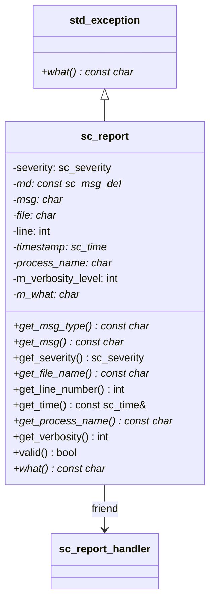

# sc_report - 執行時期錯誤報告物件

## 概述

`sc_report` 是 SystemC 錯誤報告系統的核心類別，代表一則執行時期產生的報告訊息。它繼承自 `std::exception`，因此可以像一般 C++ 例外一樣被 `throw` 和 `catch`。

**來源檔案**：`sysc/utils/sc_report.h` + `sc_report.cpp`

## 生活比喻

想像你在一家大型工廠裡工作。工廠有一套「事件通報系統」：

- **SC_INFO**：佈告欄上的一般公告 — 「今天中午有團購便當」
- **SC_WARNING**：黃色警告燈亮起 — 「某條生產線溫度偏高，請留意」
- **SC_ERROR**：紅色警報 — 「某條生產線故障，必須停下來處理」
- **SC_FATAL**：全廠緊急警報 — 「偵測到瓦斯外洩，立即疏散」

每一張通報單（`sc_report`）上面記載了：通報的嚴重程度、出了什麼事、在哪個檔案哪一行發生、當時的模擬時間、以及哪個程序（process）正在執行。

## 核心列舉

### sc_severity — 嚴重程度

```cpp
enum sc_severity {
    SC_INFO = 0,        // 純粹資訊
    SC_WARNING,         // 潛在問題警告
    SC_ERROR,           // 確定的錯誤
    SC_FATAL,           // 無法恢復的致命錯誤
    SC_MAX_SEVERITY
};
```

### sc_verbosity — 詳細程度

```cpp
enum sc_verbosity {
    SC_NONE = 0,
    SC_LOW = 100,
    SC_MEDIUM = 200,    // 預設
    SC_HIGH = 300,
    SC_FULL = 400,
    SC_DEBUG = 500
};
```

詳細程度就像新聞報導的詳略程度：`SC_LOW` 只報標題，`SC_DEBUG` 連記者的採訪筆記都附上。只有當訊息的詳細程度 <= 系統設定的最大詳細程度時，訊息才會被處理。

### sc_actions — 動作旗標

```cpp
typedef unsigned sc_actions;
enum {
    SC_UNSPECIFIED  = 0x0000, // 查找低優先權規則
    SC_DO_NOTHING   = 0x0001, // 不做任何事
    SC_THROW        = 0x0002, // 丟出例外
    SC_LOG          = 0x0004, // 寫入日誌
    SC_DISPLAY      = 0x0008, // 顯示到螢幕
    SC_CACHE_REPORT = 0x0010, // 快取報告
    SC_INTERRUPT    = 0x0020, // 呼叫中斷函式
    SC_STOP         = 0x0040, // 停止模擬
    SC_ABORT        = 0x0080, // 呼叫 abort()
};
```

這些動作可以用位元 OR 組合，例如 `SC_LOG | SC_DISPLAY` 表示「既寫日誌又顯示到螢幕」。

預設動作對應表：

| 嚴重程度 | 預設動作 |
|---------|---------|
| SC_INFO | SC_LOG \| SC_DISPLAY |
| SC_WARNING | SC_LOG \| SC_DISPLAY |
| SC_ERROR | SC_LOG \| SC_CACHE_REPORT \| SC_THROW |
| SC_FATAL | SC_LOG \| SC_DISPLAY \| SC_CACHE_REPORT \| SC_ABORT |

## sc_report 類別

```cpp
class sc_report : public std::exception {
public:
    const char* get_msg_type() const;      // 訊息類型字串
    const char* get_msg() const;           // 訊息內容
    sc_severity get_severity() const;      // 嚴重程度
    const char* get_file_name() const;     // 發生的原始碼檔案名稱
    int get_line_number() const;           // 發生的行號
    const sc_time& get_time() const;       // 發生的模擬時間
    const char* get_process_name() const;  // 當前執行程序名稱
    int get_verbosity() const;             // 詳細程度
    bool valid() const;                    // 是否有效
    virtual const char* what() const noexcept; // std::exception 介面
};
```

### 成員資料

| 成員 | 型別 | 說明 |
|------|------|------|
| `severity` | `sc_severity` | 嚴重程度 |
| `md` | `const sc_msg_def*` | 指向訊息定義結構 |
| `msg` | `char*` | 訊息內容（動態配置的複本） |
| `file` | `char*` | 原始碼檔案名稱 |
| `line` | `int` | 行號 |
| `timestamp` | `sc_time*` | 模擬時間戳記 |
| `process_name` | `char*` | 程序名稱 |
| `m_verbosity_level` | `int` | 詳細程度 |
| `m_what` | `char*` | 組合後的完整訊息字串 |

### 記憶體管理

`sc_report` 內部使用 `empty_dup()` 函式來複製字串。若傳入空指標或空字串，會回傳一個全域的 `empty_str` 靜態變數，避免不必要的記憶體配置。解構時只有非 `empty_str` 的字串才會被 `delete[]`。

## 報告巨集

```cpp
SC_REPORT_INFO(msg_type, msg)            // 資訊報告
SC_REPORT_INFO_VERB(msg_type, msg, verb) // 帶詳細程度的資訊報告
SC_REPORT_WARNING(msg_type, msg)         // 警告報告
SC_REPORT_ERROR(msg_type, msg)           // 錯誤報告
SC_REPORT_FATAL(msg_type, msg)           // 致命錯誤報告
```

`SC_REPORT_INFO_VERB` 會先檢查詳細程度是否在允許範圍內，低於門檻值的訊息會被直接忽略。`__FILE__` 和 `__LINE__` 會自動填入。

## sc_assert 巨集

```cpp
sc_assert(expr)
```

類似標準 `assert()`，但額外印出當前程序名稱和模擬時間。若 `NDEBUG` 有定義且 `SC_ENABLE_ASSERTIONS` 未定義，則 `sc_assert` 會被編譯為空操作。

## sc_abort 函式

```cpp
[[noreturn]] void sc_abort();
```

類似 `abort()`，但會先產生一則 `SC_ID_ABORT_` 報告再終止程式。

## 向後相容 API（已棄用）

以下靜態方法使用整數 ID，屬於 SystemC 2.0 時代的舊式 API，現已棄用：

- `register_id(int, const char*)` — 註冊整數 ID
- `get_message(int)` — 取得 ID 對應的訊息
- `is_suppressed(int)` — 查詢 ID 是否被抑制
- `suppress_id(int, bool)` — 抑制特定 ID
- `suppress_infos(bool)` / `suppress_warnings(bool)` — 全面抑制資訊/警告

這些方法內部都會呼叫 `sc_deprecated_report_ids()` 印出棄用警告。

## 類別關係圖



## 相關檔案

- [sc_report_handler.md](sc_report_handler.md) — 報告處理器，決定報告的處理方式
- [sc_utils_ids.md](sc_utils_ids.md) — 預定義的報告 ID
- [sc_stop_here.md](sc_stop_here.md) — 除錯用中斷/停止函式
