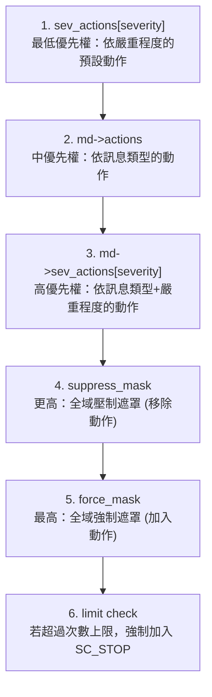

# sc_report_handler - 錯誤報告處理器

## 概述

`sc_report_handler` 是 SystemC 報告系統的「中樞指揮台」，負責接收所有報告、決定對每則報告執行什麼動作（顯示、記錄、丟出例外、中止等），並管理訊息類型定義、計數器、日誌檔案等。

**來源檔案**：`sysc/utils/sc_report_handler.h` + `sc_report_handler.cpp`

## 生活比喻

想像一座城市的 119 消防指揮中心：

- 所有報案電話（`report()`）都先打到這裡
- 指揮中心有一本「標準作業程序」（`sev_actions`），根據事件嚴重程度決定要派幾台車
- 還有一本「特定地址處理手冊」（`sc_msg_def` 鏈表），某些特定地址可能有特殊處理規則
- 指揮中心可以設定「每種事件最多出勤 N 次」（`stop_after`），超過次數就停止模擬
- 也可以全面壓制某些動作（`suppress`）或強制執行某些動作（`force`）

## sc_msg_def 結構

```cpp
struct sc_msg_def {
    const char*  msg_type;                    // 訊息類型字串
    sc_actions   actions;                     // 此類型的動作
    sc_actions   sev_actions[SC_MAX_SEVERITY]; // 各嚴重程度的動作
    unsigned     limit;                       // 次數上限
    unsigned     sev_limit[SC_MAX_SEVERITY];  // 各嚴重程度的次數上限
    unsigned     limit_mask;                  // 位元遮罩，指示哪些上限有效
    unsigned     call_count;                  // 呼叫計數
    unsigned     sev_call_count[SC_MAX_SEVERITY]; // 各嚴重程度的呼叫計數
    char*        msg_type_data;               // 訊息類型字串的資料儲存
    int          id;                          // 向後相容的整數 ID
};
```

每個 `sc_msg_def` 就像一張「事件處理卡」，記載著這種事件該怎麼處理、已經發生幾次、最多容許幾次。

## sc_report_handler 類別

### 報告方法

```cpp
// 主要報告介面
static void report(sc_severity, const char* msg_type,
                   const char* msg, const char* file, int line);

// 帶詳細程度的報告介面
static void report(sc_severity, const char* msg_type,
                   const char* msg, int verbosity,
                   const char* file, int line);
```

### 動作設定

```cpp
// 依嚴重程度設定動作
static sc_actions set_actions(sc_severity, sc_actions = SC_UNSPECIFIED);

// 依訊息類型設定動作
static sc_actions set_actions(const char* msg_type, sc_actions = SC_UNSPECIFIED);

// 依訊息類型 + 嚴重程度設定動作（最高優先權）
static sc_actions set_actions(const char* msg_type, sc_severity, sc_actions = SC_UNSPECIFIED);
```

### 次數限制

```cpp
static int stop_after(sc_severity, int limit = -1);
static int stop_after(const char* msg_type, int limit = -1);
static int stop_after(const char* msg_type, sc_severity, int limit = -1);
```

`limit = -1` 表示禁用限制，`limit = 0` 也表示禁用（不會觸發停止）。

### 全域遮罩

```cpp
static sc_actions suppress(sc_actions);  // 全域壓制某些動作
static sc_actions force(sc_actions);     // 全域強制某些動作
```

## 動作優先權機制

這是 `sc_report_handler` 最重要的設計之一。決定最終動作時，會依照以下優先權從低到高查找：



如果某一層的值為 `SC_UNSPECIFIED`，就往下一層查找。

## 預設處理器

```cpp
static void default_handler(const sc_report& rep, const sc_actions& actions);
```

預設處理器根據動作旗標依序執行：
1. `SC_DISPLAY`：輸出到 `std::cout`
2. `SC_LOG`：寫入日誌檔案
3. `SC_STOP`：呼叫 `sc_stop_here()` 然後 `sc_stop()`
4. `SC_INTERRUPT`：呼叫 `sc_interrupt_here()`
5. `SC_ABORT`：呼叫 `sc_abort()`
6. `SC_THROW`：丟出 `sc_report` 例外

使用者可透過 `set_handler()` 替換為自訂處理器。

## 訊息定義管理

### 靜態註冊

```cpp
struct msg_def_items {
    sc_msg_def*     md;        // 訊息定義陣列
    int             count;     // 陣列中的項目數
    bool            allocated; // 是否為動態配置
    msg_def_items*  next;      // 鏈結串列的下一個
};

static void add_static_msg_types(msg_def_items*);
```

訊息定義以鏈結串列的方式管理。各模組（kernel、communication、datatypes 等）在程式初始化時透過 `add_static_msg_types()` 把自己的訊息定義加入鏈表。

### 動態新增

```cpp
static sc_msg_def* add_msg_type(const char* msg_type);
```

若透過 `set_actions()` 或 `stop_after()` 引用了尚未註冊的訊息類型，會自動呼叫 `add_msg_type()` 建立新的定義。

## 日誌檔案

```cpp
static bool set_log_file_name(const char* filename);
static const char* get_log_file_name();
```

日誌檔案由內部類別 `sc_log_file_handle` 管理，使用 `std::ofstream` 實作。每當有 `SC_LOG` 動作的報告產生時，會自動寫入日誌。

## 初始化與釋放

```cpp
static void initialize(); // 重置計數器
static void release();    // 釋放所有動態配置的訊息定義
```

`initialize()` 會檢查環境變數 `SC_DEPRECATION_WARNINGS`，若設為 `"DISABLE"` 則關閉棄用警告。

## 訊息組合

```cpp
const std::string sc_report_compose_message(const sc_report& rep);
```

這個函式負責將 `sc_report` 的各項資訊組合成人類可讀的字串，格式如：
```
Error: (E3) msg_type: message
In file: filename.cpp:42
In process: top.module.process @ 100 ns
```

## 靜態變數一覽

| 變數 | 說明 |
|------|------|
| `suppress_mask` | 全域壓制遮罩 |
| `force_mask` | 全域強制遮罩 |
| `sev_actions[]` | 各嚴重程度的預設動作 |
| `sev_limit[]` | 各嚴重程度的次數上限 |
| `sev_call_count[]` | 各嚴重程度的累計次數 |
| `last_global_report` | 最後一筆全域報告的快取 |
| `available_actions` | 已使用的動作位元 |
| `handler` | 當前的處理器函式指標 |
| `log_file_name` | 日誌檔案名稱 |
| `verbosity_level` | 詳細程度門檻值 |
| `messages` | 訊息定義鏈表頭 |
| `catch_actions` | 捕獲例外時的預設動作 |

## 相關檔案

- [sc_report.md](sc_report.md) — 報告物件
- [sc_utils_ids.md](sc_utils_ids.md) — 報告 ID 定義
- [sc_stop_here.md](sc_stop_here.md) — 除錯用中斷函式
