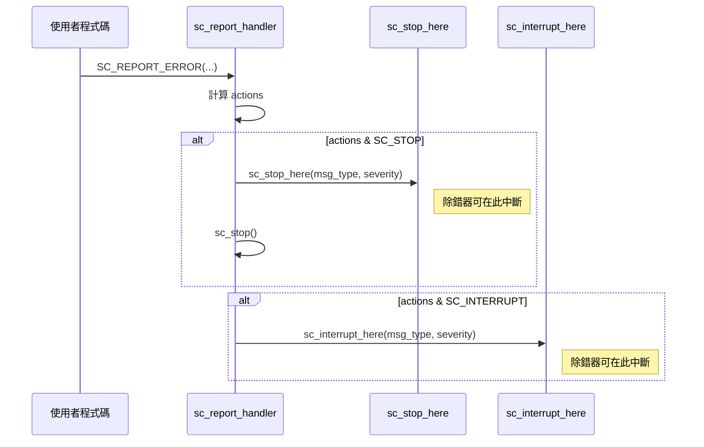

# sc_stop_here - 除錯輔助函式

## 概述

`sc_stop_here` 提供兩個專門為除錯設計的函式：`sc_stop_here()` 和 `sc_interrupt_here()`。這些函式本身幾乎不做任何事，它們存在的唯一目的就是讓開發者可以在 GDB 等除錯器中設定斷點。

**來源檔案**：`sysc/utils/sc_stop_here.h` + `sc_stop_here.cpp`

## 生活比喻

想像高速公路上的「休息站」。休息站本身不提供什麼服務，但它給了你一個明確的地點可以停下來喘口氣、檢查車況。`sc_stop_here()` 就是模擬器裡的「休息站」——當錯誤發生時，你可以在這裡停下來，用除錯器檢查程式的狀態。

## 函式介面

```cpp
void sc_interrupt_here(const char* id, sc_severity severity);
void sc_stop_here(const char* id, sc_severity severity);
```

這兩個函式都不能被內聯（inline），這是刻意的——如果被內聯了，就沒辦法在固定的地址設定斷點。

## 實作細節

```cpp
static const char* info_id    = 0;
static const char* warning_id = 0;
static const char* error_id   = 0;
static const char* fatal_id   = 0;

void sc_interrupt_here(const char* id, sc_severity severity) {
    switch(severity) {
      case SC_INFO:    info_id = id;    break;
      case SC_WARNING: warning_id = id; break;
      case SC_ERROR:   error_id = id;   break;
      default:
      case SC_FATAL:   fatal_id = id;   break;
    }
}
```

每個函式內部都只是把 `id` 存入對應的靜態變數。除錯器的使用方式：

1. 在 `sc_stop_here` 或 `sc_interrupt_here` 設定斷點
2. 當斷點觸發時，檢查 `id` 和 `severity` 參數
3. 也可以在特定的 `case` 分支設定斷點，例如只在 `SC_ERROR` 時中斷

## 與報告系統的關係



- `SC_STOP` 動作：先呼叫 `sc_stop_here()`，然後呼叫 `sc_stop()` 停止模擬
- `SC_INTERRUPT` 動作：只呼叫 `sc_interrupt_here()`，不停止模擬

## 使用方式

在 GDB 中：
```
(gdb) break sc_core::sc_stop_here
(gdb) break sc_core::sc_interrupt_here
```

或者更精確地只在特定嚴重程度時中斷：
```
(gdb) break sc_stop_here.cpp:42   # 對應 SC_ERROR 的 case
```

## 相關檔案

- [sc_report_handler.md](sc_report_handler.md) — 在 `default_handler()` 中呼叫這些函式
- [sc_report.md](sc_report.md) — 報告物件
