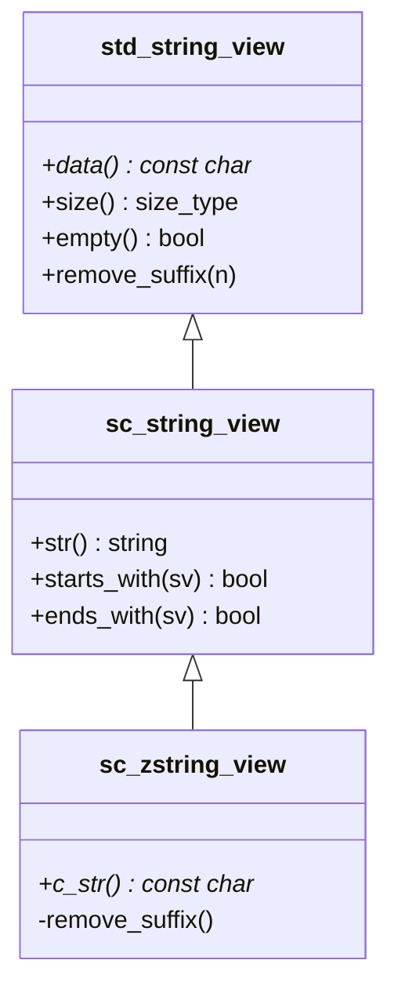

# sc_string_view - 字串視圖

## 概述

`sc_string_view` 和 `sc_zstring_view` 是 SystemC 提供的不擁有記憶體的常數字串參照類別，類似 C++17 的 `std::string_view`。它們讓函式可以接受各種字串型別（`const char*`、`std::string`、`std::string_view`）而不需要複製。

**來源檔案**：`sysc/utils/sc_string_view.h`（僅標頭檔）

## 生活比喻

想像你在圖書館查閱一本書：
- **std::string** 就像把整本書影印一份帶回家 — 你擁有自己的副本
- **sc_string_view** 就像你在圖書館裡翻閱書本 — 你只是「看」，不擁有那本書
- **sc_zstring_view** 就像你在翻閱一本你知道一定有結尾句號的書 — 保證以 null 字元結尾

使用字串視圖的好處是避免不必要的記憶體配置和複製，尤其當你只需要「看一下」字串而不需要修改它的時候。

## sc_string_view 類別

```cpp
class sc_string_view : public std::string_view {
public:
    using base_type::base_type; // 繼承所有建構子

    // 從可轉換的型別建構
    template<typename T>
    sc_string_view(const T& s);

    // 建立明確的字串複本
    std::string str() const;

    // C++20 之前的 starts_with / ends_with 支援
    bool starts_with(base_type sv) const;
    bool starts_with(char c) const;
    bool starts_with(const char* s) const;

    bool ends_with(base_type sv) const;
    bool ends_with(char c) const;
    bool ends_with(const char* s) const;
};
```

### 為什麼不直接用 std::string_view？

1. **跨版本相容**：SystemC 需要支援 C++17 和更早的編譯器
2. **補齊 C++20 功能**：在 C++20 之前就提供 `starts_with()` 和 `ends_with()`
3. **統一轉換介面**：模板建構子確保各種字串型別都能隱式轉換

## sc_zstring_view 類別

```cpp
class sc_zstring_view : public sc_string_view {
public:
    sc_zstring_view();                   // 預設為空字串 ""
    sc_zstring_view(const char* s);      // 空指標會被轉為 ""
    sc_zstring_view(const std::string& s);

    const char* c_str() const;           // 保證回傳 null-terminated 字串

private:
    using sc_string_view::remove_suffix; // 隱藏會破壞 null-terminated 不變式的方法
};
```

### 不變式保證

`sc_zstring_view` 保證底層字串永遠以 null 字元（`\0`）結尾：

- 空指標會被轉為空字串 `""`
- `remove_suffix` 被設為 `private`，因為移除後綴可能會破壞 null-terminated 的保證
- `c_str()` 可以安全地用於需要 C 風格字串的地方



## 使用場景

`sc_string_view` 在 SystemC 中主要用於：
- 函式參數：接受各種字串型別而不複製
- 名稱比較：快速比較物件名稱
- 字串查詢：`starts_with` / `ends_with` 用於階層名稱解析

## 相關檔案

- [sc_string.md](sc_string.md) — 數字表示法列舉與 I/O 輔助
- [sc_iostream.md](sc_iostream.md) — I/O 串流標頭包裝
