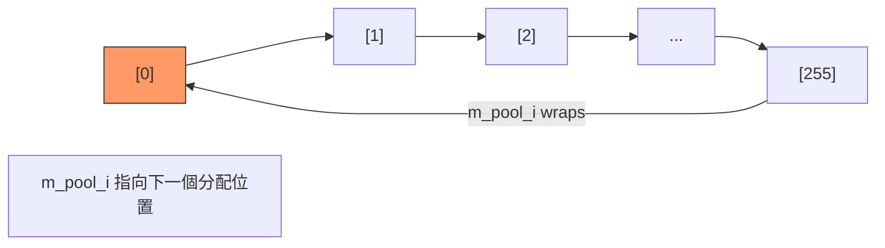

# sc_temporary - 暫存值池

## 概述

`sc_vpool` 是一個模板類別，管理一組固定大小的暫存物件池。物件以環形（circular）方式分配：用完一圈後自動從頭開始覆蓋。適用於需要大量短暫存在的暫時物件的場景。

**來源檔案**：`sysc/utils/sc_temporary.h`（僅標頭檔）

## 生活比喻

想像一家壽司店的迴轉帶：

- 帶上有固定數量的盤子（例如 256 個）
- 師傅不斷在盤子上放新壽司（`allocate`）
- 放完最後一個盤子後，又從第一個開始放（環形覆蓋）
- 你必須在壽司轉一圈回來之前吃掉它，否則就會被新的壽司覆蓋

這就是 `sc_vpool` 的運作方式：它假設每個暫存值的使用壽命很短，在池子轉一圈之前就不再需要了。

## 類別介面

```cpp
template<class T>
class sc_vpool {
protected:
    std::size_t m_pool_i;   // 下一個要分配的索引
    T*          m_pool_p;   // 物件陣列
    std::size_t m_wrap;     // 環形遮罩

public:
    sc_vpool(int log2, T* pool_p = 0);
    ~sc_vpool();
    T* allocate();     // 分配下一個暫存物件
    void reset();      // 重置索引到開頭
    std::size_t size(); // 回傳池大小
};
```

## 關鍵設計

### 二的冪次大小

池的大小必須是 2 的冪次（由 `log2` 參數決定）：

```cpp
sc_vpool(int log2, T* pool_p = 0)
  : m_pool_i(0)
  , m_pool_p(pool_p ? pool_p : new T[1 << log2])
  , m_wrap(~(static_cast<std::size_t>(-1) << log2))
{}
```

例如 `log2 = 8` 會建立一個 256 個元素的池，`m_wrap = 0xFF`。

### 環形分配

```cpp
T* allocate() {
    T* result_p = &m_pool_p[m_pool_i];
    m_pool_i = (m_pool_i + 1) & m_wrap;  // 位元 AND 實現環形
    return result_p;
}
```

用位元 AND（`& m_wrap`）取代模數運算（`% size`），因為位元運算比除法快很多。這就是為什麼大小必須是 2 的冪次。



### 不回收

注意 `sc_vpool` 沒有 `release()` 或 `free()` 方法。物件永遠不會被「歸還」，只會被新的分配覆蓋。這是有意的設計，因為暫存值的壽命假設非常短。

### 解構子的陷阱

```cpp
~sc_vpool() {
    // delete [] m_pool_p;  // 被註解掉了！
}
```

解構子並不釋放記憶體。這是因為 `sc_vpool` 通常作為全域靜態物件使用，而全域物件的解構順序不可預測——其他全域物件可能還在使用池中的暫存值。

## 使用場景

在 SystemC 中，`sc_vpool` 主要用於：
- 資料型別的暫存計算結果（如 `sc_int`、`sc_bv` 等的運算中間值）
- 字串格式化的暫存緩衝區
- 任何需要大量短暫暫存物件的地方

## 相關檔案

- [sc_mempool.md](sc_mempool.md) — 另一種記憶體管理機制（適用於不同大小的物件）
