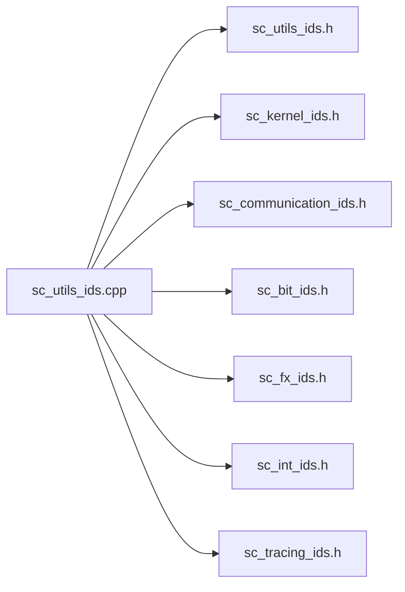

# sc_utils_ids - 報告訊息 ID 定義

## 概述

`sc_utils_ids` 定義了 SystemC utils 模組以及其他所有模組的報告訊息 ID。它是整個錯誤報告系統的「訊息字典」——每種可能出現的錯誤或警告都在這裡登記了一個唯一的字串 ID 和說明文字。

**來源檔案**：`sysc/utils/sc_utils_ids.h` + `sc_utils_ids.cpp`

## 生活比喻

想像醫院的「疾病代碼表」（ICD 代碼）。每種疾病都有一個唯一的代碼和描述，這樣不管哪個醫生看到代碼，都知道是什麼問題。`sc_utils_ids` 就是 SystemC 的「錯誤代碼表」。

## SC_DEFINE_MESSAGE 巨集

這是定義訊息 ID 的核心巨集，它有雙重身份：

### 在 .h 檔案中（聲明模式）

```cpp
#define SC_DEFINE_MESSAGE(id, unused1, unused2) \
    namespace sc_core { extern SC_API const char id[]; }
```

在標頭檔中，巨集只是聲明一個外部字串常數。第二、三個參數（整數 ID 和文字說明）在此被忽略。

### 在 .cpp 檔案中（定義模式）

```cpp
#define SC_DEFINE_MESSAGE(id, unused, text) \
    extern SC_API const char id[] = text;
```

在實作檔中，巨集將文字說明字串賦值給常數。

這種「同一個巨集、不同定義」的技巧被稱為 **X-Macro**，讓同一份清單可以在不同情境下產生不同的程式碼。

## Utils 模組定義的訊息 ID

| ID 常數 | 整數 ID | 文字說明 |
|---------|---------|---------|
| `SC_ID_STRING_TOO_LONG_` | 801 | "string is too long" |
| `SC_ID_FRONT_ON_EMPTY_LIST_` | 802 | "attempt to take front() on an empty list" |
| `SC_ID_BACK_ON_EMPTY_LIST_` | 803 | "attempt to take back() on an empty list" |
| `SC_ID_IEEE_1666_DEPRECATION_` | 804 | "/IEEE_Std_1666/deprecated" |
| `SC_ID_VECTOR_INIT_CALLED_TWICE_` | 805 | "sc_vector::init called for non-empty vector" |
| `SC_ID_VECTOR_BIND_EMPTY_` | 807 | "sc_vector::bind called with empty range" |
| `SC_ID_VECTOR_NONOBJECT_ELEMENTS_` | 808 | "sc_vector::get_elements called for element type not derived from sc_object" |
| `SC_ID_VECTOR_EMPLACE_LOCKED_` | 809 | "attempt to insert into locked sc_vector" |

其中 `SC_ID_IEEE_1666_DEPRECATION_` 特別常用，所有棄用功能的警告都使用這個 ID。

## 初始化機制

`.cpp` 檔案的初始化過程非常精巧：

```cpp
// 第一次 include：定義字串常數
#define SC_DEFINE_MESSAGE(id, unused, text) \
    extern SC_API const char id[] = text;
#include "sysc/utils/sc_utils_ids.h"
#include "sysc/kernel/sc_kernel_ids.h"
// ... 其他模組的 ids.h ...
#undef SC_DEFINE_MESSAGE

// 第二次 include：建立 sc_msg_def 陣列
static sc_msg_def texts[] = {
#define SC_DEFINE_MESSAGE(id, n, unused) \
    { (id), 0u, {0u}, 0u, {0u}, 0u, 0u, {0u}, 0, n },
#undef SC_UTILS_IDS_H
#include "sysc/utils/sc_utils_ids.h"
// ... 其他模組的 ids.h ...
#undef SC_DEFINE_MESSAGE
};
```

同一組標頭檔被 include 了兩次，每次用不同的巨集定義來產生不同的資料。

### 自動初始化

```cpp
static int initialize();
static int forty_two = initialize();
```

利用靜態變數的初始化保證 `initialize()` 在 `main()` 之前就被呼叫。這個函式：
1. 透過 `add_static_msg_types()` 註冊所有訊息定義
2. 檢查環境變數 `SC_DEPRECATION_WARNINGS`，若為 `"DISABLE"` 則關閉棄用警告

## 涵蓋的模組

`sc_utils_ids.cpp` 不只處理 utils 的訊息，它是所有模組訊息的集中註冊點：



## 相關檔案

- [sc_report.md](sc_report.md) — 使用這些 ID 的報告物件
- [sc_report_handler.md](sc_report_handler.md) — 管理訊息定義的處理器
