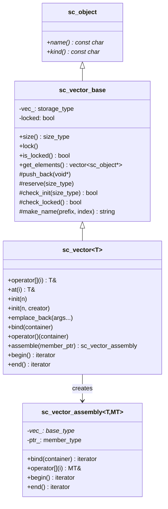

# sc_vector - 具名物件向量

## 概述

`sc_vector` 是 IEEE 1666 標準定義的容器類別，專門用來管理一組具名的 SystemC 物件（模組、埠、通道等）。它自動為每個元素產生序號化的名稱（如 `signal_0`、`signal_1`），並提供批次綁定（bind）功能。

**來源檔案**：`sysc/utils/sc_vector.h` + `sc_vector.cpp`

## 生活比喻

想像你在管理一棟公寓大樓：

- 每間公寓都有自動編號的門牌（`apt_0`、`apt_1`、`apt_2`...）
- 你可以一次建好所有公寓（`init(n)`），也可以逐間加蓋（`emplace_back`）
- 公寓全部蓋好後就「鎖定」（`lock`），不能再加蓋
- 每間公寓裡面有電表和水表，你可以用 `assemble` 把所有公寓的電表「組裝」成一個清單，方便統一管理

## 類別層次



## 初始化方式

### 方式一：預設建構子

```cpp
sc_vector<sc_signal<int>> sigs("sig", 8);
// 產生 sig_0, sig_1, ..., sig_7
```

### 方式二：自訂建構器

```cpp
sc_vector<MyModule> mods("mod", 4, [](const char* name, size_t i) {
    return new MyModule(name, some_config[i]);
});
```

### 方式三：延遲初始化

```cpp
sc_vector<sc_signal<bool>> flags("flag");
flags.init(16); // 稍後初始化
```

### 方式四：逐個新增

```cpp
sc_vector<MyModule> mods("mod");
mods.emplace_back(/* constructor args */);  // 自動命名
mods.emplace_back_with_name("custom_name"); // 自訂名稱
```

## 鎖定機制

```cpp
enum sc_vector_init_policy {
    SC_VECTOR_LOCK_AFTER_INIT,        // init() 後立即鎖定（預設）
    SC_VECTOR_LOCK_AFTER_ELABORATION  // 等到 elaboration 結束才鎖定
};
```

鎖定後呼叫 `emplace_back` 會觸發 `SC_ID_VECTOR_EMPLACE_LOCKED_` 錯誤。`SC_VECTOR_LOCK_AFTER_ELABORATION` 模式會透過 `sc_stage_callback_if` 在 elaboration 結束時自動鎖定。

## 批次綁定

```cpp
sc_vector<sc_in<int>>     ports("port", 4);
sc_vector<sc_signal<int>> sigs("sig", 4);

ports.bind(sigs);           // 一行綁定全部
ports(sigs);                // 等效寫法
ports.bind(sigs.begin()+1, sigs.end()); // 部分綁定
```

## 成員組裝（Assembly）

`assemble()` 方法可以取出每個元素的某個成員，組成一個虛擬的向量：

```cpp
struct MyModule : sc_module {
    sc_in<int>  in_port;
    sc_out<int> out_port;
};

sc_vector<MyModule> mods("mod", 4);
auto in_ports = mods.assemble(&MyModule::in_port);
in_ports.bind(signals); // 只綁定 in_port 成員
```

## 迭代器系統

`sc_vector_iter` 是一個隨機存取迭代器，支援：
- 直接存取策略（`sc_direct_access`）：直接存取元素
- 成員存取策略（`sc_member_access`）：透過成員指標存取元素的特定成員

迭代器支援 const 轉換，例如 `iterator` 可以隱式轉換為 `const_iterator`。

## 設計細節

### void* 基礎

`sc_vector_base` 內部使用 `void*` 陣列儲存元素，這是為了：
1. 支援虛擬繼承自 `sc_object`
2. 避免模板膨脹（template bloat）
3. 將實作細節隱藏在 `.cpp` 檔案中

### 名稱生成

```cpp
static std::string make_name(const char* prefix, size_type index);
```

產生 `"prefix_index"` 格式的名稱，例如 `"sig_0"`、`"sig_1"`。

### 階層範疇

`init()` 和 `emplace_back()` 內部會建立 `sc_hierarchy_scope`，確保新建元素正確地歸屬於 `sc_vector` 所在的模組階層。

## 相關檔案

- [sc_pvector.md](sc_pvector.md) — 舊式的內部指標向量（不同類別）
- [sc_utils_ids.md](sc_utils_ids.md) — 定義了 `sc_vector` 相關的錯誤訊息
