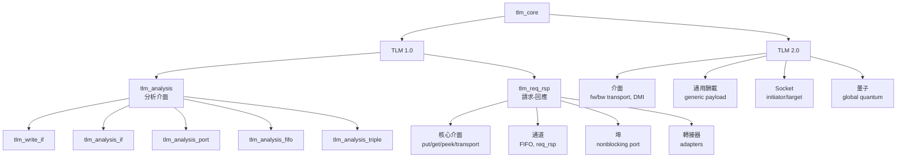

# TLM Core - 交易層級建模核心庫

TLM（Transaction-Level Modeling，交易層級建模）是 SystemC 中用於元件間通訊的標準抽象層。`tlm_core` 目錄包含了 TLM 1.0 和 TLM 2.0 兩個主要版本的核心介面與實作。

## 日常類比

想像你在網路購物：

- **TLM 1.0** 就像是傳統的郵購方式——你寫信（request）寄出去，等回信（response）寄回來。溝通方式有「寄出後等回覆」（blocking）和「寄出後不等，有回覆再通知」（non-blocking）兩種。
- **TLM 2.0** 就像是現代的快遞系統——有標準化的包裹格式（generic payload），有追蹤系統（phase），還能直接到倉庫取貨（DMI，Direct Memory Interface）而不用透過快遞員。

## TLM 1.0 vs TLM 2.0 差異總覽

| 特性 | TLM 1.0 | TLM 2.0 |
|------|---------|---------|
| 傳輸模型 | 通用的 put/get/peek | 針對記憶體映射匯流排最佳化 |
| 資料格式 | 使用者自定 template 型別 | 標準化的 `tlm_generic_payload` |
| 介面風格 | FIFO / req-rsp 通道 | Forward/Backward transport 介面 |
| 時序抽象 | 無特別支援 | Global quantum / 時間解耦 |
| 直接記憶體存取 | 不支援 | 支援 DMI |
| Socket | 無（使用 port/export） | 標準化的 initiator/target socket |

## 目錄結構

```
tlm_core/
├── tlm_1/                    # TLM 1.0
│   ├── tlm_analysis/         # 分析介面（廣播式、觀察者模式）
│   │   ├── tlm_analysis.h          # 總標頭檔
│   │   ├── tlm_analysis_if.h       # 分析介面定義
│   │   ├── tlm_analysis_port.h     # 分析埠（一對多廣播）
│   │   ├── tlm_analysis_fifo.h     # 分析 FIFO
│   │   ├── tlm_analysis_triple.h   # 含時間戳的交易三元組
│   │   └── tlm_write_if.h          # 寫入介面
│   └── tlm_req_rsp/          # 請求-回應通訊
│       ├── tlm_1_interfaces/ # 核心介面（put/get/peek/transport）
│       ├── tlm_channels/     # 通道實作（FIFO、req-rsp channel）
│       ├── tlm_ports/        # 非阻塞式埠與事件搜尋器
│       └── tlm_adapters/     # 介面轉換器
│
└── tlm_2/                    # TLM 2.0
    ├── tlm_2_interfaces/     # 前向/後向傳輸介面、DMI
    ├── tlm_generic_payload/  # 通用酬載、相位、擴充、端序轉換
    ├── tlm_sockets/          # Initiator/Target socket
    └── tlm_quantum/          # 全域量子時間管理
```



## 相關檔案

- `tlm_utils/` - 便利工具：簡化 socket、PEQ、quantum keeper 等
- `sysc/` - SystemC 核心庫（port、export、module 等底層元件）
