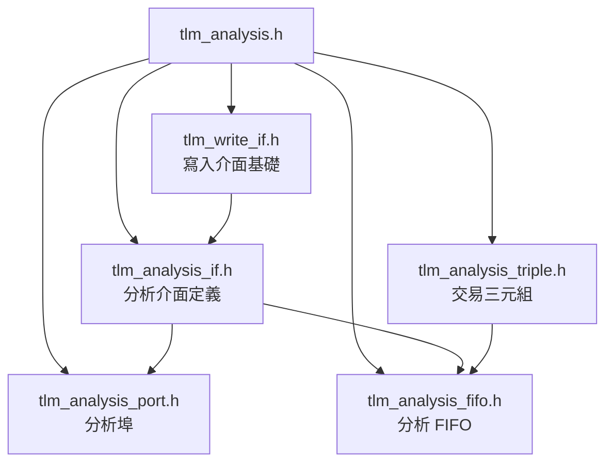

# tlm_analysis.h - TLM 1.0 分析子系統的總標頭檔

## 概述

`tlm_analysis.h` 是 TLM 1.0 分析（analysis）子系統的總入口標頭檔。它不包含任何實質的類別定義，純粹透過 `#include` 將所有分析相關的標頭檔彙集在一起，讓使用者只需引入這一個檔案就能使用整個分析功能。

## 日常類比

就像一本書的目錄頁——它本身不包含任何正文內容，但告訴你去哪裡找到所有章節。當你 `#include "tlm_analysis.h"` 時，就等於一次翻開了分析功能的所有章節。

## 包含的檔案

## 引入順序的設計考量

標頭檔的引入順序經過精心安排：

1. 先引入 `tlm_write_if.h`（基礎寫入介面）
2. 再引入 `tlm_analysis_if.h`（繼承自 write_if）
3. 然後是 `tlm_analysis_triple.h`（資料結構）
4. 最後是 `tlm_analysis_port.h` 和 `tlm_analysis_fifo.h`（使用上述介面的元件）

這確保了編譯時的依賴關係正確。

## 原始碼位置

`ref/systemc/src/tlm_core/tlm_1/tlm_analysis/tlm_analysis.h`

## 相關檔案

- [tlm_write_if.md](tlm_write_if.md) - 寫入介面
- [tlm_analysis_if.md](tlm_analysis_if.md) - 分析介面
- [tlm_analysis_port.md](tlm_analysis_port.md) - 分析埠
- [tlm_analysis_fifo.md](tlm_analysis_fifo.md) - 分析 FIFO
- [tlm_analysis_triple.md](tlm_analysis_triple.md) - 交易三元組
