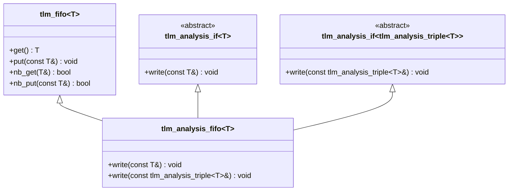
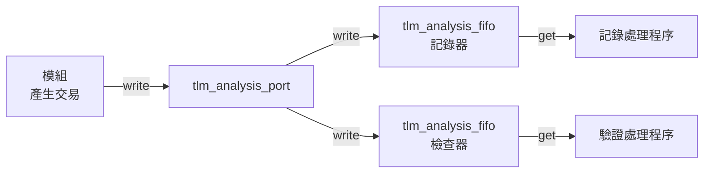

# tlm_analysis_fifo.h - 分析 FIFO

## 概述

`tlm_analysis_fifo` 是一個特殊的 FIFO，專門設計來接收分析埠（`tlm_analysis_port`）的廣播資料。它同時實作了 `tlm_analysis_if<T>` 和 `tlm_analysis_if<tlm_analysis_triple<T>>`，意味著它可以接收純資料或帶時間戳的資料。

## 日常類比

想像你訂閱了一個 YouTube 頻道：
- **分析埠** = YouTube 頻道（發布者）
- **分析 FIFO** = 你的「稍後觀看」清單
- 每當頻道發布新影片時，影片會自動加入你的清單
- 你可以隨時從清單中取出影片來觀看
- 清單沒有大小限制（無限容量）——你永遠不會因為「清單滿了」而錯過影片

## 類別詳情

### `tlm_analysis_fifo<T>`

```cpp
template<typename T>
class tlm_analysis_fifo :
  public tlm_fifo<T>,
  public virtual tlm_analysis_if<T>,
  public virtual tlm_analysis_if<tlm_analysis_triple<T>>
```

### 繼承關係



### 關鍵設計：無限容量

```cpp
tlm_analysis_fifo(const char* nm) : tlm_fifo<T>(nm, -16) {}
tlm_analysis_fifo() : tlm_fifo<T>(-16) {}
```

建構子傳入 `-16` 給 `tlm_fifo`。負數值代表無限容量（unbounded），`16` 是初始緩衝區大小。這確保了 `write()` 永遠不會因為 FIFO 滿了而失敗或阻塞。

### `write()` 方法

```cpp
void write(const T& t) {
  this->nb_put(t);
}

void write(const tlm_analysis_triple<T>& t) {
  this->nb_put(t);
}
```

兩個 `write()` 都使用 `nb_put()`（非阻塞式放入）。因為 FIFO 是無限容量的，`nb_put()` 永遠會成功。

## 使用情境



典型流程：
1. 模組透過分析埠廣播交易
2. 多個分析 FIFO 訂閱該分析埠
3. 各 FIFO 各自緩存接收到的交易
4. 後端處理程序在自己的 thread 中以 `get()` 取出交易做後續處理

## 原始碼位置

`ref/systemc/src/tlm_core/tlm_1/tlm_analysis/tlm_analysis_fifo.h`

## 相關檔案

- [tlm_analysis_port.md](tlm_analysis_port.md) - 分析埠（資料來源）
- [tlm_analysis_triple.md](tlm_analysis_triple.md) - 帶時間戳的交易三元組
- [tlm_req_rsp.md](tlm_req_rsp.md) - `tlm_fifo` 的詳細說明
