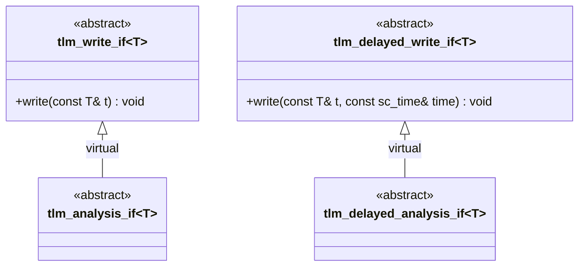

# tlm_analysis_if.h - 分析介面定義

## 概述

`tlm_analysis_if.h` 定義了分析介面 `tlm_analysis_if` 和 `tlm_delayed_analysis_if`。這些介面本質上是 `tlm_write_if` 和 `tlm_delayed_write_if` 的語義別名（semantic alias），為分析子系統提供更具描述性的型別名稱。

## 日常類比

就像「信件」和「通知函」本質上都是一張紙上寫著字——但使用不同的名稱可以明確表達它的用途。`tlm_analysis_if` 就是在說：「這個寫入操作是用來做分析廣播的，不是普通的資料傳輸。」

## 類別詳情

### `tlm_analysis_if<T>`

```cpp
template <typename T>
class tlm_analysis_if : public virtual tlm_write_if<T> {};
```

- 完全繼承自 `tlm_write_if<T>`，沒有新增任何方法
- 繼承了 `write(const T& t)` 方法
- 存在的意義是型別區分——讓編譯器和使用者知道這是「分析」用途的介面

### `tlm_delayed_analysis_if<T>`

```cpp
template <typename T>
class tlm_delayed_analysis_if : public virtual tlm_delayed_write_if<T> {};
```

- 對應的延遲版本，繼承了 `write(const T& t, const sc_time& time)`

## 為什麼要建立一個空的衍生類別？

雖然 `tlm_analysis_if` 和 `tlm_write_if` 功能完全相同，但分開定義有以下好處：

1. **型別安全**：一個期望 `tlm_analysis_if` 的 port 不會接受只實作了 `tlm_write_if` 的物件（除非它也實作了 `tlm_analysis_if`），提供了編譯期的檢查。
2. **語義清晰**：程式碼中使用 `tlm_analysis_if` 一眼就知道這是用於觀察者模式的分析廣播。
3. **擴充彈性**：未來如果分析介面需要額外方法，可以在不影響 `tlm_write_if` 的情況下擴充。



## 原始碼位置

`ref/systemc/src/tlm_core/tlm_1/tlm_analysis/tlm_analysis_if.h`

## 相關檔案

- [tlm_write_if.md](tlm_write_if.md) - 父介面
- [tlm_analysis_port.md](tlm_analysis_port.md) - 使用此介面的分析埠
- [tlm_analysis_fifo.md](tlm_analysis_fifo.md) - 實作此介面的分析 FIFO
