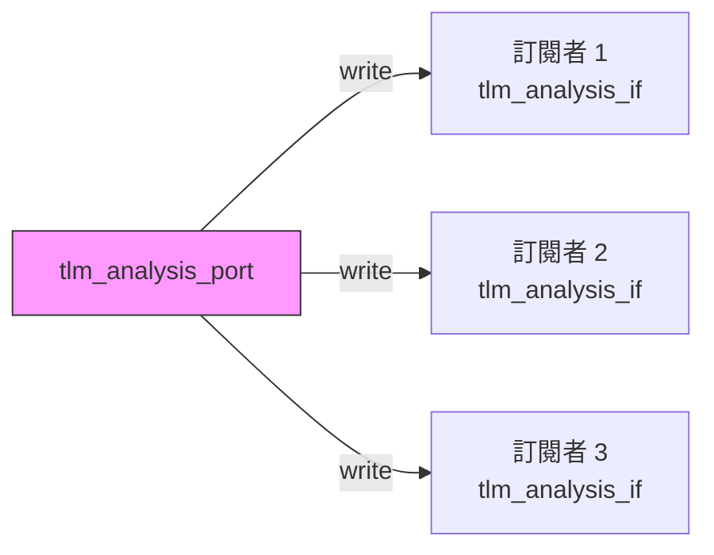

# tlm_analysis_port.h - 分析埠（一對多廣播）

## 概述

`tlm_analysis_port` 實作了觀察者模式（Observer Pattern）的廣播機制。一個分析埠可以連接多個訂閱者，當呼叫 `write()` 時，資料會被廣播給所有已連接的介面。這是 TLM 中用於監控和除錯的核心機制。

## 日常類比

想像一個 LINE 群組：
- **分析埠** = 群組的發訊者
- **`bind()` 方法** = 把人加入群組
- **`write()` 方法** = 在群組中發送訊息
- 當你在群組裡發一則訊息，所有成員（訂閱者）都會收到相同的內容
- 你可以隨時把人加入 (`bind`) 或移除 (`unbind`) 群組

## 類別詳情

### `tlm_analysis_port<T>`

```cpp
template <typename T>
class tlm_analysis_port :
  public sc_core::sc_object,
  public virtual tlm_analysis_if<T>
```

繼承自 `sc_object`（提供命名功能）和 `tlm_analysis_if<T>`（提供 `write` 介面）。

### 主要方法

| 方法 | 說明 |
|------|------|
| `bind(tlm_analysis_if<T>& _if)` | 將一個介面加入廣播清單 |
| `operator()(tlm_analysis_if<T>& _if)` | `bind()` 的便捷語法 |
| `unbind(tlm_analysis_if<T>& _if)` | 從廣播清單中移除介面，成功回傳 `true` |
| `write(const T& t)` | 將資料 `t` 廣播給所有已綁定的介面 |

### `write()` 的運作方式

```cpp
void write(const T& t) {
  for (auto i = m_interfaces.begin(); i != m_interfaces.end(); i++) {
    (*i)->write(t);
  }
}
```

遍歷所有已綁定的介面，逐一呼叫它們的 `write()` 方法。注意：
- 呼叫是**同步的**——所有訂閱者的 `write()` 都在同一個 delta cycle 內執行完畢
- 如果任一訂閱者的 `write()` 會阻塞（例如寫入已滿的 FIFO），整個廣播都會被阻塞
- 實務上，訂閱者的 `write()` 應該是非阻塞的（快速完成）

### 內部結構

使用 `std::deque<tlm_analysis_if<T>*>` 儲存所有已綁定的介面指標。選用 `deque` 而非 `vector` 的原因是 `deque` 在前端插入和刪除的效率較好。



## 與 `sc_port` 的差異

| 特性 | `tlm_analysis_port` | `sc_port` |
|------|---------------------|-----------|
| 連接數量 | 0 到多個 | 通常 1 個 |
| 繼承基礎 | `sc_object` | `sc_port_base` |
| 可否動態綁定 | 可以（甚至在模擬中） | 只能在建構期 |
| 是否支援 unbind | 是 | 否 |

`tlm_analysis_port` 選擇繼承 `sc_object` 而非 `sc_port`，是因為它需要更靈活的綁定策略——支持零個或多個連接，且可以動態解除綁定。

## 原始碼位置

`ref/systemc/src/tlm_core/tlm_1/tlm_analysis/tlm_analysis_port.h`

## 相關檔案

- [tlm_analysis_if.md](tlm_analysis_if.md) - 分析介面
- [tlm_analysis_fifo.md](tlm_analysis_fifo.md) - 可作為訂閱者的分析 FIFO
- [tlm_analysis_triple.md](tlm_analysis_triple.md) - 可搭配使用的時間戳交易
