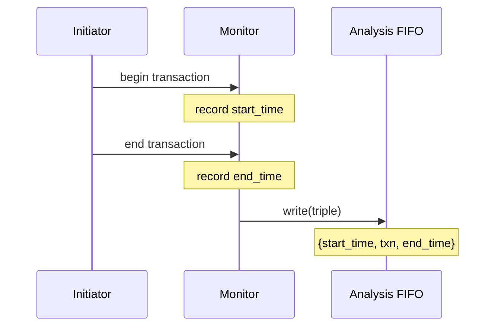

# tlm_analysis_triple.h - 交易三元組（含時間戳）

## 概述

`tlm_analysis_triple` 是一個簡單的資料結構，將一筆交易（transaction）與其開始時間和結束時間包裝在一起。它常用於分析和效能量測，讓觀察者不僅能看到交易內容，還能知道交易何時開始、何時結束。

## 日常類比

想像一張快遞的寄件單：
- **交易（transaction）** = 包裹的內容
- **開始時間（start_time）** = 寄出時間
- **結束時間（end_time）** = 送達時間

有了這三個資訊，你就能知道包裹是什麼、什麼時候寄的、什麼時候到的——這對分析系統效能非常有用。

## 類別詳情

### `tlm_analysis_triple<T>`

```cpp
template<typename T>
struct tlm_analysis_triple {
  sc_core::sc_time start_time;
  T transaction;
  sc_core::sc_time end_time;
};
```

### 成員變數

| 成員 | 型別 | 說明 |
|------|------|------|
| `start_time` | `sc_time` | 交易的開始時間 |
| `transaction` | `T` | 交易物件本身 |
| `end_time` | `sc_time` | 交易的結束時間 |

### 建構子

| 建構子 | 說明 |
|--------|------|
| `tlm_analysis_triple()` | 預設建構子 |
| `tlm_analysis_triple(const tlm_analysis_triple&)` | 複製建構子 |
| `tlm_analysis_triple(const T& t)` | 從交易建構，只設定 `transaction` |

### 隱式型別轉換

```cpp
operator T() { return transaction; }
operator const T&() const { return transaction; }
```

提供了到 `T` 的隱式轉換，讓 `tlm_analysis_triple<T>` 可以在需要 `T` 的地方直接使用。例如：

```cpp
tlm_analysis_triple<int> triple;
triple.transaction = 42;
int value = triple;  // value == 42, implicit conversion
```

## 使用情境



## 原始碼位置

`ref/systemc/src/tlm_core/tlm_1/tlm_analysis/tlm_analysis_triple.h`

## 相關檔案

- [tlm_analysis_fifo.md](tlm_analysis_fifo.md) - 可接收 triple 的分析 FIFO
- [tlm_analysis_port.md](tlm_analysis_port.md) - 可廣播 triple 的分析埠
