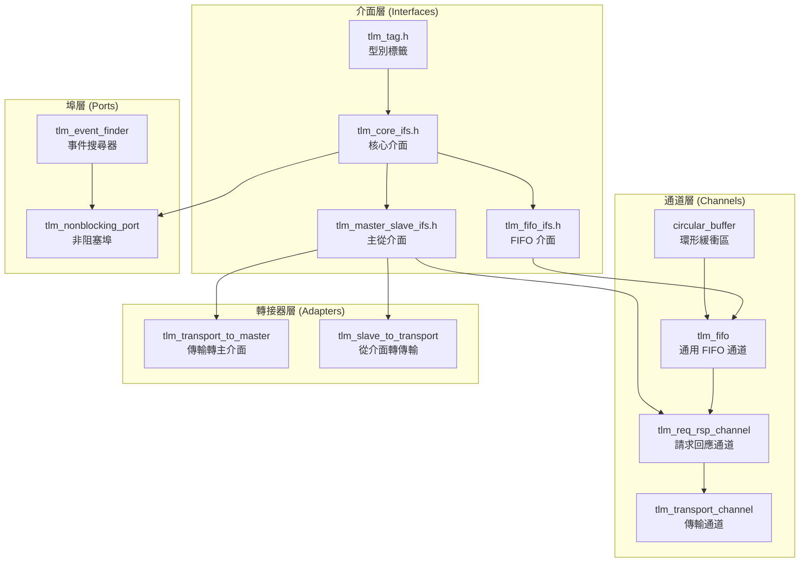
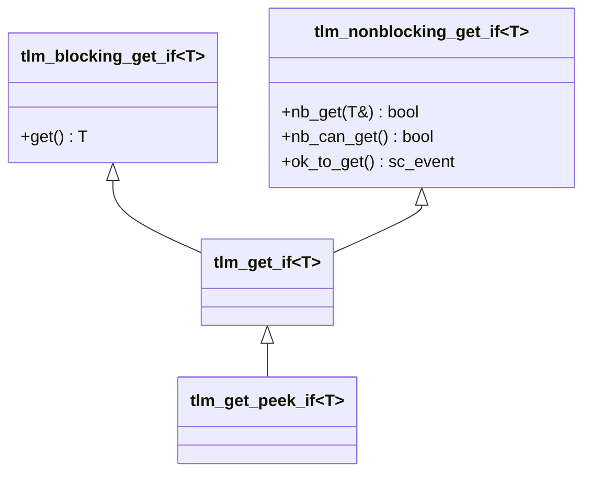
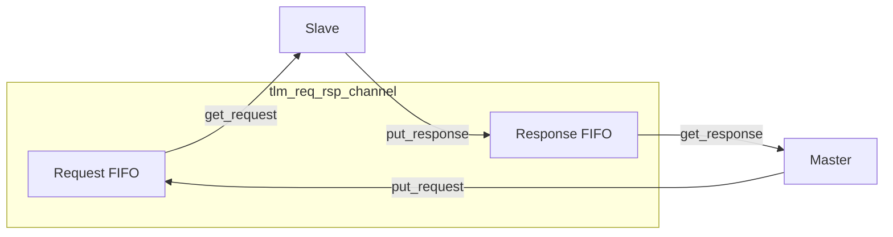

# TLM 1.0 Request-Response 子系統

## 概述

`tlm_req_rsp` 子系統是 TLM 1.0 中用於元件間雙向通訊的核心框架。它提供了一套完整的介面、通道、埠和轉接器，讓 initiator（發起者）可以發送請求（request），並接收 target（目標）的回應（response）。

## 日常類比

想像一家餐廳的點餐系統：
- **Initiator（顧客）** 發送 **Request（點單）** 到廚房
- **Target（廚房）** 處理後回傳 **Response（菜餚）**
- 中間的 **Channel（傳菜窗口）** 負責傳遞點單和菜餚
- **Blocking 模式** = 顧客點完餐後坐在位子上等，直到菜上來
- **Non-blocking 模式** = 顧客點完餐後去做別的事，菜好了再來拿

## 架構總覽



---

## 1. 核心介面 (`tlm_core_ifs.h`)

這是 TLM 1.0 最核心的檔案，定義了所有基礎通訊介面。

### 雙向介面

| 介面 | 方法 | 說明 |
|------|------|------|
| `tlm_transport_if<REQ, RSP>` | `RSP transport(const REQ&)` | 同步的請求-回應，一次呼叫完成整個交易 |

### 單向阻塞介面

| 介面 | 方法 | 說明 |
|------|------|------|
| `tlm_blocking_get_if<T>` | `T get()` | 阻塞式取得資料，FIFO 空時等待 |
| `tlm_blocking_put_if<T>` | `void put(const T&)` | 阻塞式放入資料，FIFO 滿時等待 |
| `tlm_blocking_peek_if<T>` | `T peek() const` | 阻塞式窺看資料，不移除 |

### 單向非阻塞介面

| 介面 | 方法 | 說明 |
|------|------|------|
| `tlm_nonblocking_get_if<T>` | `bool nb_get(T&)` | 非阻塞取得，成功回傳 `true` |
| | `bool nb_can_get() const` | 檢查是否有資料可取 |
| | `const sc_event& ok_to_get() const` | 取得「可取」事件 |
| `tlm_nonblocking_put_if<T>` | `bool nb_put(const T&)` | 非阻塞放入，成功回傳 `true` |
| | `bool nb_can_put() const` | 檢查是否可放入 |
| | `const sc_event& ok_to_put() const` | 取得「可放」事件 |
| `tlm_nonblocking_peek_if<T>` | `bool nb_peek(T&) const` | 非阻塞窺看 |

### 組合介面



### `tlm_tag<T>`

```cpp
template<class T> class tlm_tag {};
```

一個空的模板類別，純粹用來在函式多載中區分型別。例如 `get(tlm_tag<T>*)` 中，`tlm_tag` 幫助編譯器推導回傳型別。

---

## 2. FIFO 介面 (`tlm_fifo_ifs.h`)

在核心介面之上，為 FIFO 特有的功能定義擴充介面。

### `tlm_fifo_debug_if<T>`

提供除錯用的方法：
- `int used() const` - 已使用的空間數
- `int size() const` - FIFO 總大小
- `void debug() const` - 輸出除錯資訊
- `bool nb_peek(T&, int n) const` - 窺看第 n 個元素
- `bool nb_poke(const T&, int n)` - 直接修改第 n 個元素

### `tlm_fifo_config_size_if`

動態調整 FIFO 大小：
- `void nb_expand(unsigned int n)` - 擴大容量
- `void nb_unbound(unsigned int n)` - 設為無限容量
- `bool nb_reduce(unsigned int n)` - 縮小容量
- `bool nb_bound(unsigned int n)` - 設定上限

---

## 3. 主從介面 (`tlm_master_slave_ifs.h`)

將 put 和 get 介面組合成完整的主從介面。

| 介面 | 繼承自 | 說明 |
|------|--------|------|
| `tlm_blocking_master_if<REQ,RSP>` | `blocking_put<REQ>` + `blocking_get_peek<RSP>` | 阻塞式主介面 |
| `tlm_blocking_slave_if<REQ,RSP>` | `blocking_put<RSP>` + `blocking_get_peek<REQ>` | 阻塞式從介面 |
| `tlm_master_if<REQ,RSP>` | 全部 put + get_peek 介面 | 完整主介面 |
| `tlm_slave_if<REQ,RSP>` | 全部 put + get_peek 介面 | 完整從介面 |

注意主從介面的方向是對稱的：Master 「put REQ, get RSP」；Slave「get REQ, put RSP」。

---

## 4. FIFO 通道 (`tlm_fifo.h` 及相關檔案)

### `tlm_fifo<T>`

最重要的通道實作，類似標準的 FIFO 佇列。

**特性：**
- 支援有限和無限容量（建構子傳入負值表示無限）
- 基於 `circular_buffer<T>` 實作，高效率的環形緩衝區
- 實作所有 get/put/peek 的 blocking 和 non-blocking 介面
- 支援動態調整大小

**容量規則：**
- `size > 0`：固定容量，滿時 `put()` 等待，`nb_put()` 回傳 `false`
- `size < 0`：無限容量，`abs(size)` 為初始緩衝區大小
- `size == 0`：零容量，同時是滿的和空的

**更新機制：**
```
put/get 操作 → request_update() → update() 在下個 delta cycle 觸發事件通知
```

### `circular_buffer<T>`

底層的環形緩衝區實作，使用原始記憶體（`unsigned char[]`）和 placement new 來管理物件生命週期。支援動態調整大小。

---

## 5. 請求-回應通道

### `tlm_req_rsp_channel<REQ, RSP>`

使用兩個 FIFO 組成雙向通道：一個用於 request，一個用於 response。



提供的 export：
- `put_request_export` / `get_request_export`
- `put_response_export` / `get_response_export`
- `master_export` / `slave_export`（組合式介面）

### `tlm_transport_channel<REQ, RSP>`

在 `tlm_req_rsp_channel` 之上增加了 `tlm_transport_if`（同步傳輸介面）。透過 `tlm_transport_to_master` 轉接器，將同步的 `transport()` 呼叫分解為 `put()` + `get()` 操作。

---

## 6. 轉接器 (`tlm_adapters.h`)

### `tlm_transport_to_master<REQ, RSP>`

將 `tlm_transport_if`（同步呼叫）轉換成 `tlm_master_if`（put + get）：

```cpp
RSP transport(const REQ& req) {
  mutex.lock();
  master_port->put(req);
  rsp = master_port->get();
  mutex.unlock();
  return rsp;
}
```

使用 mutex 確保 thread safety。

### `tlm_slave_to_transport<REQ, RSP>`

反向轉換：從 slave 介面的 get/put 模式轉為 transport 呼叫。在一個迴圈中不斷取得 request、呼叫 transport、回寫 response。

---

## 7. 非阻塞埠 (`tlm_nonblocking_port.h`)

### `tlm_nonblocking_get_port<T>` / `tlm_nonblocking_put_port<T>` / `tlm_nonblocking_peek_port<T>`

這些埠提供了 `ok_to_get()` / `ok_to_put()` / `ok_to_peek()` 方法，回傳 `sc_event_finder`。這讓 SystemC 的靜態敏感度（static sensitivity）機制可以在 `SC_METHOD` 中使用：

```cpp
SC_METHOD(my_method);
sensitive << my_port.ok_to_get();
```

### `tlm_event_finder_t<IF, T>`

事件搜尋器的實作。它包裝了一個介面方法指標，在需要時透過介面取得對應的事件。

---

## 8. 輔助實作 (`tlm_put_get_imp.h`)

### `tlm_put_get_imp<PUT_DATA, GET_DATA>`

將獨立的 `tlm_put_if` 和 `tlm_get_peek_if` 組合成單一物件。用在 `tlm_req_rsp_channel` 內部，將兩個 FIFO 包裝成統一的主/從介面。

### `tlm_master_imp` / `tlm_slave_imp`

分別繼承 `tlm_put_get_imp` 並實作 `tlm_master_if` / `tlm_slave_if`，只是調整了 put/get 的方向：
- `tlm_master_imp`: put REQ, get RSP
- `tlm_slave_imp`: put RSP, get REQ（方向反轉）

## 原始碼位置

- `ref/systemc/src/tlm_core/tlm_1/tlm_req_rsp/`
  - `tlm_1_interfaces/` - 所有介面定義
  - `tlm_channels/tlm_fifo/` - FIFO 和環形緩衝區
  - `tlm_channels/tlm_req_rsp_channels/` - 請求-回應通道
  - `tlm_ports/` - 非阻塞埠和事件搜尋器
  - `tlm_adapters/` - 介面轉接器

## 相關檔案

- [tlm_analysis.md](tlm_analysis.md) - 分析子系統（觀察者模式的廣播機制）
- [../tlm_2/tlm_fw_bw_ifs.md](../tlm_2/tlm_fw_bw_ifs.md) - TLM 2.0 的介面設計（取代了 req-rsp 模式）
