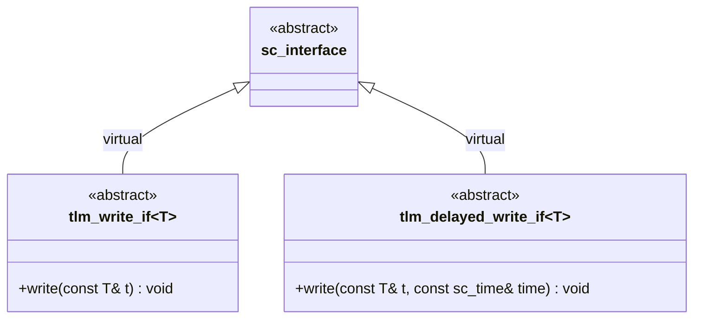

# tlm_write_if.h - 寫入介面定義

## 概述

`tlm_write_if.h` 定義了 TLM 中最基本的寫入介面：`tlm_write_if` 和 `tlm_delayed_write_if`。這兩個介面是整個分析（analysis）子系統的基礎，提供了「將資料寫入目標」的抽象行為。

## 日常類比

- **`tlm_write_if`**：就像在即時通訊軟體裡發訊息——你按下「送出」，對方立刻就收到了。沒有延遲的概念。
- **`tlm_delayed_write_if`**：就像排程發送郵件——你不只指定了內容，還指定了「幾點鐘寄出」。帶有一個時間參數。

## 類別詳情

### `tlm_write_if<T>`

```cpp
template <typename T>
class tlm_write_if : public virtual sc_core::sc_interface {
public:
  virtual void write(const T& t) = 0;
};
```

- 繼承自 `sc_interface`，是 SystemC 的標準介面基礎類別
- 只有一個純虛函式 `write(const T& t)`
- 參數以 `const` 引用傳入，表示寫入操作不會修改傳入的資料
- 模板參數 `T` 可以是任何型別——交易物件、簡單資料等

### `tlm_delayed_write_if<T>`

```cpp
template <typename T>
class tlm_delayed_write_if : public virtual sc_core::sc_interface {
public:
  virtual void write(const T& t, const sc_core::sc_time& time) = 0;
};
```

- 與 `tlm_write_if` 相似，但多了一個 `sc_time` 參數
- 可以指定寫入操作應該在什麼時間點生效
- 實際上在現有程式碼中較少被使用

## 設計考量

### 為什麼使用 virtual 繼承？

```cpp
class tlm_write_if : public virtual sc_core::sc_interface
```

使用 `virtual` 繼承是為了解決菱形繼承（diamond inheritance）問題。當一個類別同時繼承多個介面（例如同時繼承 `tlm_write_if` 和 `tlm_get_if`），而這些介面都繼承自 `sc_interface` 時，使用 `virtual` 可以確保 `sc_interface` 只有一份副本。



## 原始碼位置

`ref/systemc/src/tlm_core/tlm_1/tlm_analysis/tlm_write_if.h`

## 相關檔案

- [tlm_analysis_if.md](tlm_analysis_if.md) - 分析介面（繼承自 `tlm_write_if`）
- [tlm_analysis_port.md](tlm_analysis_port.md) - 分析埠（實作 `tlm_analysis_if`）
