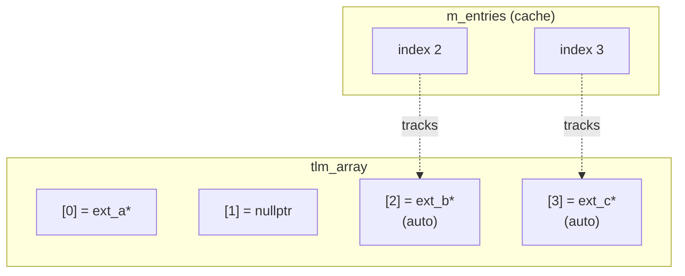

# tlm_array.h - 擴充陣列容器

## 概述

`tlm_array` 是一個輕量化的動態陣列，專門用於 `tlm_generic_payload` 中儲存擴充（extension）指標。它繼承自 `std::vector`，增加了 `expand`（只增不減的擴展）和快取管理功能。

## 日常類比

想像一排帶編號的置物格：
- 每個格子對應一種擴充類型
- 格子可以放東西（set extension）或清空（clear extension）
- 格子的數量只會越來越多（expand），不會縮小
- **快取機制**：有一張清單記錄「哪些格子是自動管理的」，當交易完成時，這些格子的內容會被自動釋放

## 類別詳情

### `tlm_array<T>`

```cpp
template <typename T>
class tlm_array : private std::vector<T> {
public:
  tlm_array(size_type size = 0);

  using base_type::operator[];  // array access
  using base_type::size;        // get size

  void expand(size_type new_size);         // grow if needed
  void insert_in_cache(T* p);             // mark slot for auto-cleanup
  void free_entire_cache();               // free all cached slots
};
```

### `expand(new_size)`

```cpp
void expand(size_type new_size) {
  if (new_size > size()) {
    base_type::resize(new_size);
  }
}
```

只在需要時擴大，永不縮小。這確保了已分配的 ID 索引始終有效。

### 快取機制

`m_entries` 記錄了哪些索引位置包含「自動管理」的擴充（透過 `set_auto_extension` 設定的）。

```cpp
void insert_in_cache(T* p) {
  m_entries.push_back(p - &(*this)[0]);
}

void free_entire_cache() {
  while (m_entries.size()) {
    if ((*this)[m_entries.back()])
      (*this)[m_entries.back()]->free();
    (*this)[m_entries.back()] = 0;
    m_entries.pop_back();
  }
}
```



當呼叫 `free_entire_cache()` 時：
1. 對 index 3 的 ext_c 呼叫 `free()`，清為 nullptr
2. 對 index 2 的 ext_b 呼叫 `free()`，清為 nullptr
3. `m_entries` 清空

## 設計考量

### 為什麼 private 繼承 `std::vector`？

- 只暴露需要的方法（`operator[]`、`size`）
- 隱藏 `push_back`、`erase` 等不應該被直接呼叫的方法
- 擴充陣列的大小應只透過 `expand()` 控制

### 為什麼只增不減？

擴充的 ID 是全域分配的靜態常數。一旦分配了 ID = 5，所有 GP 的陣列都必須至少有 6 個元素。縮小陣列會導致越界存取。

## 原始碼位置

`ref/systemc/src/tlm_core/tlm_2/tlm_generic_payload/tlm_array.h`

## 相關檔案

- [tlm_generic_payload.md](tlm_generic_payload.md) - 使用此陣列儲存擴充
