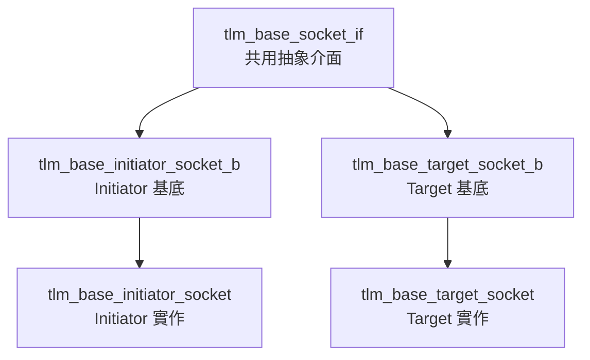

# tlm_base_socket_if.h - Socket 基礎介面

## 概述

`tlm_base_socket_if` 定義了所有 TLM 2.0 socket 的共用抽象介面，以及 `tlm_socket_category` 列舉。這個介面讓工具和基礎設施可以在不知道具體 socket 型別的情況下查詢 socket 的基本屬性。

## 日常類比

就像電器上的銘牌——不管是冰箱、微波爐還是電視，銘牌都標示了「電壓」、「頻率」、「類型」等資訊。`tlm_base_socket_if` 就是每個 socket 的「銘牌介面」。

## Socket 類別列舉

```cpp
enum tlm_socket_category {
  TLM_UNKNOWN_SOCKET        = 0,
  TLM_INITIATOR_SOCKET      = 0x1,
  TLM_TARGET_SOCKET         = 0x2,
  TLM_MULTI_SOCKET          = 0x10,
  TLM_MULTI_INITIATOR_SOCKET = TLM_INITIATOR_SOCKET | TLM_MULTI_SOCKET,  // 0x11
  TLM_MULTI_TARGET_SOCKET    = TLM_TARGET_SOCKET | TLM_MULTI_SOCKET      // 0x12
};
```

使用位元遮罩設計：
- Bit 0：是否為 initiator
- Bit 1：是否為 target
- Bit 4：是否為 multi-socket

## 介面方法

```cpp
class tlm_base_socket_if {
public:
  virtual sc_port_base&       get_base_port() = 0;
  virtual sc_port_base const& get_base_port() const = 0;
  virtual sc_export_base&       get_base_export() = 0;
  virtual sc_export_base const& get_base_export() const = 0;

  virtual unsigned int      get_bus_width() const = 0;
  virtual std::type_index   get_protocol_types() const = 0;
  virtual tlm_socket_category get_socket_category() const = 0;
  virtual bool              is_multi_socket() const = 0;

protected:
  virtual ~tlm_base_socket_if() {}
};
```

| 方法 | 回傳 | 說明 |
|------|------|------|
| `get_base_port()` | `sc_port_base&` | 取得底層的 port |
| `get_base_export()` | `sc_export_base&` | 取得底層的 export |
| `get_bus_width()` | `unsigned int` | 匯流排寬度（bits） |
| `get_protocol_types()` | `std::type_index` | 使用的協議型別 |
| `get_socket_category()` | `tlm_socket_category` | socket 類別 |
| `is_multi_socket()` | `bool` | 是否為 multi-socket |

## 在 socket 階層中的位置



## 原始碼位置

`ref/systemc/src/tlm_core/tlm_2/tlm_sockets/tlm_base_socket_if.h`

## 相關檔案

- [tlm_initiator_socket.md](tlm_initiator_socket.md) - Initiator socket
- [tlm_target_socket.md](tlm_target_socket.md) - Target socket
