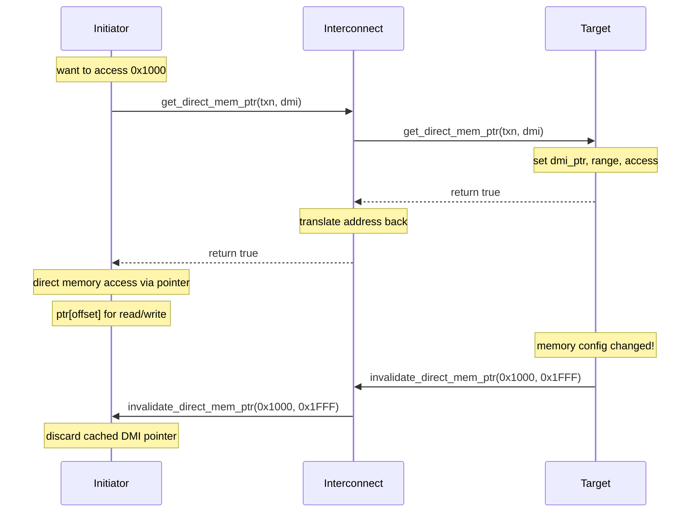

# tlm_dmi.h - 直接記憶體介面 (DMI)

## 概述

`tlm_dmi` 類別封裝了 DMI（Direct Memory Interface）的資訊，讓 initiator 可以繞過正常的傳輸路徑，直接用指標存取 target 的記憶體。這是 TLM 2.0 中最重要的效能最佳化手段之一。

## 日常類比

想像你每天都去同一家便利商店買牛奶：
- **正常傳輸** = 每次都要走到櫃台、排隊、結帳、拿牛奶
- **DMI** = 店長認識你了，給你一把倉庫鑰匙，你自己進去拿就好
- **DMI 失效** = 倉庫搬遷了，店長通知你：「舊鑰匙不能用了，要重新申請」

## 類別詳情

### 存取權限列舉

```cpp
enum dmi_access_e {
  DMI_ACCESS_NONE       = 0x00,  // no access
  DMI_ACCESS_READ       = 0x01,  // read only
  DMI_ACCESS_WRITE      = 0x02,  // write only
  DMI_ACCESS_READ_WRITE = 0x03   // read and write
};
```

使用位元遮罩（bitmask）設計，`READ_WRITE = READ | WRITE`。

### 成員變數

| 成員 | 型別 | 說明 |
|------|------|------|
| `m_dmi_ptr` | `unsigned char*` | 指向 target 記憶體的指標 |
| `m_dmi_start_address` | `uint64` | DMI 區域的起始位址 |
| `m_dmi_end_address` | `uint64` | DMI 區域的結束位址 |
| `m_dmi_access` | `dmi_access_e` | 授予的存取權限 |
| `m_dmi_read_latency` | `sc_time` | 讀取延遲 |
| `m_dmi_write_latency` | `sc_time` | 寫入延遲 |

### 初始化

```cpp
void init() {
  m_dmi_ptr           = 0x0;
  m_dmi_start_address = 0x0;
  m_dmi_end_address   = (uint64)(-1);  // 0xFFFFFFFFFFFFFFFF
  m_dmi_access        = DMI_ACCESS_NONE;
  m_dmi_read_latency  = SC_ZERO_TIME;
  m_dmi_write_latency = SC_ZERO_TIME;
}
```

注意 `m_dmi_end_address` 預設為最大值——代表「整個位址空間」。

### Getter / Setter 方法

提供完整的 getter/setter 對，以及便利的權限檢查方法：

```cpp
bool is_read_allowed() const;
bool is_write_allowed() const;
bool is_read_write_allowed() const;
bool is_none_allowed() const;

void allow_read();
void allow_write();
void allow_read_write();
void allow_none();
```

## DMI 使用流程



## 設計重點

### 位址空間

- `m_dmi_ptr` 指向 `m_dmi_start_address` 對應的資料
- 要存取位址 `addr` 的資料：`m_dmi_ptr[addr - m_dmi_start_address]`
- Interconnect 負責將位址從 initiator 空間轉換到 target 空間

### 延遲

- `m_dmi_read_latency` 和 `m_dmi_write_latency` 讓 initiator 在使用 DMI 時仍能模擬正確的時序
- Interconnect 可以在 target 的延遲上加上自己的延遲

### 全域失效

```cpp
invalidate_direct_mem_ptr(0x0, (uint64)-1)
```

位址範圍設為 `0x0` 到 `0xFFFFFFFFFFFFFFFF` 表示全域失效——所有 DMI 指標都要丟棄。

## 原始碼位置

`ref/systemc/src/tlm_core/tlm_2/tlm_2_interfaces/tlm_dmi.h`

## 相關檔案

- [tlm_fw_bw_ifs.md](tlm_fw_bw_ifs.md) - DMI 相關的介面定義
- [tlm_generic_payload.md](tlm_generic_payload.md) - `is_dmi_allowed()` 提示
- [tlm_initiator_socket.md](tlm_initiator_socket.md) - 發起 DMI 請求的 socket
