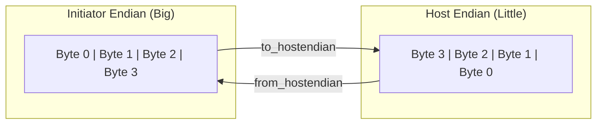

# tlm_endian_conv.h - 端序轉換輔助函式

## 概述

`tlm_endian_conv.h` 提供了一組模板函式，用於在 initiator 的端序（endianness）與主機端序不同時，自動轉換 `tlm_generic_payload` 中的資料排列方式。這些函式供 initiator 模型內部使用，確保在不同端序的系統上模擬結果正確。

## 日常類比

想像你是一個翻譯員，負責在兩種書寫方向之間轉換：
- **Big-endian** = 從左到右寫（如英文），最重要的位元組在前
- **Little-endian** = 從右到左寫（如阿拉伯文），最不重要的位元組在前
- **端序轉換** = 把文件從一種書寫方向翻譯成另一種

如果你的電腦是 Little-endian（x86），但模擬的硬體是 Big-endian（某些 ARM），你就需要這些函式來做轉換。

## 函式組概覽

所有函式都是成對出現的——`to_hostendian_xxx` 在發送前轉換，`from_hostendian_xxx` 在收到回應後轉回：

| 函式組 | 適用情境 | 限制 | 效能 |
|--------|----------|------|------|
| `generic` | 幾乎所有情境 | 2 的冪次匯流排寬度 | 最慢 |
| `word` | 非對齊、非串流 | 不支援 streaming width | 中等 |
| `aligned` | 字元組對齊的交易 | 位址和長度必須對齊 | 較快 |
| `single` | 單字傳輸 | 不跨匯流排字邊界 | 最快 |

### 統一回應入口

```cpp
void tlm_from_hostendian(tlm_generic_payload* txn);
```

如果不確定用哪個 `from_` 函式，可以用這個統一入口，它會自動找到正確的轉換函式（但無法 inline，稍慢）。

## 使用模式

```cpp
// In initiator:
template<class DATAWORD>
void do_transaction(tlm_generic_payload& txn) {
  // 1. Convert to host endianness before sending
  tlm_to_hostendian_generic<DATAWORD>(&txn, BUS_WIDTH);

  // 2. Send transaction
  socket->b_transport(txn, delay);

  // 3. Convert back after response
  tlm_from_hostendian_generic<DATAWORD>(&txn, BUS_WIDTH);

  // 4. Now data in txn is in initiator's endianness
}
```

## 內部機制

### `tlm_endian_context`

一個擴充類別，附加在 GP 上保存轉換前的原始狀態：

```cpp
class tlm_endian_context : public tlm_extension<tlm_endian_context> {
  uint64 address;          // original address
  uchar* data_ptr;         // original data pointer
  int length;              // original length
  int stream_width;        // original stream width
  uchar* new_dbuf;         // new data buffer
  uchar* new_bebuf;        // new byte-enable buffer
  void (*from_f)(...);     // matching from_ function
  int sizeof_databus;      // bus width
};
```

### 轉換原理（generic 版本）



步驟：
1. 計算新的資料長度和位址（可能因對齊需要而變大）
2. 分配新的 data buffer 和 byte-enable buffer
3. 將資料按照端序規則逐位元組重新排列
4. 更新 GP 的各個欄位

### 物件池 (Pool)

```cpp
static tlm_endian_context_pool global_tlm_endian_context_pool;
```

`tlm_endian_context` 使用物件池來避免頻繁的 `new`/`delete`，提高效能。

## 設計注意事項

- 這些函式**只在 initiator 內部使用**——不能用於 interconnect 或 target
- 函式會修改 GP 的多個欄位（data ptr、byte enable 等），不遵守 GP 的可變性規則
- `tlm_endian_context` 擴充不會被移除，會隨 GP 留存
- 只在 initiator 端序與主機端序不同時才需要使用

## 原始碼位置

`ref/systemc/src/tlm_core/tlm_2/tlm_generic_payload/tlm_endian_conv.h`

## 相關檔案

- [tlm_generic_payload.md](tlm_generic_payload.md) - 被轉換的酬載
- [tlm_helpers.md](tlm_helpers.md) - 端序偵測輔助函式
