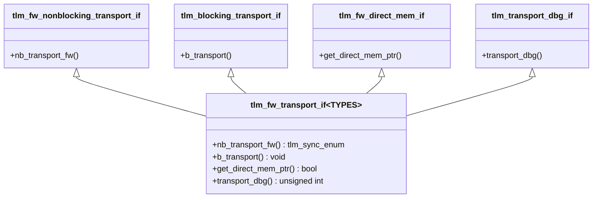
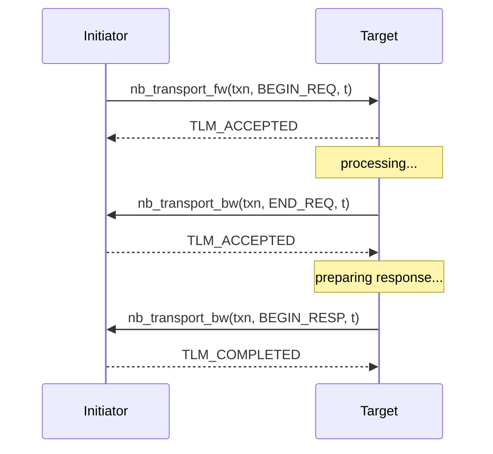
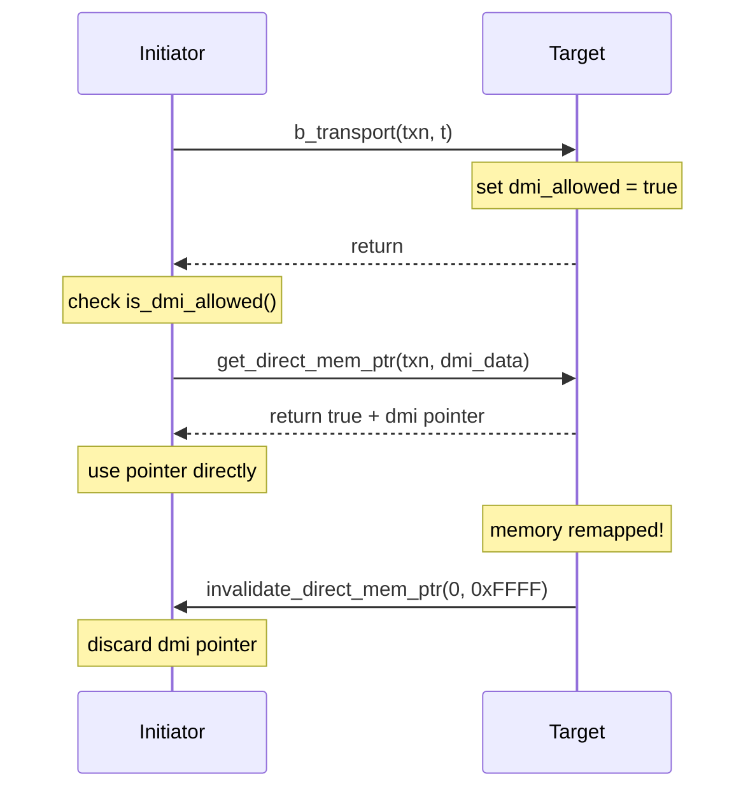

# tlm_fw_bw_ifs.h - 前向/後向傳輸介面

## 概述

`tlm_fw_bw_ifs.h` 定義了 TLM 2.0 的核心通訊介面——前向介面（Forward Interface）和後向介面（Backward Interface）。這是 TLM 2.0 整個 socket 通訊機制的基礎，包括阻塞/非阻塞傳輸、DMI（直接記憶體介面）和除錯傳輸。

## 日常類比

想像一個客服系統：
- **前向介面（Forward）** = 客戶打電話給客服中心（initiator -> target）
  - **`b_transport`**：撥打後一直等到問題解決才掛電話（阻塞式）
  - **`nb_transport_fw`**：留下訊息，客服處理完再回電（非阻塞式）
  - **`get_direct_mem_ptr`**：拿到 VIP 通道，以後可以直接進後台
  - **`transport_dbg`**：偷偷查看內部資料，不影響任何狀態
- **後向介面（Backward）** = 客服中心回電給客戶（target -> initiator）
  - **`nb_transport_bw`**：客服處理完主動回電通知
  - **`invalidate_direct_mem_ptr`**：VIP 通道失效通知

## 核心列舉

### `tlm_sync_enum`

非阻塞傳輸的回傳值，表示交易的處理狀態：

| 值 | 意義 | 類比 |
|----|------|------|
| `TLM_ACCEPTED` | 已接受，稍後會有後續通知 | 「收到了，我處理完會回電」 |
| `TLM_UPDATED` | 已處理部分，phase 已更新 | 「已完成一個步驟，進入下一階段」 |
| `TLM_COMPLETED` | 整個交易已完成 | 「全部處理完畢」 |

## 基礎介面

### 非阻塞傳輸

```cpp
// Forward: initiator -> target
template <typename TRANS, typename PHASE>
class tlm_fw_nonblocking_transport_if {
  virtual tlm_sync_enum nb_transport_fw(TRANS& trans, PHASE& phase, sc_time& t) = 0;
};

// Backward: target -> initiator
template <typename TRANS, typename PHASE>
class tlm_bw_nonblocking_transport_if {
  virtual tlm_sync_enum nb_transport_bw(TRANS& trans, PHASE& phase, sc_time& t) = 0;
};
```

非阻塞傳輸使用「乒乓」模式：initiator 呼叫 `nb_transport_fw`，target 可以透過 `nb_transport_bw` 回呼。

### 阻塞傳輸

```cpp
template <typename TRANS>
class tlm_blocking_transport_if {
  virtual void b_transport(TRANS& trans, sc_time& t) = 0;
};
```

一次呼叫完成整個交易。`sc_time& t` 是標註時間（annotation time），target 可以修改它來表示延遲。

### DMI 介面

```cpp
// Forward: 請求直接記憶體存取
template <typename TRANS>
class tlm_fw_direct_mem_if {
  virtual bool get_direct_mem_ptr(TRANS& trans, tlm_dmi& dmi_data) = 0;
};

// Backward: 通知 DMI 指標失效
class tlm_bw_direct_mem_if {
  virtual void invalidate_direct_mem_ptr(uint64 start, uint64 end) = 0;
};
```

### 除錯介面

```cpp
template <typename TRANS>
class tlm_transport_dbg_if {
  virtual unsigned int transport_dbg(TRANS& trans) = 0;
};
```

回傳成功傳輸的位元組數。不允許有任何副作用（side effect），也不能呼叫 `wait()`。

## 組合介面

### `tlm_base_protocol_types`

```cpp
struct tlm_base_protocol_types {
  typedef tlm_generic_payload tlm_payload_type;
  typedef tlm_phase           tlm_phase_type;
};
```

定義了基本協議的型別組合。這是預設的 TYPES 參數。

### `tlm_fw_transport_if<TYPES>`

組合了所有前向介面：



### `tlm_bw_transport_if<TYPES>`

組合了所有後向介面：`nb_transport_bw` + `invalidate_direct_mem_ptr`

## 非阻塞傳輸流程



## DMI 流程



## 原始碼位置

`ref/systemc/src/tlm_core/tlm_2/tlm_2_interfaces/tlm_fw_bw_ifs.h`

## 相關檔案

- [tlm_dmi.md](tlm_dmi.md) - DMI 資料結構
- [tlm_generic_payload.md](tlm_generic_payload.md) - 通用酬載
- [tlm_phase.md](tlm_phase.md) - 交易相位
- [tlm_initiator_socket.md](tlm_initiator_socket.md) - Initiator socket
- [tlm_target_socket.md](tlm_target_socket.md) - Target socket
