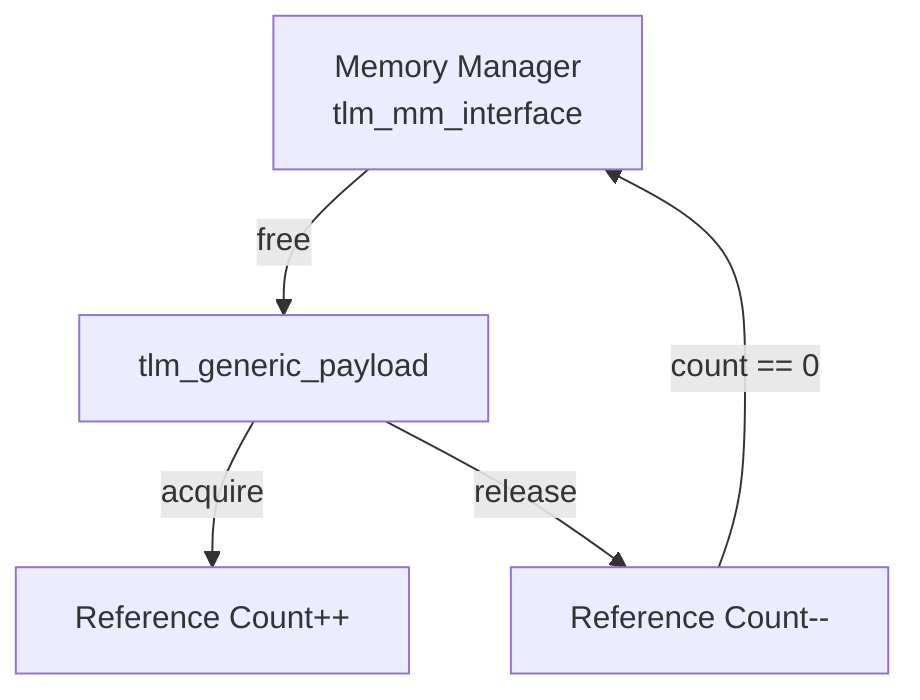
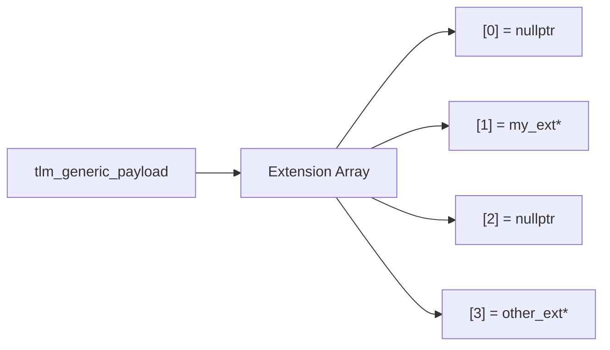

# tlm_generic_payload - 通用酬載

## 概述

`tlm_generic_payload` 是 TLM 2.0 的核心資料結構，代表一筆匯流排交易（bus transaction）。它定義了標準化的欄位來描述讀寫命令、位址、資料、回應狀態等，並提供了可擴充的擴充機制（extension mechanism）。

檔案分佈：
- `tlm_generic_payload.h` - 總標頭檔
- `tlm_gp.h` - 類別定義
- `tlm_gp.cpp` - 實作

## 日常類比

`tlm_generic_payload` 就像一個標準化的快遞包裹：

| 包裹的元素 | 對應的 GP 欄位 | 說明 |
|-----------|---------------|------|
| 收件地址 | `m_address` | 資料要送到哪裡 |
| 「寄件」或「取件」 | `m_command` | READ 或 WRITE |
| 包裹內容 | `m_data` | 實際的資料 |
| 包裹大小 | `m_length` | 資料長度（bytes） |
| 回執聯 | `m_response_status` | 是否成功送達 |
| 特殊處理標籤 | `m_byte_enable` | 哪些 byte 有效 |
| 串流寬度 | `m_streaming_width` | 循環存取的寬度 |
| VIP 標記 | `m_dmi` | 是否建議使用 DMI |
| 額外附件 | `m_extensions` | 擴充資料 |

## 主要列舉

### `tlm_command`

```cpp
enum tlm_command {
  TLM_READ_COMMAND,    // read from target
  TLM_WRITE_COMMAND,   // write to target
  TLM_IGNORE_COMMAND   // no operation
};
```

### `tlm_response_status`

```cpp
enum tlm_response_status {
  TLM_OK_RESPONSE = 1,              // success
  TLM_INCOMPLETE_RESPONSE = 0,      // not yet processed
  TLM_GENERIC_ERROR_RESPONSE = -1,
  TLM_ADDRESS_ERROR_RESPONSE = -2,
  TLM_COMMAND_ERROR_RESPONSE = -3,
  TLM_BURST_ERROR_RESPONSE = -4,
  TLM_BYTE_ENABLE_ERROR_RESPONSE = -5
};
```

正值代表成功，零代表未處理，負值代表各種錯誤。

### `tlm_gp_option`

```cpp
enum tlm_gp_option {
  TLM_MIN_PAYLOAD,           // minimum fields only
  TLM_FULL_PAYLOAD,          // all fields valid
  TLM_FULL_PAYLOAD_ACCEPTED  // full payload accepted by target
};
```

## 類別：`tlm_generic_payload`

### 核心欄位與 API

```cpp
// Command
void set_read();
void set_write();
bool is_read() const;
bool is_write() const;
tlm_command get_command() const;

// Address
void set_address(uint64 address);
uint64 get_address() const;

// Data
void set_data_ptr(unsigned char* data);
unsigned char* get_data_ptr() const;
void set_data_length(unsigned int length);
unsigned int get_data_length() const;

// Response
void set_response_status(tlm_response_status);
tlm_response_status get_response_status() const;
bool is_response_ok() const;

// Byte enable
void set_byte_enable_ptr(unsigned char* be);
void set_byte_enable_length(unsigned int len);

// Streaming
void set_streaming_width(unsigned int width);

// DMI hint
void set_dmi_allowed(bool);
bool is_dmi_allowed() const;
```

### 記憶體管理



```cpp
class tlm_mm_interface {
  virtual void free(tlm_generic_payload*) = 0;
};

// Usage
gp->set_mm(&my_mm);
gp->acquire();   // ref_count++
gp->release();   // ref_count--, if 0 -> mm->free(gp)
```

記憶體管理器是選擇性的。如果設定了 MM，可以使用引用計數來管理 GP 的生命週期。

### 深複製與更新

```cpp
// deep copy all fields and extensions
void deep_copy_from(const tlm_generic_payload& other);

// update original from a deep copy (for reads: copy back data)
void update_original_from(const tlm_generic_payload& other,
                          bool use_byte_enable_on_read = true);

// copy only extensions
void update_extensions_from(const tlm_generic_payload& other);
```

## 擴充機制 (Extension Mechanism)

### 定義自訂擴充

```cpp
class my_extension : public tlm::tlm_extension<my_extension> {
public:
  int custom_field;

  tlm_extension_base* clone() const override {
    auto* ext = new my_extension;
    ext->custom_field = custom_field;
    return ext;
  }
  void copy_from(const tlm_extension_base& other) override {
    custom_field = static_cast<const my_extension&>(other).custom_field;
  }
};
```

`tlm_extension<T>` 使用 CRTP（Curiously Recurring Template Pattern），在 C++ 靜態初始化時自動為每個擴充類別分配唯一 ID。

### 使用擴充

```cpp
// Set
my_extension* ext = new my_extension;
ext->custom_field = 42;
gp->set_extension(ext);

// Get
my_extension* got_ext;
gp->get_extension(got_ext);
// got_ext->custom_field == 42

// Auto extension (MM will free it)
gp->set_auto_extension(new my_extension);

// Clear (just remove, don't free)
gp->clear_extension<my_extension>();

// Release (remove + free via MM or directly)
gp->release_extension<my_extension>();
```

### 擴充陣列



每個擴充型別透過 `tlm_extension<T>::ID` 取得索引，直接在陣列中存取——O(1) 時間複雜度。

## RTL 背景

在硬體設計中，匯流排交易（如 AXI、AHB）有固定的訊號定義。`tlm_generic_payload` 的欄位對應了常見的匯流排屬性：

| GP 欄位 | AXI 對應 | 說明 |
|---------|----------|------|
| `m_address` | AWADDR / ARADDR | 位址 |
| `m_command` | 讀/寫通道選擇 | 存取方向 |
| `m_data` | WDATA / RDATA | 資料 |
| `m_length` | AxLEN * AxSIZE | 傳輸長度 |
| `m_byte_enable` | WSTRB | 位元組遮罩 |
| `m_response_status` | BRESP / RRESP | 回應狀態 |

## 原始碼位置

- `ref/systemc/src/tlm_core/tlm_2/tlm_generic_payload/tlm_generic_payload.h`
- `ref/systemc/src/tlm_core/tlm_2/tlm_generic_payload/tlm_gp.h`
- `ref/systemc/src/tlm_core/tlm_2/tlm_generic_payload/tlm_gp.cpp`

## 相關檔案

- [tlm_phase.md](tlm_phase.md) - 交易相位
- [tlm_array.md](tlm_array.md) - 擴充陣列的底層容器
- [tlm_fw_bw_ifs.md](tlm_fw_bw_ifs.md) - 使用 GP 的傳輸介面
- [tlm_endian_conv.md](tlm_endian_conv.md) - GP 的端序轉換
