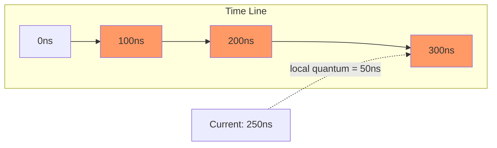
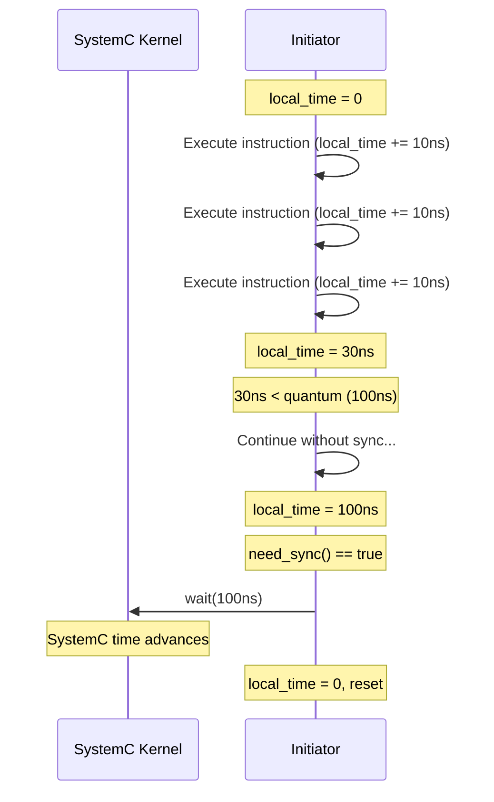

# tlm_global_quantum - 全域量子時間管理

## 概述

`tlm_global_quantum` 定義了所有 initiator 可以「領先」SystemC 時間多遠的上限值——稱為全域量子（Global Quantum）。在時間解耦（temporal decoupling）的 loosely-timed 模型中，initiator 可以不用每一步都同步到 SystemC 時間，而是累積一段本地時間後再同步。全域量子就是這段領先時間的上限。

## 日常類比

想像一個馬拉松比賽中的計時系統：
- **SystemC 時間** = 官方計時鐘
- **本地時間** = 每位選手手上的碼表
- **全域量子** = 規定「選手最多可以跑離計時點多遠就必須回來報到」
- 例如全域量子 = 1 公里：選手可以自由跑 1 公里，到了檢查點就必須和官方時鐘同步

如果全域量子設得太大，模擬快但時序精度差；設得太小，精度好但模擬慢。

## 類別：`tlm_global_quantum`

### Singleton 模式

```cpp
static tlm_global_quantum& instance();
```

全域只有一個實例，所有 initiator 共用同一個量子值。

### 主要方法

```cpp
void set(const sc_time& t);           // set global quantum
const sc_time& get() const;           // get global quantum
sc_time compute_local_quantum();       // compute next sync point
```

### `compute_local_quantum()` 的計算方式

```cpp
sc_time compute_local_quantum() {
  if (m_global_quantum != SC_ZERO_TIME) {
    const sc_time current = sc_time_stamp();
    const sc_time g_quant = m_global_quantum;
    return g_quant - (current % g_quant);
  }
  return SC_ZERO_TIME;
}
```

回傳從當前 SystemC 時間到下一個量子邊界的距離。

**範例：**
- 全域量子 = 100ns
- 當前時間 = 250ns
- `250 % 100 = 50`
- 回傳 `100 - 50 = 50ns`（下一個同步點在 300ns）



## 時間解耦概念



## 原始碼位置

- `ref/systemc/src/tlm_core/tlm_2/tlm_quantum/tlm_global_quantum.h`
- `ref/systemc/src/tlm_core/tlm_2/tlm_quantum/tlm_global_quantum.cpp`

## 相關檔案

- [../../tlm_utils/tlm_quantumkeeper.md](../../tlm_utils/tlm_quantumkeeper.md) - 使用全域量子的本地時間管理器
