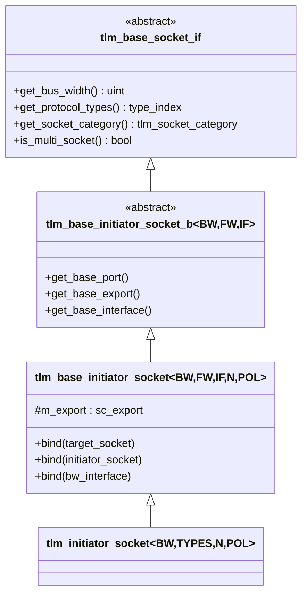
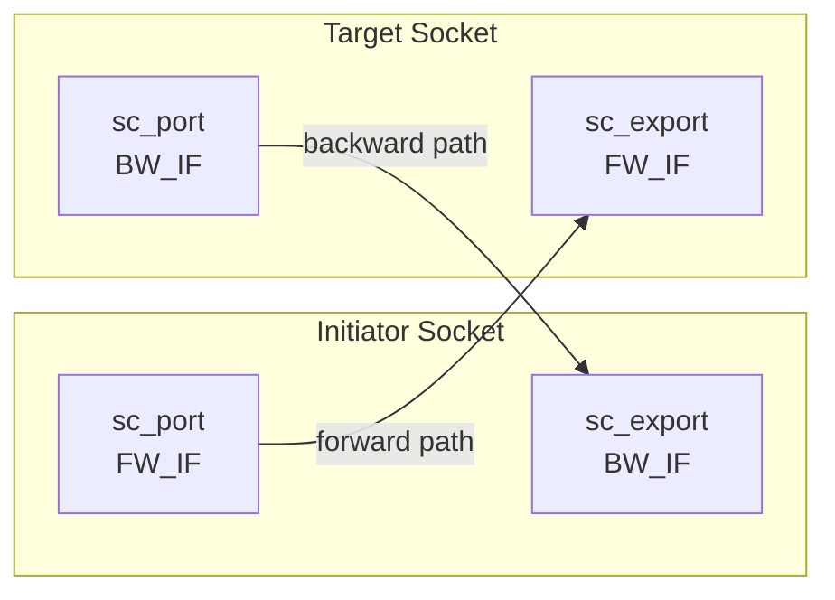

# tlm_initiator_socket.h - Initiator Socket

## 概述

`tlm_initiator_socket` 是 TLM 2.0 中 initiator（發起者）端的 socket，封裝了一個 `sc_port`（用於向 target 發送前向呼叫）和一個 `sc_export`（用於接收 target 的後向回呼）。它是 TLM 2.0 point-to-point 連接的一端。

## 日常類比

把 initiator socket 想像成一支電話：
- **Port（sc_port）** = 撥號功能，用來主動打電話給 target
- **Export（sc_export）** = 接聽功能，讓 target 可以回電
- **bind()** = 交換電話號碼，建立通訊關係

一支電話同時具備撥出和接聽的功能，initiator socket 也同時具備發送和接收的能力。

## 類別層次



## 模板參數

| 參數 | 預設值 | 說明 |
|------|--------|------|
| `BUSWIDTH` | 32 | 匯流排寬度（bits） |
| `TYPES` | `tlm_base_protocol_types` | 協議型別組 |
| `N` | 1 | 最大連接數 |
| `POL` | `SC_ONE_OR_MORE_BOUND` | 綁定策略 |

## 綁定操作

### 1. 綁定到 Target Socket

```cpp
virtual void bind(base_target_socket_type& s) {
  // initiator.port -> target.export (forward path)
  (get_base_port())(s.get_base_interface());
  // target.port -> initiator.export (backward path)
  (s.get_base_port())(get_base_interface());
}
```



### 2. 階層式綁定（Hierarchical Bind）

```cpp
virtual void bind(base_type& s) {
  // port chain
  (get_base_port())(s.get_base_port());
  // export chain
  (s.get_base_export())(get_base_export());
}
```

用於模組內部將子模組的 socket 與外部 socket 連接。

### 3. 綁定介面

```cpp
virtual void bind(bw_interface_type& ifs) {
  (get_base_export())(ifs);
}
```

直接將一個 backward 介面實作綁定到 export。

## 便利類別 `tlm_initiator_socket`

```cpp
template <unsigned int BUSWIDTH = 32,
          typename TYPES = tlm_base_protocol_types,
          int N = 1,
          sc_core::sc_port_policy POL = sc_core::SC_ONE_OR_MORE_BOUND>
class tlm_initiator_socket :
  public tlm_base_initiator_socket<BUSWIDTH,
    tlm_fw_transport_if<TYPES>,
    tlm_bw_transport_if<TYPES>, N, POL>
```

自動將 `TYPES` 展開為 `tlm_fw_transport_if<TYPES>` 和 `tlm_bw_transport_if<TYPES>`，簡化使用。

## 使用範例

```cpp
class MyInitiator : public sc_module {
  tlm_utils::simple_initiator_socket<MyInitiator> socket;

  void thread() {
    tlm_generic_payload txn;
    sc_time delay = SC_ZERO_TIME;

    txn.set_command(TLM_WRITE_COMMAND);
    txn.set_address(0x100);
    txn.set_data_ptr(data);
    txn.set_data_length(4);

    socket->b_transport(txn, delay);  // forward call via port
  }
};
```

## 原始碼位置

`ref/systemc/src/tlm_core/tlm_2/tlm_sockets/tlm_initiator_socket.h`

## 相關檔案

- [tlm_target_socket.md](tlm_target_socket.md) - 對應的 target socket
- [tlm_base_socket_if.md](tlm_base_socket_if.md) - socket 基礎介面
- [tlm_fw_bw_ifs.md](tlm_fw_bw_ifs.md) - 傳輸介面定義
