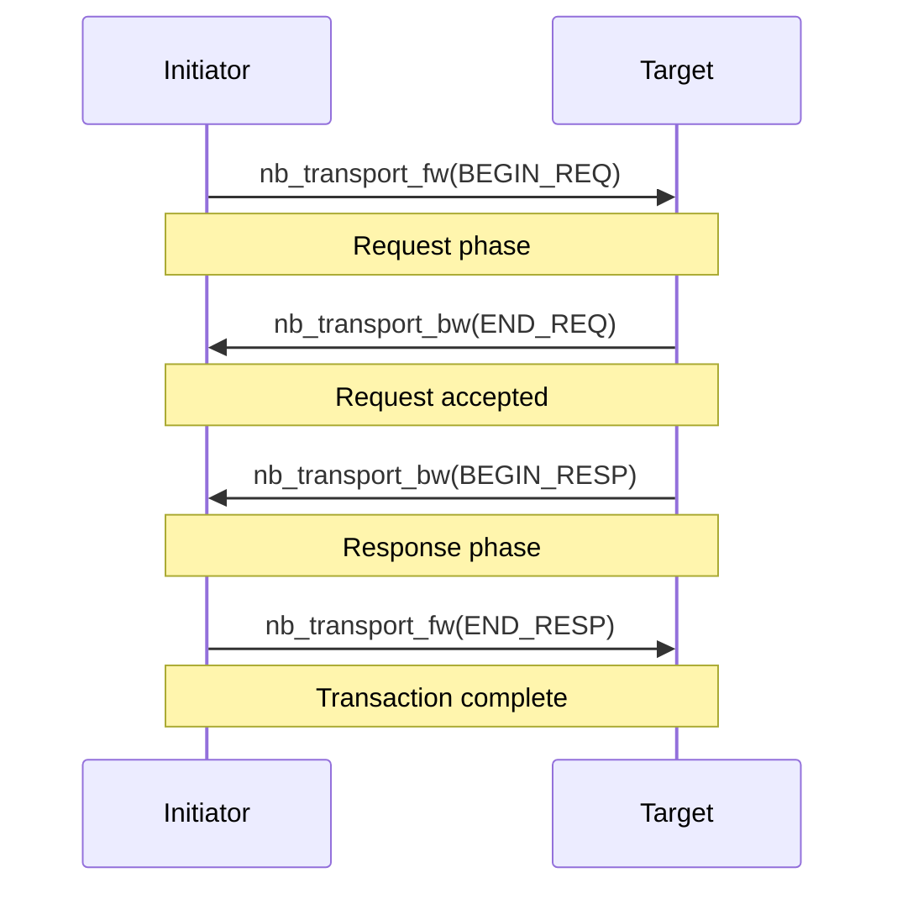
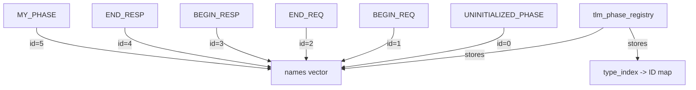

# tlm_phase - 交易相位

## 概述

`tlm_phase` 定義了 TLM 2.0 非阻塞傳輸中交易的進行階段。每次呼叫 `nb_transport_fw` 或 `nb_transport_bw` 時，都會攜帶一個 phase 參數來表示交易目前處於哪個階段。系統預設四個標準相位，使用者也可以定義自訂相位。

## 日常類比

想像在餐廳的點餐流程：
1. **BEGIN_REQ**（開始請求）= 顧客舉手點餐
2. **END_REQ**（結束請求）= 服務生記好了點單
3. **BEGIN_RESP**（開始回應）= 廚房把菜端出來
4. **END_RESP**（結束回應）= 顧客確認收到菜

每個階段就是一個 phase，表示整個交易進行到哪一步了。

## 標準相位

```cpp
enum tlm_phase_enum {
  UNINITIALIZED_PHASE = 0,  // not yet set
  BEGIN_REQ = 1,             // begin request
  END_REQ,                   // end request
  BEGIN_RESP,                // begin response
  END_RESP                   // end response
};
```

### 標準四階段協議



## 類別：`tlm_phase`

```cpp
class tlm_phase {
public:
  tlm_phase();                          // default: UNINITIALIZED_PHASE
  tlm_phase(tlm_phase_enum standard);   // from standard enum
  tlm_phase& operator=(tlm_phase_enum);

  operator unsigned int() const;        // get phase ID
  const char* get_name() const;         // get phase name string

protected:
  // for extended phases
  tlm_phase(const std::type_info& type, const char* name);
private:
  unsigned int m_id;
};
```

### 設計重點

- `m_id` 是一個 `unsigned int`，標準相位使用 0-4 的值
- 支援隱式轉換到 `unsigned int`，方便在 `switch` 中使用
- 支援 `operator<<` 以便輸出名稱

## 自訂相位

### 宣告方式

```cpp
TLM_DECLARE_EXTENDED_PHASE(MY_PHASE);
```

這個巨集會：
1. 建立一個繼承自 `tlm_phase` 的匿名類別
2. 在建構時自動向全域 registry 註冊
3. 產生一個 `const` 的靜態物件 `MY_PHASE`

### Registry 機制



`tlm_phase_registry` 是一個單例（singleton），管理所有 phase 的 ID 與名稱對應。使用 `std::type_index` 來避免重複註冊。

## 在非阻塞傳輸中的使用

```cpp
tlm_phase phase = tlm::BEGIN_REQ;
sc_time delay = SC_ZERO_TIME;

tlm_sync_enum status = init_socket->nb_transport_fw(txn, phase, delay);

switch (status) {
  case TLM_ACCEPTED:
    // target accepted, will call nb_transport_bw later
    break;
  case TLM_UPDATED:
    // target updated phase (e.g., phase == END_REQ now)
    break;
  case TLM_COMPLETED:
    // transaction done in one call
    break;
}
```

## 原始碼位置

- `ref/systemc/src/tlm_core/tlm_2/tlm_generic_payload/tlm_phase.h`
- `ref/systemc/src/tlm_core/tlm_2/tlm_generic_payload/tlm_phase.cpp`

## 相關檔案

- [tlm_fw_bw_ifs.md](tlm_fw_bw_ifs.md) - 使用 phase 的傳輸介面
- [tlm_generic_payload.md](tlm_generic_payload.md) - 搭配使用的酬載
