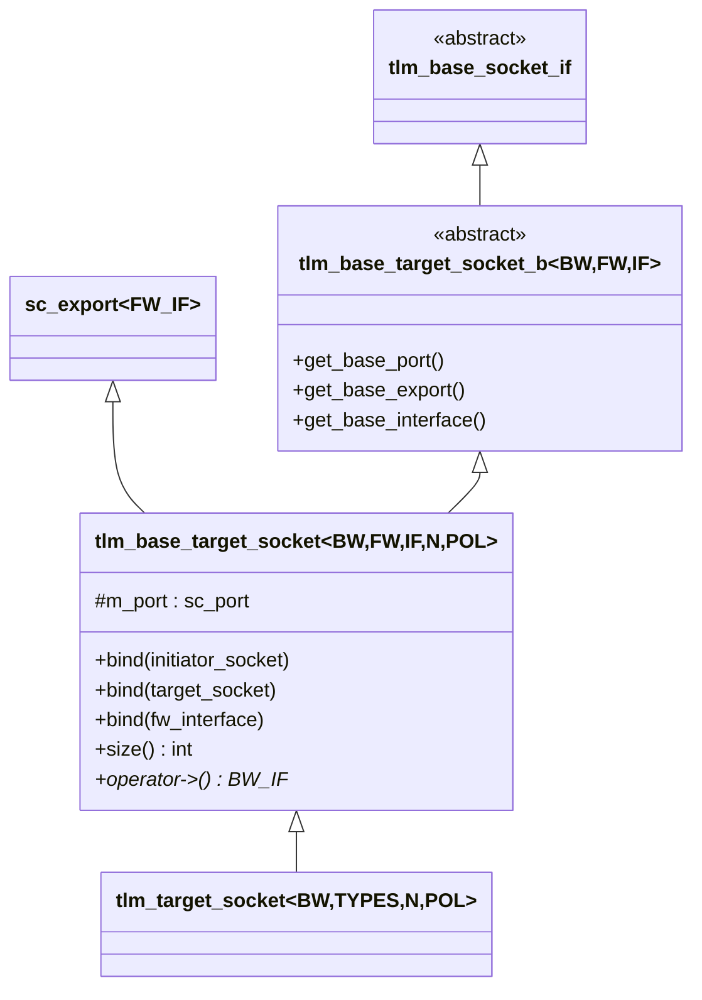
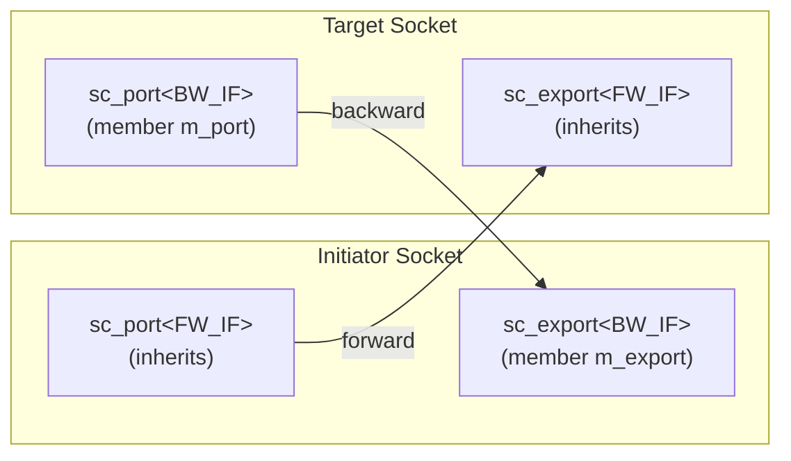

# tlm_target_socket.h - Target Socket

## 概述

`tlm_target_socket` 是 TLM 2.0 中 target（目標）端的 socket。與 initiator socket 對稱，它封裝了一個 `sc_export`（接收前向呼叫）和一個 `sc_port`（發送後向回呼）。Target socket 本身繼承自 `sc_export`，因此可以直接用來綁定前向介面的實作。

## 日常類比

如果 initiator socket 是「打電話的那方」，那 target socket 就是「接電話的那方」：
- **Export（sc_export，即自身）** = 接聽來電的電話線
- **Port（sc_port）** = 用來主動回電的撥號功能
- 當 initiator 呼叫 `nb_transport_fw` 或 `b_transport`，就是 target socket 接到來電
- 當 target 需要回呼 `nb_transport_bw` 或 `invalidate_direct_mem_ptr`，就是使用內部的 port 回電

## 類別層次



## 模板參數

| 參數 | 預設值 | 說明 |
|------|--------|------|
| `BUSWIDTH` | 32 | 匯流排寬度（bits） |
| `FW_IF` | `tlm_fw_transport_if<>` | 前向介面型別 |
| `BW_IF` | `tlm_bw_transport_if<>` | 後向介面型別 |
| `N` | 1 | 最大連接數 |
| `POL` | `SC_ONE_OR_MORE_BOUND` | 綁定策略 |

## 與 Initiator Socket 的對稱結構



| 面向 | Initiator Socket | Target Socket |
|------|------------------|---------------|
| 繼承 | `sc_port<FW_IF>` | `sc_export<FW_IF>` |
| 成員 | `m_export` (BW_IF) | `m_port` (BW_IF) |
| 前向呼叫 | 透過 port 送出 | 透過 export 接收 |
| 後向呼叫 | 透過 export 接收 | 透過 port 送出 |

## 綁定操作

### 綁定到 Initiator Socket

```cpp
virtual void bind(base_initiator_socket_type& s) {
  // initiator.port -> target.export (forward)
  (s.get_base_port())(get_base_interface());
  // target.port -> initiator.export (backward)
  get_base_port()(s.get_base_interface());
}
```

### 階層式綁定

```cpp
virtual void bind(base_type& s) {
  // check for illegal multi-socket hierarchical bind
  if (s.get_socket_category() == TLM_MULTI_TARGET_SOCKET) {
    if (TLM_MULTI_TARGET_SOCKET != get_socket_category()) {
      SC_REPORT_ERROR(...);
    }
  }
  (get_base_export())(s.get_base_export());
  (s.get_base_port())(get_base_port());
}
```

注意：階層式綁定時會檢查 multi-socket 的合法性——不能把 multi-target socket 階層式綁定到非 multi-target socket。

### 額外的便利方法

```cpp
int size() const;           // number of bound initiators
bw_interface_type* operator->();   // access backward interface
bw_interface_type* operator[](int i); // access i-th backward interface
```

## 原始碼位置

`ref/systemc/src/tlm_core/tlm_2/tlm_sockets/tlm_target_socket.h`

## 相關檔案

- [tlm_initiator_socket.md](tlm_initiator_socket.md) - 對應的 initiator socket
- [tlm_base_socket_if.md](tlm_base_socket_if.md) - socket 基礎介面
- [tlm_fw_bw_ifs.md](tlm_fw_bw_ifs.md) - 傳輸介面定義
