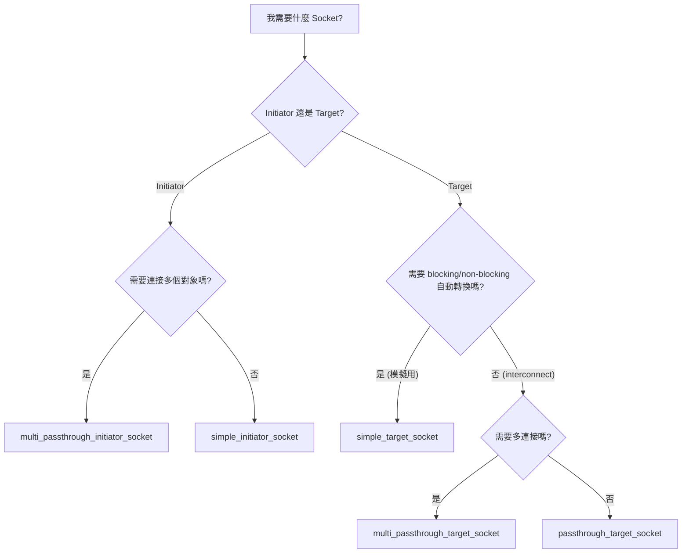

# TLM Utils - TLM 工具庫

## 概述

`tlm_utils` 提供了一系列便利工具，建構在 `tlm_core` 之上，讓使用者可以更輕鬆地建立 TLM 2.0 模型。這些工具類別不是 TLM 標準的核心部分，但在實務上幾乎每個 TLM 模型都會用到。

## 日常類比

如果 `tlm_core` 是基本的樂高積木（port、export、socket、generic payload），那 `tlm_utils` 就是預組裝好的樂高套件——把最常用的組合方式包裝起來，讓你不用每次都從零開始拼。

## 工具分類

### 便利 Socket

| 工具 | 用途 | 適用場景 |
|------|------|----------|
| `simple_initiator_socket` | 簡化的 initiator socket | 最常用，自動管理 backward 回呼 |
| `simple_target_socket` | 簡化的 target socket | 最常用，支援 blocking/non-blocking 自動轉換 |
| `passthrough_target_socket` | 穿透式 target socket | Interconnect 元件，直接轉發呼叫 |
| `multi_passthrough_initiator_socket` | 多連接 initiator socket | 連接多個 target |
| `multi_passthrough_target_socket` | 多連接 target socket | 接受多個 initiator 連接 |

### 時間管理

| 工具 | 用途 |
|------|------|
| `tlm_quantumkeeper` | 管理本地時間和全域量子同步 |

### 事件佇列

| 工具 | 用途 |
|------|------|
| `peq_with_get` | 使用 `get_next_transaction()` 輪詢的事件佇列 |
| `peq_with_cb_and_phase` | 使用回呼函式和 phase 的事件佇列 |

### 擴充機制

| 工具 | 用途 |
|------|------|
| `instance_specific_extensions` | 每個模組實例私有的擴充 |

### 基礎輔助

| 工具 | 用途 |
|------|------|
| `convenience_socket_bases` | 所有便利 socket 的基礎類別 |
| `multi_socket_bases` | Multi-socket 的基礎類別和回呼綁定器 |

## 架構關係

```mermaid
graph TD
    subgraph "tlm_core (Standard)"
        IS[tlm_initiator_socket]
        TS[tlm_target_socket]
        GP[tlm_generic_payload]
        GQ[tlm_global_quantum]
    end

    subgraph "tlm_utils (Convenience)"
        CSB[convenience_socket_bases]
        MSB[multi_socket_bases]

        SIS[simple_initiator_socket]
        STS[simple_target_socket]
        PTS[passthrough_target_socket]
        MPIS[multi_passthrough_initiator_socket]
        MPTS[multi_passthrough_target_socket]

        QK[tlm_quantumkeeper]
        PEQ1[peq_with_get]
        PEQ2[peq_with_cb_and_phase]
        ISE[instance_specific_extensions]
    end

    IS --> SIS
    IS --> MPIS
    TS --> STS
    TS --> PTS
    TS --> MPTS

    CSB --> SIS
    CSB --> STS
    CSB --> PTS
    MSB --> MPIS
    MSB --> MPTS

    GQ --> QK
    GP --> PEQ1
    GP --> PEQ2
    GP --> ISE
```



## 選擇指南



## 目錄結構

```
tlm_utils/
├── convenience_socket_bases.h/.cpp    # 基礎輔助類別
├── simple_initiator_socket.h          # 簡化 initiator socket
├── simple_target_socket.h             # 簡化 target socket
├── passthrough_target_socket.h        # 穿透式 target socket
├── multi_passthrough_initiator_socket.h # 多連接 initiator socket
├── multi_passthrough_target_socket.h    # 多連接 target socket
├── multi_socket_bases.h               # multi-socket 基礎
├── peq_with_get.h                     # 事件佇列（輪詢式）
├── peq_with_cb_and_phase.h            # 事件佇列（回呼式）
├── tlm_quantumkeeper.h                # 量子時間管理
├── instance_specific_extensions.h/.cpp # 實例私有擴充
└── instance_specific_extensions_int.h  # 內部實作
```

## 相關檔案

- [../tlm_core/_index.md](../tlm_core/_index.md) - TLM 核心庫
