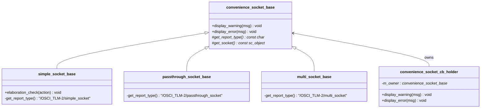

# convenience_socket_bases - 便利 Socket 基礎類別

## 概述

`convenience_socket_bases.h/cpp` 定義了所有便利 socket（simple、passthrough、multi）的共用基礎類別。主要提供統一的錯誤報告和警告機制，以及 elaboration 階段的檢查功能。

## 日常類比

就像所有家用電器都有共同的安全標準——過載保護、漏電斷路器等。`convenience_socket_base` 就是便利 socket 的「安全標準基礎」，確保所有 socket 在出錯時都能以統一、清楚的方式報告問題。

## 類別層次



## 主要類別

### `convenience_socket_base`

所有便利 socket 的根基礎類別。

```cpp
class convenience_socket_base {
public:
  void display_warning(const char* msg) const;
  void display_error(const char* msg) const;
private:
  virtual const char* get_report_type() const = 0;
  virtual const sc_object* get_socket() const = 0;
};
```

- `display_warning` / `display_error`：以 `socket_name: message` 格式輸出
- `get_report_type()`：回傳 SystemC report 的分類名稱
- `get_socket()`：回傳 socket 對應的 `sc_object`，用來取得名稱

### `simple_socket_base`

```cpp
class simple_socket_base : public convenience_socket_base {
  void elaboration_check(const char* action) const;
};
```

`elaboration_check()` 確認是否還在 elaboration 階段。simple socket 的回呼註冊必須在 elaboration 完成前完成，否則報錯。

report type: `"/OSCI_TLM-2/simple_socket"`

### `passthrough_socket_base`

report type: `"/OSCI_TLM-2/passthrough_socket"`

### `multi_socket_base`

report type: `"/OSCI_TLM-2/multi_socket"`

### `convenience_socket_cb_holder`

回呼物件（callback binder）的基礎類別。它持有一個 `convenience_socket_base*` 指標，將警告/錯誤委派給 socket 本身。

```cpp
class convenience_socket_cb_holder {
public:
  void display_warning(const char* msg) const;
  void display_error(const char* msg) const;
protected:
  explicit convenience_socket_cb_holder(convenience_socket_base* owner);
private:
  convenience_socket_base* m_owner;
};
```

## 原始碼位置

- `ref/systemc/src/tlm_utils/convenience_socket_bases.h`
- `ref/systemc/src/tlm_utils/convenience_socket_bases.cpp`

## 相關檔案

- [simple_initiator_socket.md](simple_initiator_socket.md)
- [simple_target_socket.md](simple_target_socket.md)
- [passthrough_target_socket.md](passthrough_target_socket.md)
- [multi_socket_bases.md](multi_socket_bases.md)
